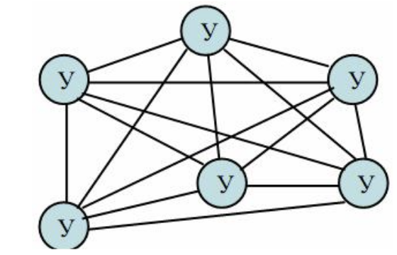
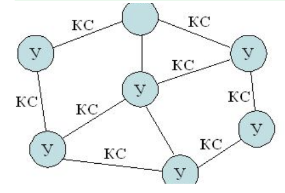
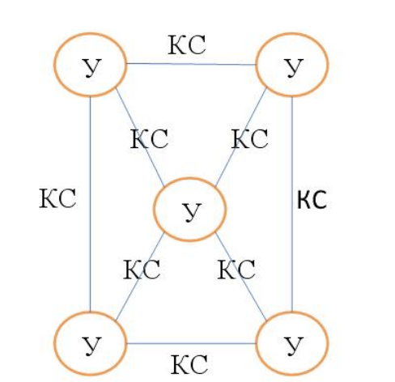

_____
### Что по определению может включать в себя ЭВМ (компьютер)?
*  один центральный процессор

*  устройства ввода/вывода
*  оперативная память
*  процессоры ввода/вывода
_____
### Что по определению может включать в себя вычислительный комплекс?
*  два и более центральных процессоров

*  устройства ввода/вывода
*  оперативная память
*  процессоры ввода/вывода
_____
### Что по определению может включать в себя вычислительная система?
*  ровно один центральный процессор
*  устройства ввода/вывода
*  оперативная память
*  процессоры ввода/вывода
*  базы данных
*  операционная система
*  прикладные программы
*  два и более центральных процессоров
_____
### Что по определению могут включать в себя средства телекоммуникаций?
*  узлы связи
*  каналы связи
_____
### Что по определению может включать в себя ЭВМ (компьютер)?
*  технические средства
*  только один из прочих вариантов ответа правильный
_____
### Выберите корректные утверждения.
*  Вычислительный комплекс - это совокупность технических средств, содержащих более одного центрального процессора.
*  Вычислительная система - это совокупность технических и программных средств.
*  Вычислительная машина (компьютер) - это совокупность технических средств.
_____
### В чем отличие информации от данных? Выберите верные утверждения.
*  Данные могут не содержать информацию
*  Мерой данных является объем
*  Мерой информации является энтропия
_____
### Как называется совокупность средств вычислительной техники, объединенных с помощью средств телекоммуникаций?
*  сеть ЭВМ
*  компьютерная сеть
_____
### Основной целью построения вычислительного комплекса является обеспечение ... (закончите фразу)
*  высокой надежности и/или производительности
_____
### В чём принято измерять системную производительность вычислительной системы?
*  задач в секунду
### В чём принято измерять производительность вычислительной системы?
*  задач в секунду
_____
### В чём принято измерять производительность компьютера (вычислительной машины)?
*  MFLOPS
*  MIPS
_____
### Что по определению включает в себя канал связи?
*  линия связи
*  каналообразующее оборудование
*  аппаратура передачи данных
_____
### Укажите, что из перечисленного может использоваться в качестве узла связи компьютерной сети.
*  мост
*  шлюз
*  маршрутизатор
*  коммутатор
_____
### Что принято называть программными средствами вычислительной системы?
*  системное программное обеспечение
*  прикладное программное обеспечение
_____
### Что принято относить к информационному обеспечению (dataware) вычислительной системы?
*  база данных
*  система управления базой данных
_____
### Укажите основные функции узла связи в компьютерной сети?
*  маршрутизация
*  коммутация
*  мультиплексирование
*  демультиплексирование
_____
### Как называется процесс установления физического или логического соединения между входным и выходным портами узла связи?
*  коммутация
*  Коммутация
*  коммутацией
_____
### Как называется процесс выбора выходного порта в узле компьютерной сети при определении направления передачи данных?

* В качестве ответа введите одно слово в именительном падеже единственного числа.
*  маршрутизация
*  Маршрутизация
*  маршрутизацией
_____
### Как называется процесс объединения нескольких входящих в узел потоков данных в один выходящий из узла поток?
*  мультиплексирование
*  Мультиплексирование
*  мультиплексированием
*  multiplexing
*  Multiplexing
_____
### Как называется процесс разделения одного входящего в узел потока данных на несколько выходящих из узла потоков?
*  демультиплексирование
*  Демультиплексирование
*  демультиплексированием
*  demultiplexing
*  Demultiplexing
_____
### Какие поля в общем случае содержатся в сообщении, передаваемом по компьютерной сети?
*  данные
*  заголовок
*  концевик
_____
### Укажите, что является узлом компьютерной сети.
*  маршрутизатор
*  центр обработки данных
*  коммутатор
_____
### Что обозначает аббревиатура PAN?
*  Персональная сеть
_____
### Установите соответствие русских терминов англоязычным аббревиатурам.
*  LAN ::: локальная сеть
*  MAN ::: городская сеть
*  PAN ::: персональная сеть
*  WAN ::: глобальная сеть
_____
### Укажите, каких типов бывают компьютерные сети в зависимости от их назначения.
*  вычислительные
*  информационные
*  информационно-вычислительные
*  информационно-управляющие
_____
### Как называется компьютерная сеть, которая используется для объединения телефонов, карманных ПК, смартфонов?
*  PAN
_____
### Какие технологии используются для построения PAN?
*  Bluetooth
*  Zigbee
_____
### Что обозначает аббревиатура MAN?
*  Городская вычислительная сеть
_____
### Что обозначает аббревиатура LAN?
*  Локальная вычислительная сеть
_____
### Что обозначает аббревиатура WAN?
*  Глобальная вычислительная сеть
_____
### Как называется компьютерная сеть, представляющая собой логичесое объединение узлов, которые физически могут находиться в разных локальных сетях?
*  Виртуальная частная сеть
*  VPN
_____
### Какие технологии используются для построения LAN?
*  Ethernet
*  Token Ring
_____
### Какие технологии используются для построения MAN?
*  IEEE 802.16 (WiMAX)
_____
### Какие технологии используются для построения WAN?
*  ATM
*  MPLS
_____
### Какие данные являются в исходном виде дискретными?
*  телеграфные
*  компьютерные
_____
### Какие данные являются в исходном виде непрерывными?
*  разговорная речь
*  видео
*  температура воздуха в помещении
*  уровень воды в Неве
_____
### Какой спектр частот имеют аудиоданные (с музыкой)?
*  от 20 Гц до 20 кГц
_____
### В чём отличие аудиоданных от телефонных?
*  у аудиоданных более широкий спектр
_____
### Какой спектр частот имеют голосовые данные?
*  от 80 Гц до 12 кГц
_____
### Какой спектр частот имеют видеоданные?
*  от 40 Гц до 6000 кГц
_____
### В какой полосе частот передаются данные в каналах тональной частоты?
*  от 300 Гц до 3400 Гц
_____
### Какие требования предъявляются к организации компьютерных сетей?
*  Открытость
*  Гибкость
*  Совместимость
*  Масштабируемость
*  Эффективность
_____
### Возможность включения дополнительных компонентов в компьютерную сеть без изменения существующих технических и программных средств называется ...
*  открытостью
_____
### Сохранение работоспособности при изменении структуры вычислительной сети в результате выхода из строя отдельных компонентов или при замене оборудования называется ...
*  гибкостью
_____
### Возможность работы в сети оборудования разного типа и разных производителей называется ...
*  совместимостью
_____
### Способность компьютерной сети увеличивать свою производительность при добавлении узлов и каналов связи называется...
*  масштабируемостью

### Способность компьютерной сети не снижать свою производительность при добавлении узлов и каналов связи называется...
*  масштабируемостью
_____
### Обеспечение требуемого качества обслуживания пользователей компьютерной сети при минимальных затратах называется ...
*  эффективностью
_____
### Укажите номера уровней OSI-модели.
*  Сетевой уровень ::: 3
*  Уровень представления ::: 6
*  Физический уровень ::: 1
*  Транспортный уровень ::: 4
*  Прикладной уровень ::: 7
*  Сеансовый уровень ::: 5
*  Канальный уровень ::: 2
_____
### Как называются уровни OSI-модели?
*  5 ::: сеансовый
*  7 ::: прикладной
*  1 ::: физический
*  4 ::: транспортный
*  2 ::: канальный
*  6 ::: представления
*  3 ::: сетевой
_____
### Установите соответствие между русскоязычными и англоязычными названиями уровней OSI-модели
*  физический уровень ::: physical layer (PHY)
*  канальный уровень ::: data link layer
*  сетевой уровень ::: network layer
*  транспортный уровень ::: transport layer
*  сеансовый уровень ::: session layer
*  уровень представления ::: presentation layer
*  прикладной уровень ::: application layer
_____
### Как называется первый уровень OSI-модели?
* В качестве ответа введите одно слово (прилагательное в именительном падеже)
*  физический
*  Физический
*  physical
*  PHY
_____
### Как называется второй уровень OSI-модели?
* В качестве ответа введите одно слово (прилагательное в именительном падеже)
*  канальный
*  Канальный
*  data link
_____
### Как называется третий уровень OSI-модели?
* В качестве ответа введите одно слово (прилагательное в именительном падеже)
*  сетевой
*  Сетевой
*  network
*  Network
_____
### Как называется четвёртый уровень OSI-модели?
* В качестве ответа введите одно слово (прилагательное в именительном падеже)
*  транспортный
*  Транспортный
*  transport
*  Transport

_____
### Как называется пятый уровень OSI-модели?
* В качестве ответа введите одно слово (прилагательное в именительном падеже)
*  сеансовый
*  Сеансовый
*  сессионный
*  Сессионный
*  session
*  Session
_____
### Как называется шестой уровень OSI-модели?
*  представления
*  Представления
*  представительский
*  Представительский
*  Presentation
*  presentation
_____
### Как называется седьмой уровень OSI-модели?
* В качестве ответа введите одно слово (прилагательное в именительном падеже)
*  прикладной
*  Прикладной
*  Application
*  application
_____
### Какая основная задача решается на 3-м уровне OSI-модели?
*  Маршрутизация
_____
### Какая основная задача решается на 2-м уровне OSI-модели?
*  управление доступом к среде передачи данных
_____
### На каком уровне OSI-модели решается задача управления доступом к среде передачи данных?
*  канальном
_____
### Сколько уровней содержит OSI-модель?
*  7
*  семь
*  Семь
_____
### На каком уровне OSI-модели реализуются методы доступа к среде передачи?
*  2
*  канальный
*  канальном
*  Канальный
*  на канальном
_____
### На каком уровне OSI-модели реализуются методы маршрутизации?
*  3
*  сетевой
*  Сетевой
*  сетевом
*  на сетевом
_____
### На каком уровне OSI-модели реализуется ...?
*  контроль последовательности прохождения пакетов ::: транспортный
*  управление маршрутизацией ::: сетевой
*  управление доступом сетевых устройств к среде передачи ::: канальный
*  модуляция сигнала, передаваемого по среде ::: физический
*  интерфейс между программой пользователя и системой связи ::: прикладной
*  кодирование передаваемых сигналов ::: физический
*  шифрование и дешифрование данных ::: представления
_____
### На какие подуровни разбивается в IEEE-модели канальный уровень?
*  MAC
*  LLC
_____
### Подуровень управления доступом к среде передачи - это ...
*  MAC
_____
### Подуровень управления логическим соединением - это ...
*  LLC
_____
### Какие типы сервисов обеспечивает LLC-подуровень канального уровня?
*  сервис без установления соединения и без подтверждения доставки
*  сервис без установления соединения с подтверждением доставки
*  сервис с установлением соединения
_____
### Как называется соглашение о взаимодействии между уровнями одной системы, определяющее структуру данных и способ обмена данными между соседними уровнями?

* В качестве ответа введите одно слово в именительном падеже единственного числа.
*  интерфейс
*  Интерфейс
*  интерфейсом
*  Интерфейсом
_____
### Как называется совокупность правил, регламентирующих формат и процедуры взаимодействия процессов одноимённых уровней на основе обмена сообщениями?

* В качестве ответа введите одно слово в именительном падеже единственного числа.
*  протокол
*  Протокол
*  протоколом
*  Протоколом

_____
### На каком уровне (название) OSI-модели реализуются методы маршрутизации?
*  Сетевой
*  сетевой
*  сетевом
*  на сетевом
*  Сетевом
*  На сетевом
_____
### На каком уровне (название) OSI-модели используются MAC-адреса?
*  Канальном
*  канальном
*  канальный
*  Канальный
*  на канальном
*  На канальном
_____
### На каком уровне (название) OSI-модели появляется используется МАС-адрес?
*  Канальный
*  канальный
*  канальном
*  Канальном
*  на канальном
*  На канальном
_____
### Что такое МАС-адрес?
*  Физический адрес
_____
### Сколько устройств в Интернете может иметь одинаковый универсальный MAC-адрес?
*  1
_____
### Что такое ISO?
*  Международная организация по стандартизации
_____
### Что такое OSI?
*  Модель взаимодействия открытых систем
_____
### Какие уровни OSI-модели относятся к высшим уровням?
*  транспортный
*  сеансовый
*  представления
*  прикладной
_____
### Какие уровни OSI-модели относятся к низшим уровням?
*  физический
*  канальный
*  сетевой
_____
### Интерфейсы подразделяются на:
*  схемные
*  программные
_____
### Какие из перечисленных характеристик используются для описания сетевых протоколов?
*  логическая
*  процедурная
_____
### На каком уровне OSI-модели используются IP-адреса?

* В качестве ответа введите целое число
*  3
_____
### PDU - это ...
*  Протокольный блок данных
_____
### Пусть некоторое приложение собирается передать сообщение в компьютерную сеть.Что будет происходить с PDU, содержащим это сообщение?
*  Размер PDU будет увеличиваться
*  PDU будет продвигаться от 7-го уровня к 1-му
_____
### Какая англоязычная аббревиатура соответствует термину "протокольный блок данных"?
*  PDU
*  pdu
*  ЗВГ
_____
### Как называется блок данных, передаваемый на канальном уровне?
*  Кадр
_____
### Как называется блок данных, передаваемый на канальном уровне?
*  кадр
*  кадром
*  Кадр
*  Кадром
*  frame
*  Frame
_____
### Как называется блок данных, передаваемый на сетевом уровне?
*  пакет
*  Пакет
*  packet
*  Packet
_____
### Установите соответствие между русскими и английскими терминами.
*  кадр ::: frame
*  пакет ::: packet
*  дейтаграмма ::: datagram
*  сообщение ::: message
_____
### Что является корректным МАС-адресом?
*  00-1А-F4-05-56-67
_____
### Что является корректным МАС-адресом?
*  00-01-05-99-95-00
*  01-AA-BB-CC-DD-EF
*  2F-01-05-95-91-90
_____
### Что не может являться МАС-адресом?
*  00-12-AA-CD-RH-34
*  AA-BB-CC-DD-EE-FF
*  00-00-00-3A-D4-F5
*  5F-11-22-33-44-55
_____
### Что не может являться МАС-адресом?
*  12-24-99-0Х-FA-08
*  45-16-A1-B2-C3-00
*  02-00-16-71-11-17-11
*  42-16-A1-B2-C3-D4
_____
### Как называется представленная на рисунке топология?

*  Полносвязная
_____
### Как называется представленная на рисунке топология?

*  Многосвязная
_____
### Как называется представленная на рисунке топология?

*  Многосвязная
_____