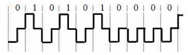

_____
### Что по определению может включать в себя ЭВМ (компьютер)?
* один центральный процессор

* устройства ввода/вывода
* оперативная память
* процессоры ввода/вывода
_____
### Что по определению может включать в себя вычислительный комплекс?
* два и более центральных процессоров

* устройства ввода/вывода
* оперативная память
* процессоры ввода/вывода
_____
### Что по определению может включать в себя вычислительная система?
* ровно один центральный процессор
* устройства ввода/вывода
* оперативная память
* процессоры ввода/вывода
* базы данных
* операционная система
* прикладные программы
* два и более центральных процессоров
_____
### Что по определению могут включать в себя средства телекоммуникаций?
* узлы связи
* каналы связи
_____
### Что по определению может включать в себя ЭВМ (компьютер)?
* технические средства
* только один из прочих вариантов ответа правильный
_____
### Выберите корректные утверждения.
* Вычислительный комплекс - это совокупность технических средств, содержащих более одного центрального процессора.
* Вычислительная система - это совокупность технических и программных средств.
* Вычислительная машина (компьютер) - это совокупность технических средств.
_____
### В чем отличие информации от данных? Выберите верные утверждения.
* Данные могут не содержать информацию
* Мерой данных является объем
* Мерой информации является энтропия
_____
### Как называется совокупность средств вычислительной техники, объединенных с помощью средств телекоммуникаций?
* сеть ЭВМ
* компьютерная сеть
_____
### Основной целью построения вычислительного комплекса является обеспечение ... (закончите фразу)
* высокой надежности и/или производительности
_____
### В чём принято измерять системную производительность вычислительной системы?
* задач в секунду
### В чём принято измерять производительность вычислительной системы?
* задач в секунду
_____
### В чём принято измерять производительность компьютера (вычислительной машины)?
* MFLOPS
* MIPS
_____
### Что по определению включает в себя канал связи?
* линия связи
* каналообразующее оборудование
* аппаратура передачи данных
_____
### Укажите, что из перечисленного может использоваться в качестве узла связи компьютерной сети.
* мост
* шлюз
* маршрутизатор
* коммутатор
_____
### Что принято называть программными средствами вычислительной системы?
* системное программное обеспечение
* прикладное программное обеспечение
_____
### Что принято относить к информационному обеспечению (dataware) вычислительной системы?
* база данных
* система управления базой данных
_____
### Укажите основные функции узла связи в компьютерной сети?
* маршрутизация
* коммутация
* мультиплексирование
* демультиплексирование
_____
### Как называется процесс установления физического или логического соединения между входным и выходным портами узла связи?
* коммутация
* Коммутация
* коммутацией
_____
### Как называется процесс выбора выходного порта в узле компьютерной сети при определении направления передачи данных?

*В качестве ответа введите одно слово в именительном падеже единственного числа.
* маршрутизация
* Маршрутизация
* маршрутизацией
_____
### Как называется процесс объединения нескольких входящих в узел потоков данных в один выходящий из узла поток?
* мультиплексирование
* Мультиплексирование
* мультиплексированием
* multiplexing
* Multiplexing
_____
### Как называется процесс разделения одного входящего в узел потока данных на несколько выходящих из узла потоков?
* демультиплексирование
* Демультиплексирование
* демультиплексированием
* demultiplexing
* Demultiplexing
_____
### Какие поля в общем случае содержатся в сообщении, передаваемом по компьютерной сети?
* данные
* заголовок
* концевик
_____
### Укажите, что является узлом компьютерной сети.
* маршрутизатор
* центр обработки данных
* коммутатор
_____
### Что обозначает аббревиатура PAN?
* Персональная сеть
_____
### Установите соответствие русских терминов англоязычным аббревиатурам.
* LAN ::: локальная сеть
* MAN ::: городская сеть
* PAN ::: персональная сеть
* WAN ::: глобальная сеть
_____
### Укажите, каких типов бывают компьютерные сети в зависимости от их назначения.
* вычислительные
* информационные
* информационно-вычислительные
* информационно-управляющие
_____
### Как называется компьютерная сеть, которая используется для объединения телефонов, карманных ПК, смартфонов?
* PAN
_____
### Какие технологии используются для построения PAN?
* Bluetooth
* Zigbee
_____
### Что обозначает аббревиатура MAN?
* Городская вычислительная сеть
_____
### Что обозначает аббревиатура LAN?
* Локальная вычислительная сеть
_____
### Что обозначает аббревиатура WAN?
* Глобальная вычислительная сеть
_____
### Как называется компьютерная сеть, представляющая собой логичесое объединение узлов, которые физически могут находиться в разных локальных сетях?
* Виртуальная частная сеть
* VPN
_____
### Какие технологии используются для построения LAN?
* Ethernet
* Token Ring
_____
### Какие технологии используются для построения MAN?
* IEEE 802.16 (WiMAX)
_____
### Какие технологии используются для построения WAN?
* ATM
* MPLS
_____
### Какие данные являются в исходном виде дискретными?
* телеграфные
* компьютерные
_____
### Какие данные являются в исходном виде непрерывными?
* разговорная речь
* видео
* температура воздуха в помещении
* уровень воды в Неве
_____
### Какой спектр частот имеют аудиоданные (с музыкой)?
* от 20 Гц до 20 кГц
_____
### В чём отличие аудиоданных от телефонных?
* у аудиоданных более широкий спектр
_____
### Какой спектр частот имеют голосовые данные?
* от 80 Гц до 12 кГц
_____
### Какой спектр частот имеют видеоданные?
* от 40 Гц до 6000 кГц
_____
### В какой полосе частот передаются данные в каналах тональной частоты?
* от 300 Гц до 3400 Гц
_____
### Какие требования предъявляются к организации компьютерных сетей?
* Открытость
* Гибкость
* Совместимость
* Масштабируемость
* Эффективность
_____
### Возможность включения дополнительных компонентов в компьютерную сеть без изменения существующих технических и программных средств называется ...
* открытостью
_____
### Сохранение работоспособности при изменении структуры вычислительной сети в результате выхода из строя отдельных компонентов или при замене оборудования называется ...
* гибкостью
_____
### Возможность работы в сети оборудования разного типа и разных производителей называется ...
* совместимостью
_____
### Способность компьютерной сети увеличивать свою производительность при добавлении узлов и каналов связи называется...
* масштабируемостью

### Способность компьютерной сети не снижать свою производительность при добавлении узлов и каналов связи называется...
* масштабируемостью
_____
### Обеспечение требуемого качества обслуживания пользователей компьютерной сети при минимальных затратах называется ...
* эффективностью
_____
### Укажите номера уровней OSI-модели.
* Сетевой уровень ::: 3
* Уровень представления ::: 6
* Физический уровень ::: 1
* Транспортный уровень ::: 4
* Прикладной уровень ::: 7
* Сеансовый уровень ::: 5
* Канальный уровень ::: 2
_____
### Как называются уровни OSI-модели?
* 5 ::: сеансовый
* 7 ::: прикладной
* 1 ::: физический
* 4 ::: транспортный
* 2 ::: канальный
* 6 ::: представления
* 3 ::: сетевой
_____
### Установите соответствие между русскоязычными и англоязычными названиями уровней OSI-модели
* физический уровень ::: physical layer (PHY)
* канальный уровень ::: data link layer
* сетевой уровень ::: network layer
* транспортный уровень ::: transport layer
* сеансовый уровень ::: session layer
* уровень представления ::: presentation layer
* прикладной уровень ::: application layer
_____
### Как называется первый уровень OSI-модели?
*В качестве ответа введите одно слово (прилагательное в именительном падеже)
* физический
* Физический
* physical
* PHY
_____
### Как называется второй уровень OSI-модели?
*В качестве ответа введите одно слово (прилагательное в именительном падеже)
* канальный
* Канальный
* data link
_____
### Как называется третий уровень OSI-модели?
*В качестве ответа введите одно слово (прилагательное в именительном падеже)
* сетевой
* Сетевой
* network
* Network
_____
### Как называется четвёртый уровень OSI-модели?
*В качестве ответа введите одно слово (прилагательное в именительном падеже)
* транспортный
* Транспортный
* transport
* Transport

_____
### Как называется пятый уровень OSI-модели?
*В качестве ответа введите одно слово (прилагательное в именительном падеже)
* сеансовый
* Сеансовый
* сессионный
* Сессионный
* session
* Session
_____
### Как называется шестой уровень OSI-модели?
* представления
* Представления
* представительский
* Представительский
* Presentation
* presentation
_____
### Как называется седьмой уровень OSI-модели?
*В качестве ответа введите одно слово (прилагательное в именительном падеже)
* прикладной
* Прикладной
* Application
* application
_____
### Какая основная задача решается на 3-м уровне OSI-модели?
* Маршрутизация
_____
### Какая основная задача решается на 2-м уровне OSI-модели?
* управление доступом к среде передачи данных
_____
### На каком уровне OSI-модели решается задача управления доступом к среде передачи данных?
* канальном
_____
### Сколько уровней содержит OSI-модель?
* 7
* семь
* Семь
_____
### На каком уровне OSI-модели реализуются методы доступа к среде передачи?
* 2
* канальный
* канальном
* Канальный
* на канальном
_____
### На каком уровне OSI-модели реализуются методы маршрутизации?
* 3
* сетевой
* Сетевой
* сетевом
* на сетевом
_____
### На каком уровне OSI-модели реализуется ...?
* контроль последовательности прохождения пакетов ::: транспортный
* управление маршрутизацией ::: сетевой
* управление доступом сетевых устройств к среде передачи ::: канальный
* модуляция сигнала, передаваемого по среде ::: физический
* интерфейс между программой пользователя и системой связи ::: прикладной
* кодирование передаваемых сигналов ::: физический
* шифрование и дешифрование данных ::: представления
_____
### На какие подуровни разбивается в IEEE-модели канальный уровень?
* MAC
* LLC
_____
### Подуровень управления доступом к среде передачи - это ...
* MAC
_____
### Подуровень управления логическим соединением - это ...
* LLC
_____
### Какие типы сервисов обеспечивает LLC-подуровень канального уровня?
* сервис без установления соединения и без подтверждения доставки
* сервис без установления соединения с подтверждением доставки
* сервис с установлением соединения
_____
### Как называется соглашение о взаимодействии между уровнями одной системы, определяющее структуру данных и способ обмена данными между соседними уровнями?

*В качестве ответа введите одно слово в именительном падеже единственного числа.
* интерфейс
* Интерфейс
* интерфейсом
* Интерфейсом
_____
### Как называется совокупность правил, регламентирующих формат и процедуры взаимодействия процессов одноимённых уровней на основе обмена сообщениями?

*В качестве ответа введите одно слово в именительном падеже единственного числа.
* протокол
* Протокол
* протоколом
* Протоколом

_____
### На каком уровне (название) OSI-модели реализуются методы маршрутизации?
* Сетевой
* сетевой
* сетевом
* на сетевом
* Сетевом
* На сетевом
_____
### На каком уровне (название) OSI-модели используются MAC-адреса?
* Канальном
* канальном
* канальный
* Канальный
* на канальном
* На канальном
_____
### На каком уровне (название) OSI-модели появляется используется МАС-адрес?
* Канальный
* канальный
* канальном
* Канальном
* на канальном
* На канальном
_____
### Что такое МАС-адрес?
* Физический адрес
_____
### Сколько устройств в Интернете может иметь одинаковый универсальный MAC-адрес?
* 1
_____
### Что такое ISO?
* Международная организация по стандартизации
_____
### Что такое OSI?
* Модель взаимодействия открытых систем
_____
### Какие уровни OSI-модели относятся к высшим уровням?
* транспортный
* сеансовый
* представления
* прикладной
_____
### Какие уровни OSI-модели относятся к низшим уровням?
* физический
* канальный
* сетевой
_____
### Интерфейсы подразделяются на:
* схемные
* программные
_____
### Какие из перечисленных характеристик используются для описания сетевых протоколов?
* логическая
* процедурная
_____
### На каком уровне OSI-модели используются IP-адреса?

*В качестве ответа введите целое число
* 3
_____
### PDU - это ...
* Протокольный блок данных
_____
### Пусть некоторое приложение собирается передать сообщение в компьютерную сеть.Что будет происходить с PDU, содержащим это сообщение?
* Размер PDU будет увеличиваться
* PDU будет продвигаться от 7-го уровня к 1-му
_____
### Какая англоязычная аббревиатура соответствует термину "протокольный блок данных"?
* PDU
* pdu
* ЗВГ
_____
### Как называется блок данных, передаваемый на канальном уровне?
* Кадр
_____
### Как называется блок данных, передаваемый на канальном уровне?
* кадр
* кадром
* Кадр
* Кадром
* frame
* Frame
_____
### Как называется блок данных, передаваемый на сетевом уровне?
* пакет
* Пакет
* packet
* Packet
_____
### Установите соответствие между русскими и английскими терминами.
* кадр ::: frame
* пакет ::: packet
* дейтаграмма ::: datagram
* сообщение ::: message
_____
### Что является корректным МАС-адресом?
* 00-1А-F4-05-56-67
_____
### Что является корректным МАС-адресом?
* 00-01-05-99-95-00
* 01-AA-BB-CC-DD-EF
* 2F-01-05-95-91-90
_____
### Что не может являться МАС-адресом?
* 00-12-AA-CD-RH-34
* AA-BB-CC-DD-EE-FF
* 00-00-00-3A-D4-F5
* 5F-11-22-33-44-55
_____
### Что не может являться МАС-адресом?
* 12-24-99-0Х-FA-08
* 45-16-A1-B2-C3-00
* 02-00-16-71-11-17-11
* 42-16-A1-B2-C3-D4
_____
### Как называется представленная на рисунке топология?

* Полносвязная
_____
### Как называется представленная на рисунке топология?

* Многосвязная
_____
### Как называется представленная на рисунке топология?

* Многосвязная
_____
### Как называется представленная на рисунке топология?

* Звезда
_____
### Как называется представленная на рисунке топология?

* Кольцо
_____
### Как называется представленная на рисунке топология?

* Общая шина
_____
### В каких единицах обычно измеряется длина маршрута доставки сообщений при сравнении разных топологий?

*В качестве ответа введите одно слово с маленькой буквы в именительном падеже единственного числа.
* хоп
* хопы
* в хопах
* hop
_____
### Какие характеристики используются при сравнении разных топологий сети передачи данных?
* производительность сети (возможное снижение эффективной скорости передачи данных из-за конфликтов)
* время доставки сообщений (или длина маршрута)
* стоимость, зависящая как от состава оборудования, так и от сложности реализации
* надежность, определяемая наличием альтернативных путей
* сложность (простота) структурной и функциональной организации
_____
### Какая топология обеспечивает минимальное время доставки сообщений?
* Полносвязная
_____
### Какая топология СПД обладает максимальной надежностью?
* Полносвязная
_____
### Какая топология является самой простой и дешевой?
* Общая шина
_____
### Выберите верные утверждения.
* Физическая топология полностью определяется структурой связи узлов
* Логическая топология зависит от последовательности передачи данных между узлами
* Физическая топология сети "Кольцо" может совпадать с "Полносвязной" при некотором количестве узлов в сети
_____
### Чему равно количество каналов связи в сети с топологией "Дерево", состоящей из 10 узлов?

*В качестве ответа введите целое число
* 9

_____
### Чему равно количество каналов связи в сети с топологией "Дерево", состоящей из 15 узлов?

*В качестве ответа введите целое число
* 14
_____
### Чему равно количество каналов связи в сети с топологией "Звезда", состоящей из 10 узлов?

*В качестве ответа введите целое число
* 9

_____
### Чему равно количество каналов связи в сети с топологией "Звезда", состоящей из 15 узлов?

*В качестве ответа введите целое число
* 14
_____
### Чему равно количество каналов связи в сети с топологией "Кольцо", состоящей из 10 узлов?

*В качестве ответа введите целое число
* 10
_____
### Чему равно количество каналов связи в сети с топологией "Кольцо", состоящей из 15 узлов?

*В качестве ответа введите целое число
* 15
_____
### Чему равно количество каналов связи в сети с топологией "Полносвязная", состоящей из 10 узлов?

*В качестве ответа введите целое число
* 45
_____
### Чему равно количество каналов связи в сети с топологией "Полносвязная", состоящей из 15 узлов?

*В качестве ответа введите целое число
* 105
_____
### Чему равно количество каналов связи в сети с топологией "Полносвязная", состоящей из 20 узлов?

*В качестве ответа введите целое число
* 190
_____
### В сети с топологией "Кольцо" 24 компьютера. Чему равна средняя длина маршрута доставки сообщений в такой сети, если пакеты могут двигаться только в одном направлении?

*В качестве ответа укажите целое число хопов.
* 12
_____
### В сети с топологией "Кольцо" 12 компьютеров. Чему равна средняя длина маршрута доставки сообщений в такой сети, если пакеты могут двигаться только в одном направлении?

*В качестве ответа укажите целое число хопов.
* 6
_____
### В сети с топологией "Кольцо" 7 компьютеров. Чему равна средняя длина маршрута доставки сообщений в такой сети, если пакеты могут двигаться в обоих направлениях и всегда двигаются по кратчайшему маршруту?

*В качестве ответа укажите целое число хопов.
* 2
_____
### В сети с топологией "Кольцо" 23 компьютера. Чему равна средняя длина маршрута доставки сообщений в такой сети, если пакеты могут двигаться обоих направлениях и всегда двигаются по кратчайшему маршруту?

*В качестве ответа укажите целое число хопов.
* 6
_____
### Какие способы коммутации используются в компьютерных сетях?
* коммутация пакетов
* коммутация ячеек
* коммутация каналов
* коммутация сообщений
_____
### Какой способ коммутации используется в традиционных (аналоговых) телефонных сетях?
* коммутация каналов
_____
### Какие способы коммутации используют промежуточное хранение передаваемых данных?
* коммутация сообщений
* коммутация пакетов
* коммутация ячеек
_____
### При каком способе коммутации каналы связи должны иметь одинаковые пропускные способности на всем пути передачи?
* Коммутация каналов
_____
### Какой способ коммутации эффективен при передаче больших объемов данных?
* коммутация каналов
_____
### Какой способ коммутации непременно требует установления соединения?
* коммутация каналов
_____
### Что относится к достоинствам коммутации каналов?
* возможность использования существующих телефонных каналов
* не требуется память в транзитных узлах для хранения сообщений
* высокая эффективность при передаче больших объемов данных
_____
### Что относится к недостаткам коммутации каналов?
* каналы связи должны иметь одинаковые пропускные способности на всем пути передачи
* большие накладные расходы на установление соединения
_____
### Какими преимуществами обладает коммутация сообщений по сравнению с коммутацией каналов?
* не требуется предварительное установление соединения
* каналы связи на всем пути передачи могут иметь разные пропускные способности
_____
### Какими недостатками обладает коммутация сообщений по сравнению с коммутацией каналов?
* необходимость хранения передаваемых сообщений в промежуточных узлах, что требует значительной ёмкости памяти при разных длинах передаваемых сообщений.
* задержка в промежуточных узлах может оказаться значительной
_____
### Какими недостатками обладает коммутация сообщений по сравнению с коммутацией пакетов?
* большее время доставки сообщений
* большие затраты буферной памяти в промежуточных узлах
* менее эффективная организация надежной передачи данных
_____
### Какими преимуществами обладает коммутация сообщений по сравнению с коммутацией пакетов?
* меньшие накладные расходы на анализ заголовков
* не требуется сборка сообщения в узле назначения
_____
### Какими преимуществами обладает коммутация пакетов по сравнению с коммутацией сообщений?
* меньше время доставки сообщений
* более эффективное использование буферной памяти
* более эффективная организация надежной передачи данных
_____
### Какими недостатками обладает коммутация пакетов по сравнению с коммутацией сообщений?
* более высокие накладные расходы на анализ заголовков
* необходимость сборки из пакетов в узле назначения
_____
### Чем обусловлен тот факт, что при коммутации пакетов буферная память используется более эффективно, чем при коммутации сообщений?
* ограниченным размером пакетов
_____
### За счёт чего время доставки сообщений при коммутации пакетов меньше, чем при коммутации сообщений?
* разные пакеты одного и того же собщения передаются параллельно по разным каналам
_____
### При каком способе коммутации затраты на буферную память в узлах оказываются наибольшими?
* коммутация сообщений
_____
### Почему коммутация пакетов обеспечивает более эффективную организацию надежной передачи данных, чем коммутация сообщений?
* контроль передаваемых данных осуществляется для каждого пакета
* в случае обнаружения ошибки переприему подлежит только один пакет
_____
### Основные достоинства коммутации ячеек?
* маленькие задержки ячеек в узлах
* не монополизируется канал связи
* быстрая обработка заголовка ячейки в узлах, поскольку местоположение заголовка строго фиксировано
* более эффективная, по сравнению с коммутацией пакетов, организация буферной памяти и надежной передачи данных
_____
### Основной недостаток коммутации ячеек?
* большие накладные расходы на передачу заголовка
_____
### Какой способ коммутации является основным в современных компьютерных сетях?
* коммутация пакетов
_____
### Какие способы коммутации являются основными и наиболее широко используемыми в компьютерных сетях?
* каналов
* пакетов
_____
### Какими способами в компьютерной сети может быть реализована коммутация пакетов?
* дейтаграммный
* виртуальный канал
_____
### Как называется способ передачи данных, при котором пакеты одного и того же сообщения могут передаваться между двумя взаимодействующими абонентами по разным маршрутам?

*В качестве ответа введите прилагательное в именительном падеже единственного числа с маленькой буквы
* дейтаграммном
_____
### Как называется способ передачи данных, при котором пакеты одного и того же сообщения приходят в конечный узел в произвольной последовательности?

*В качестве ответа введите прилагательное в именительном падеже единственного числа с маленькой буквы
* дейтаграммном
_____
### Какими достоинствами обладает дейтаграммный способ передачи пакетов?
* простота организации и реализации передачи данных - каждый пакет сообщения передается независимо от других пакетов
* каждый пакет выбирает наилучший путь
_____
### Какими недостатками обладает способ передачи пакетов "виртуальный канал"?
* наличие накладных расходов на установление соединения
* неэффективное использование ресурсов сети
_____
### Основной недостаток дейтаграммного способа передачи данных?
* усложняется процесс сборки сообщения из пакетов, т.к. они могут приходить в конечный узел в произвольном порядке
_____
### При каком способе передачи пакеты передаются в сети по одному и тому же маршруту?
* Виртуальный канал
_____
### При каком способе передачи пакеты одного и того же сообщения передаются в сети по разным маршрутам?
* Дейтаграммный
_____
### Какие методы маршрутизации относятся к простым?
* лавинообразные
* по предыдущему опыту
* случайные
_____
### Какие методы маршрутизации относятся к фиксированным?
* однопутевые
* многопутевые
_____
### Какие методы маршрутизации относятся к адаптивным?
* локальные
* централизованные
* распределённые
_____
### В каком методе маршрутизации изменение маршрутной таблицы зависит от состояний выходных буферов данного узла (маршрутизатора) и не зависит от состояния соседних узлов?
* локальный
_____
### В каком методе маршрутизации изменение маршрутной таблицы зависит от состояний соседних узлов (маршрутизаторов)?
* распределённый
_____
### В каком методе маршрутизации изменение маршрутной таблицы осуществляется на основе анализа адресов отправителей пакетов?
* по предыдущему опыту
_____
### Что изображено на рисунке?

*В качестве ответа введите два слова

* маршрутная таблица
* таблица маршрутизации
* Маршрутная таблица
* Таблица маршрутизации
_____
### Интервал времени, в течение которого узел сети, передавший пакет, ожидает подтверждения - это…
* Таймаут
_____
### Из какого условия обычно определяется величина тайм-аута при единичной ширине окна?
* минимум вдвое больше, чем время передачи кадра
_____
### Какие особенности присущи сетевому компьютерному трафику?
* неоднородность потока данных
* разные требования к качеству передачи данных разных типов
* возникновение периодов перегрузок
* нестационарность трафика
_____
### Какие цели преследует управление трафиком?
* обеспечение надежной передачи данных
* повышение эффективости загрузки оборудования сети
* обеспечение требуемого уровня задержек при передаче по сети
* предотвращение перегрузок и блокировок
_____
### Какая задача реализуется за счет механизмов квитирования и тайм-аута?
* надежная передача данных
_____
### Какая из представленных на графике зависимостей отражает влияние числа пакетов на производительность сети?

* 5

### Какая из представленных на графике зависимостей (номер) отражает зависимость производительности сети от числа пакетов в сети?

* 5
_____
### За счёт чего в телекоммуникационной сети обеспечивается надежная передача данных?
* за счет механизма квитирования
_____
### Как называется служебный кадр, подтверждающий, что данные переданы без ошибок?
* положительная квитанция
_____
### Как называется служебный кадр, свидетельствующий, что переданные данные содержат ошибку?
* отрицательная квитанция
_____
### Какой вид после реализации процедуры бит-стаффинг примет кадр:10111110111111011111110?
* 10 1111 1001 1111 0101 1111 0110 (без пробелов)
_____
### Какой вид после реализации процедуры бит-стаффинга примет кадр:11111011110111111111111?
* 11 1110 0111 1011 1110 1111 1011 (без пробелов)
_____
### Восстановите кадр, переданный в соответствии с процедурой бит-стаффинга и имеющий вид11111001111011111011111011 ?
* 111 1101 1110 1111 1111 1111 (без пробелов)
_____
### Восстановите кадр, переданный в соответствии с процедурой бит-стаффинга и имеющий вид100110111110001111101 ?
*  100 1101 1111 0011 1111 (без пробелов)
_____
### Основное назначение "механизма скользящего окна"?
* увеличить загрузку канала связи
_____
### Что такое "ширина окна"?
* максимальное число кадров, которые могут быть переданы без подтверждения
_____
### Ширина окна равна 128. Передающий узел, передавший 36-й кадр, получил подтверждение о приёме 28-го кадра. Какое максимальное число кадров может ещё передать узел без подтверждения?
* 120
_____
### Ширина окна равна 128. Передающий узел, передавший 39-й кадр, получил подтверждение о приёме 38-го кадра. Какое максимальное число кадров может ещё передать узел без подтверждения?
* 127
_____
### Ширина окна равна 8. Передающий узел, передавший 5-й кадр, получил подтверждение о приёме 3-го кадра. Какое максимальное число кадров может ещё передать узел без подтверждения?
* 6
_____
### Ширина окна равна 16. Передающий узел, передавший 6-й кадр, получил подтверждение о приёме 5-го кадра. Какое максимальное число кадров может ещё передать узел без подтверждения?
* 15
_____
### Какая из перечисленных задач реализуется за счет применения механизма окна?
* увеличение загрузки канала связи
_____
### В каких единицах принято измерять пропускную способность каналов связи в сетях ЭВМ?
* [bps]
* [килобит*секунд]
_____
### Чему соответствует пропускная способность канала связи в 100 кбит/с?
* 100 000 бит/с
_____
### Установите соответствие между значениями.
* 1 кбит/с ::: 1 000 бит/с
* 1 Мбит/с ::: 1 000 000 бит/с
* 1 Тбит/с ::: 1 000 000 000 000 бит/с
* 1 Гбит/с ::: 1 000 000 000 бит/с
* 1 Пбит/с ::: 1 000 000 000 000 000 бит/с
_____
### Выберите корректно заданные значения пропускных способностей канала связи в компьютерной сети?
* 128 кбит/с
* 10 Мбит/с
* 1 Гбит/с
_____
### Укажите некорректно заданные значения пропускных способностей канала связи в компьютерной сети?
* 100 Кбит/с
* 256 кбайт/с
* 512 Кбайт/с
* 10 мбит/с
_____
### Какой стек протоколов разработан компанией IBM и предназначен для удаленной связи с большими компьютерами?
* SNA
_____
### Как называется множество протоколов разных уровней одной сетевой технологии?
* стек
* стек протоколов
* Стек
* Стек протоколов
_____
### Что являеся сетевыми стеками протоколов?
* TCP/IP
* XNS
* IPX
* AppleTalk
* DECnet
* SNA
_____
### Сколько уровней содержит стек протоколов TCP/IP?
* 4
_____
### Пусть некоторое приложение вот-вот получит сообщение из компьютерной сети.Что будет происходить с PDU, содержащим это сообщение, при продвижении PDU по интерфейсам между уровнями OSI-модели?
* Размер PDU будет уменьшаться
* PDU будет продвигаться от 1-го уровня к 7-му
_____
### Как называется преобразование данных в вид, позволяющий передавать их по выбранному каналу связи и обнаруживать ошибки, возникающие из-за помех при их передаче в этом канале связи?
* кодирование
* Кодирование
* Кодированием
* кодированием
_____
### Какие типы сигналов используются в компьютерных сетях для передачи данных?
* электрические
* электромагнитные
* оптические
_____
### Какие типы сигналов для передачи данных не используются в компьютерных сетях ?
* акустические
* логические
_____
### Как называется способность системы противостоять воздействию помех?
* помехоустойчивость
* Помехоустойчивость
* помехозащищенность
* Помехозащищенность
_____
### Как называется количество данных, которое может быть передано по каналу связи за единицу времени?
* пропускная способность канала связи
_____
### В каких единицах принято измерять пропускную способность канала связи в компьютерных сетях?
* кбит/с
_____
### bps - это единица измерения ...
* пропускной способности канала
_____
### BER - это ...
* интенсивность битовых ошибок
_____
### Канал связи, предоставляемый на определённое время, называется ...
* Коммутируемым
_____
### Канал связи, существующий постоянно между двумя пользователями, называется ...
* Выделенным
_____
### Канал связи, по которому возможна передача только в одном направлении, называется ...
* симплексным
* симплексный
* Симплексный
* Симплексным
* simplex
_____
### Канал связи, по которому возможна одновременная передача в обоих направлениях, называется ...
* дуплексный
* дуплексным
* Дуплексный
* Дуплексным
* duplex
_____
### Канал связи, по которому возможна передача в обоих направлениях, но в разные моменты времени, называется ...
* полудуплексным
* полудуплексный
* Полудуплексным
* Полудуплексный
* half-duplex
* halfduplex
* half duplex
_____
### Раскрыть обозначения элементов на схеме аналогового канала связи, предназначенного для передачи дискретных сообщений (на рисунке: ИС - источник сообщений, ПС - приёмник сообщений).

*  ::: дискретный (двоичный) сигнал
*  ::: непрерывный сигнал
*  ::: модулятор
*  ::: демодулятор
*  ::: фильтр
*  ::: линия связи
_____
### Раскрыть обозначения элементов на схеме дискретного (цифрового) канала связи (на рисунке: ИДС - источник дискретных сообщений; ПДС - приёмник дискретных сообщений).

*  ::: устройство сопряжения с КС
*  ::: устройство защиты от ошибок
*  ::: устройство преобразования сигналов
*  ::: линия связи
_____
### Для обеспечения требуемых динамических и частотных свойств передаваемого сигнала в непрерывном канале связи используются ...
* фильтры
_____
### В каких единицах измеряется усиление и ослабление сигнала?
* дБ
_____
### Мощность сигнала уменьшилась в 100 раз. Чему равно изменение сигнала?
* -20 дБ
_____
### Мощность сигнала уменьшилась в 10000 раз. Чему равно изменение сигнала?
* -40 дБ
_____
### Мощность сигнала уменьшилась в 1000 раз. Чему равно изменение сигнала?
* -30 дБ
_____
### Как называется отношение выходной мощности сигнала ко входной?
* коэффициент передачи
* коэффициентом передачи
* Коэффициент передачи
* Коэффициентом передачи
_____
### Во сколько раз уменьшится мощность сигнала на расстоянии 100 м, если его ослабление равно: d=100 дБ/км?
* 10
_____
### Во сколько раз уменьшится мощность сигнала на расстоянии 50 м, если его ослабление равно: d=20 дБ/100 м?
* 10
_____
### Во сколько раз уменьшится мощность сигнала на расстоянии 2000 м, если его ослабление равно: d=10 дБ/км?
* 100
_____
### Во сколько раз уменьшится мощность сигнала на расстоянии 3 км, если его ослабление равно: d=10 дБ/км?
* 1000
_____
### В чем состоит удобство вычисления затухания в децибелах?
* при каскадном включении нескольких устройств затухания в децибелах складываются
_____
### Гармоническое колебание задано уравнением F(t) = X*sin(Y*t + Z). Что такое Z?
* фаза
_____
### Гармоническое колебание задано уравнением F(t) = X*sin(Y*t + Z). Что такое X?
* амплитуда
_____
### Какой спектр частот имеют дискретные сигналы?
* Бесконечный
_____
### В каких единицах измеряется линейная частота?
* Гц
_____
### Единица измерения линейной частоты - это ...
* Гц
* Герц
* Hz
* Herz
* герц
_____
### Как называется единица измерения линейной частоты?
* Герц
* Гц
* Herz
* Hz
_____
### Какие параметры гармонического сигнала могут нести информацию?
* амплитуда
* фаза
* частота
_____
### Какие утверждения являются верными?
* спектр - характеристика сигнала
* полоса пропускания - характеристика среды передачи
* для корректной передачи сигнала полоса пропускания должна быть шире спектра
_____
### Какие утверждения являются неверными?
* спектр - характеристика среды передачи
* полоса пропускания - характеристика сигнала
* для корректной передачи сигнала спектр должен быть больше полосы пропускания
* для корректной передачи сигнала спектр может быть как больше, так и меньше полосы пропускания
_____
### Выберите правильные утверждения
* Спектр - это характеристика сигнала.
* Полоса пропускания - это характеристика канала связи.
_____
### Полоса пропускания - это характеристика ...
* среды передачи
_____
### В каких единицах измеряется спектр?
* Гц
* Герц
* Hz
* Herz
_____
### В каких единицах измеряется полоса пропускания?
* Гц
* Герц
* Hz
* Herz
_____
### При каком условии обеспечивается качественная передача сигнала?
* Спектр сигнала меньше полосы пропускания
_____
### Какую ширину полосы пропускания (в Гц) имеет телефонный канал? Ответ округлите до целых.
* 3100
_____
### Какую ширину полосы пропускания (в кГц) имеет телефонный канал? Ответ округлить до 1-го знака после запятой.
* 3,1
* 3.1
_____
### В каком интервале находится полоса пропускания телефонного канала?
* От 300 до 3400 Гц
_____
### Какие данные являются в исходном виде дискретными?
* телеграфные
* компьютерные
_____
### Какие данные являются в исходном виде непрерывными?
* разговорная речь
* видео
* температура воздуха в помещении
* уровень воды в Неве
_____
### Какой спектр частот имеют аудиоданные / голосовые данные / видеоданные? В какой полосе частот передаются данные в каналах тональной частоты?
* от 20 Гц до 20 кГц
_____
### В чём отличие аудиоданных от телефонных?
* более широкий спектр
_____
### Рассчитать максимально возможную пропускную способность (кбит/с) канала связи при условии, что полоса пропускания равна 100 МГц, а мощность сигнала равна мощности шума.
* 100.000 (без точки)
_____
### Какой английской аббревиатурой обозначается отношение мощности передаваемого сигнала к мощности шума на линии связи?
* SNR
* snr
_____
### Какая формула позволяет рассчитать максимально возможную пропускную способность канала связи, зная его полосу пропускания и SNR?
* Формула Шеннона
_____
### Рассчитать максимально возможную пропускную способность (кбит/с) канала связи при условии, что полоса пропускания равна 100 МГц, а отношение мощности сигнала к мощности шума равно 3.
* 200.000 (без точки)
_____
### Рассчитать максимально возможную пропускную способность (Мбит/с) канала связи при условии, что полоса пропускания равна 100 МГц, а отношение мощности сигнала к мощности шума равно 3.
* 200
_____
### Рассчитать максимально возможную пропускную способность (бит/с) канала связи при условии, что полоса пропускания равна 100 МГц, а отношение мощности сигнала к мощности шума равно 3.
* 200.000.000 (без точки)
_____
### Рассчитать максимально возможную пропускную способность (бит/с) канала связи при условии, что полоса пропускания равна 20 МГц, а отношение мощности сигнала к мощности шума равно 3.
* 40.000.000 (без точки)
_____
### Рассчитать максимально возможную пропускную способность (кбит/с) канала связи при условии, что полоса пропускания равна 20 МГц, а отношение мощности сигнала к мощности шума равно 3.
* 40.000 (без точки)
_____
### Рассчитать максимально возможную пропускную способность (Мбит/с) канала связи при условии, что полоса пропускания равна 20 МГц, а отношение мощности сигнала к мощности шума равно 3.
* 40
_____
### Рассчитать максимально возможную пропускную способность (Мбит/с) канала связи при условии, что полоса пропускания равна 100 МГц, а отношение мощности сигнала к мощности шума равно 7.
* 300
_____
### Рассчитать максимально возможную пропускную способность (кбит/с) канала связи при условии, что полоса пропускания равна 100 МГц, а отношение мощности сигнала к мощности шума равно 7.
* 300.000 (без точки)
_____
### Рассчитать максимально возможную пропускную способность (бит/с) канала связи при условии, что полоса пропускания равна 100 МГц, а отношение мощности сигнала к мощности шума равно 7.
* 300.000.000 (без точки)
_____
### Рассчитать максимально возможную пропускную способность (бит/с) канала связи при условии, что полоса пропускания равна 10 МГц, а отношение мощности сигнала к мощности шума равно 15.
* 40.000.000 (без точки)
_____
### Рассчитать максимально возможную пропускную способность (кбит/с) канала связи при условии, что полоса пропускания равна 100 кГц, а отношение мощности сигнала к мощности шума равно 127.
* 700
_____
### Рассчитать максимально возможную пропускную способность (бит/с) канала связи при условии, что полоса пропускания равна 100 кГц, а отношение мощности сигнала к мощности шума равно 1023.
* 1.000.000 (без точки)
_____
### Изменение характеристик несущей в соответствии с информативным сигналом - это…
* модуляция
* Модуляция
_____
### Какие бывают методы модуляции?
* Амплитудная
* Фазовая
_____
### Какие бывают методы модуляции?
* Частотная
* Амплитудная
_____
### Какие из перечисленных методов модуляции используются для представления непрерывных данных в виде непрерывных сигналов?
* амплитудная
* частотная
_____
### Какие из перечисленных методов модуляции используются для представления непрерывных данных в виде дискретных сигналов?
* импульсно-кодовая
* амплитудно-импульсная
_____
### Какие из перечисленных методов модуляции используются для представления дискретных данных в виде непрерывных сигналов?
* амплитудная
* фазовая
* частотная
_____
### Какие методы модуляции представлены на рисунке?

* :: амплитудная
* :: частотная
* :: фазовая
_____
### От чего зависит спектр результирующего модулированного сигнала?
1>от метода модуляции
2>от скорости модуляции
_____
### Как называется аналоговый высокочастотный сигнал, подвергаемый модуляции в соответствии с некоторым информативным сигналом?
1>несущая
2>несущей
3>Несущая
4>Несущей
_____
### Чему равна скорость передачи речевых данных при использовании адаптивной дифференциальной импульсно-кодовой модуляции?
1>32 кбит/с
_____
### Чему равна скорость передачи речевых данных (бит/с) при использовании адаптивной дифференциальной импульсно-кодовой модуляции?
1>32000
_____
### Чему равна скорость передачи речевых данных (кбит/с) при использовании импульсно-кодовой модуляции?
1>64
_____
### Чему равна скорость передачи речевых данных (бит/с) при использовании импульсно-кодовой модуляции?
1>64000
_____
### При каком способе модуляции по каналу связи передается разность между текущим значением сигнала и предыдущим?
1>адаптивная дифференциальная импульсно-кодовая модуляция
_____
### Модуляция, при которой непрерывный сигнал представляется совокупностью дискретных сигналов с определенной амплитудой, называется ...
1>Амплитудно-импульсной модуляцией
_____
### Что такое АИМ?
1>Амплитудно-импульсная модуляция
_____
### Как называется метод модуляции, показанный на рисунке?

1>амплитудно-импульсная модуляция
2>амплитудно-импульсной модуляцией
3>амплитудно-импульсная
4>амплитудно-импульсной
5>АИМ
_____
### Чему равна частота квантования речевого сигнала в методе модуляции, показанном на рисунке? Ответ указать в Герцах.

1>8000
2>восемь тысяч
3>8 000
_____
### Что такое ИКМ?
1>Импульсно-кодовая модуляция

_____
### Модуляция, при которой аналоговый сигнал кодируется сериями импульсов, представляющими собой цифровые коды амплитуд в точках отсчета аналогового сигнала, называется ...
1>Импульсно-кодовой модуляцией

_____
### Как называется метод модуляции, показанный на рисунке?

1>импульсно-кодовая модуляция
2>импульсно-кодовой модуляцией
3>импульсно-кодовая
4>импульсно-кодовой
5>ИКМ
6>PCM
_____
### Чему равен интервал Δt квантования по времени в методе модуляции, показанном на рисунке, при использовании этого метода в телефонии? Ответ укажите в микросекундах.

1>125

_____
### Чему равен интервал квантования по времени Δt в методе модуляции, показанном на рисунке, при использовании этого метода в телефонии? Ответ укажите в миллисекундах.

1>0,125
2>0.125
3>1/8
_____
### Чему равно количество N уровней квантования по значению сигнала в методе модуляции, показанном на рисунке, при использовании этого метода в телефонии?

1>256
_____
### Какая минимальная пропускная способность необходима для передачи речевого сигнала с использованием метода модуляции, показанного на рисунке, при условии, что количество уровней квантования по значению сигнала равно 256, а интервал квантования по времени равен 125 мкс? Ответ укажите в кбит/с

1>64

_____
### Чему равна частота квантования речевого сигнала в методе модуляции, показанном на рисунке, при использовании этого метода в телефонии? Ответ указать в кГц

1>8
2>восемь
_____
### Чему равна частота квантования речевого сигнала в методе модуляции, показанном на рисунке, при использовании этого метода в телефонии? Ответ указать в Гц

1>8000
_____
### Какие коды применяют при цифровом кодировании дискретных данных?
1>потенциальные
2>импульсные
_____
### Какой метод кодирования изображен на рисунке?

1>RZ
_____
### Какие коды применяют при цифровом кодировании дискретных данных?
1>потенциальные
2>импульсные
_____
### Какой метод кодирования изображен на рисунке?

_____
### Какой метод кодирования изображен на рисунке?

1>NRZ
2>nrz
_____
### Какой метод кодирования изображен на рисунке?

1>AMI
_____
### Какой метод кодирования изображен на рисунке?

1>AMI
_____
### Какой метод кодирования изображен на рисунке?

1>Манчестерский
_____
### Какой метод кодирования изображен на рисунке?

1>MLT-3
_____
### Какой метод кодирования изображен на рисунке (англоязычная аббревиатура)?

1>MLT-3
2>MLT3
3>ЬДЕ-3
4>ЬДЕ3

_____
### Какой метод кодирования изображен на рисунке (англоязычная аббревиатура)?

1>PAM-5
2>PAM5
3>PAM 5
_____
### Что не является методом физического кодирования?
1>ISDN
_____
### Что является методом физического кодирования?
1>MLT-3
2>NRZ
_____
### Какой метод является методом логического кодирования?
1>4B/5B
_____
### Какие методы не относятся к методам логического кодирования?
1>MLT-3
2>РАМ-5
3>NRZI
_____
### Какими достоинствами обладает метод кодирования NRZ?
1>наличие только двух уровней потенциала
2>низкая частота основной гармоники
3>простота реализации
_____
### Какими недостатками обладает метод кодирования NRZ?
1>не обладает свойством самосинхронизации
2>наличие низкочастотной составляющей
_____
### Какими достоинствами обладает метод кодирования RZ?
1>обладает свойством самосинхронизации
2>отсутствие постоянной низкочастотной составляющей
_____
### Какими недостатками обладает метод кодирования RZ?
1>наличие трех уровней сигнала
2>спектр сигнала шире, чем у потенциальных кодов NRZ
_____
### В каких методах кодирования используются только два уровня сигнала?
1>NRZ
2>NRZI
3>Манчестерское кодирование
_____
### В каких методах кодирования используются три уровня сигнала?
1>RZ
2>AMI
3>MLT-3
_____
### В каких методах кодирования используется более двух уровней сигнала?
1>AMI
2>PAM-5
3>MLT-3
4>RZ
_____
### Какими достоинствами обладает манчестерское кодирование?
1>обладает свойством самосинхронизации
2>наличие только двух уровней сигнала
3>нет постоянной составляющей
_____
### Основной недостаток манчестерского кодирования?
1>спектр сигнала шире, чем у кода NRZ и кода AMI
_____
### Какими недостатками обладает метод кодирования MLT-3?
1>наличие трех уровней сигнала
2>отсутствие самосинхронизации
_____
### Сколько уровней сигнала используется для передачи данных в методе кодирования PAM-5?
1>4
_____
### В каком методе используется двухбитовое кодирование?
1>PAM-5
_____
### Какая битовая последовательность закодирована методом "Манчестер 2"?

_____
### Какая битовая последовательность закодирована методом "Манчестер 2"?

_____
### Какая битовая последовательность закодирована методом "Манчестер 2"?

_____
### Какая битовая последовательность закодирована методом "Манчестер 2"?

_____
### Какая битовая последовательность закодирована методом "MLT-3"?

_____
### Какая битовая последовательность закодирована методом "MLT-3"?

_____
### Какая битовая последовательность закодирована методом "MLT-3"?

_____
### Какая битовая последовательность закодирована методом "MLT-3"?

_____
### Какая битовая последовательность закодирована методом "РАМ-5"?

_____
### Какая битовая последовательность закодирована методом "РАМ-5"?

_____
### Какая битовая последовательность закодирована методом "РАМ-5"?

_____
### Выполнить скремблирование последовательности 10000001 с использованием сотношения:

_____
### Выполнить скремблирование последовательности 11000001
с использованием сотношения:

_____
### Выполнить скремблирование последовательности 10010001
с использованием сотношения:

_____
### Выполнить скремблирование последовательности 11111001
с использованием сотношения:

_____
### Выполнить скремблирование последовательности 10011111
с использованием сотношения:

_____
### Выполнить скремблирование последовательности 01000010
с использованием сотношения:

_____
### Выполнить скремблирование последовательности 11111001
с использованием сотношения:

_____
### Выполнить скремблирование последовательности 01111110
с использованием сотношения:

_____
### Какими достоинствами обладает избыточное кодирование?
1>код становится самосинхронизирующимся
2>исчезает постоянная составляющая

_____
### Какими недостатками обладает избыточное кодирование?
1>уменьшается полезная пропускная способность канала связи
2>дополнительные затраты времени на реализацию кодирования

_____
### Как называется способ улучшения потенциальных кодов, основанный на предварительном "перемешивании" исходной информации по определенному алгоритму с целью исключения длинных последовательностей нулей или единиц?
1>скремблирование
2>скрэмблирование
3>scrambling
4>Скремблирование
5>Скрэмблирование
6>Scrambling

_____
### Каким преимуществом обладает скремблирование по сравнению с избыточным кодированием?
1>выше полезная пропускная способность канала связи

_____
### Каким недостатком обладает скремблирование по сравнению с избыточным кодированием?
1>нет гарантии исключения длинных последовательностей нулей или единиц

_____
### Сколько избыточных (запрещённых) кодов содержится в методе логического кодирования 4В/5В?
1>16

_____
### Сколько избыточных (запрещённых) кодов содержится в методе логического кодирования 5В/6В?
1>32
_____
### Сколько избыточных (запрещённых) кодов содержится в методе логического кодирования 8В/10В?
1>768

_____
### Сколько избыточных (запрещённых) кодов содержится в методе логического кодирования 8В/6Т?
1>473

_____
### Чему равна избыточность (в процентах) логического кодирования 4В/5В?
1>25

_____
### Чему равна избыточность (в процентах) логического кодирования 5В/6В?
1>20

_____
### Чему равна избыточность (в процентах) логического кодирования 8В/10В?
1>25

_____
### Что такое FDM?
1>Частотное мультиплексирование

_____
### Что такое TDM?
1>Временное мультиплексирование

_____
### Что такое WDM?
1>Волновое мультиплексирование

_____
### Какие методы мультиплексирования используются в современных вычислительных сетях?
1>частотное мультиплексирование
2>временное мультиплексирование
3>волновое мультиплексирование

_____
### Какая англоязычная аббревиатура означает частотное мультиплексирование?
1>FDM
2>АВЬ

_____
### Какая англоязычная аббревиатура означает временно'е мультиплексирование?
1>TDM
2>ЕВЬ

_____
### Какая англоязычная аббревиатура означает волновое мультиплексирование?
1>WDM
2>ЦВЬ

_____
### Какие электрические кабели связи применяются в сетях передачи данных?
1>витая пара
2>коаксиальный кабель

_____
### Что относится к характеристикам линии связи?
1>полоса пропускания
2>помехоустойчивость
3>удельная стоимость

_____
### В каких единицах измеряется затухание сигнала?
1>дБ
2>децибел
3>децибелы

_____
### В каких единицах измеряется импеданс?
1>Ом
2>ом

_____
### С какой целью применяется скручивание электрических проводников?
1>с целью уменьшения излучения и повышения помехозащищенности кабеля

_____
### Иерархическая кабельная система здания или группы зданий, разделенная на структурные подсистемы, называется ...
1>структурированной кабельной системой

_____
### СКС - это ...
1>структурированная кабельная система

_____
### Какие недостатки присущи кабельным линиям связи (включая оптоволоконные)?
1>высокая стоимость арендуемых выделенных каналов
2>подверженность механическим воздействиям
3>невозможность организации мобильной связи

_____
### Кабель витой пары какой категории (номер) применяется в настоящее время наиболее широко?
1>5

_____
### Какую полосу пропускания (в МГц) имеют электрические кабели 3-й категории?
1>16

_____
### Какую полосу пропускания (в МГц) имеют электрические кабели 5-й категории?
1>100

_____
### Расположите (пронумеруйте) кабели в порядке возрастания их качества для передачи данных.
(+1) неэкранированная витая пара
(+1) экранированная витая пара
(+1) тонкий коаксиальный кабель
(+1) толстый коаксиальный кабель
(+1) многомодовый кабель
(+1) одномодовый кабель

_____
### Расположите (пронумеруйте) кабели в порядке убывания их качества для передачи данных.
(+1) одномодовый
(+1) многомодовый
(+1) толстый коаксиальный
(+1) тонкий коаксиальный
(+1) экранированная витая пара
(+1) неэкранированная витая пара

_____
### Какая англоязычная аббревиатура используется для неэкранированной витой пары?
(+1) UTP
(+1) ГЕЗ

_____
### Какая англоязычная аббревиатура используется для электрического кабеля с одним общим экраном для всех витых пар?
(+1) FTP

_____
### Какая англоязычная аббревиатура используется для электрического кабеля с экранированием каждой витой пары и с общим экраном для всех пар?
(+1) STP

_____
### Какие кабели на основе витой пары относятся к экранированным?
(+1) FTP
(+1) STP

_____
### Какие бывают типы коаксиального кабеля?
(+1) толстый
(+1) тонкий

_____
### Что представляет собой кабель UTP?
(+1) Неэкранированная витая пара

_____
### Что представляет собой кабель STP?
(+1) Экранированная витая пара

_____
### Неэкранированная витая пара - это ...
(+1) UTP

_____
### Экранированная витая пара - это ...
(+1) STP
(+1) FTP

_____
### Оптическое волокно, в котором передается только один луч, называется ...
(+1) одномодовым
(+1) одномодовое
(+1) одномодовое волокно

_____
### Оптическое волокно, в котором передается несколько лучей, называется ...
(+1) многомодовым
(+1) многомодовое

_____
### Какие достоинства присущи волоконно-оптическим кабелям?
(+1) высокая пропускная способность
(+1) отсутствие электромагнитного излучения
(+1) высокая помехоустойчивость
(+1) малый вес
(+1) высокое электрическое сопротивление, обеспечивающее гальваническую развязку

_____
### Какие недостатки присущи волоконно-оптическим кабелям?
(+1) трудоемкость монтажа, требующая специального оборудования
(+1) высокая стоимость сетевых устройств

_____
### Какими достоинствами обладают одномодовые оптические волокна по сравнению с многомодовыми?
(+1) меньше затухание
(+1) больше полоса пропускания

_____
### Какими недостатками обладают одномодовые оптические волокна по сравнению с многомодовыми?
(+1) дороже многомодовых
(+1) труднее ввести световой луч

_____
### Какими достоинствами обладают многомодовые оптические волокна по сравнению с одномодовыми?
(+1) более удобны при монтаже
(+1) дешевле

_____
### Какими недостатками обладают многомодовые оптические волокна по сравнению с одномодовыми?
(+1) большое затухание
(+1) меньше полоса пропускания

_____
### На каких длинах волн осуществляется передача сигналов по оптическому волокну?
(+1) 0,85 мкм
(+1) 1,31 мкм
(+1) 1,55 мкм

_____
### На каких длинах волн не осуществляется передача сигналов по оптическому волокну?
(+1) 2,95 мкм
(+1) 1,85 мкм
(+1) 0,55 мкм

_____
### Чему равен диаметр световодной жилы одномодового оптического волокна?
(+1) 8-10 мкм

_____
### Чему равен диаметр световодной жилы многомодового оптического волокна?
(+1) 50-60 мкм

_____
### В каких пределах находится затухание в оптических волокнах?
(+1) от 0,2 до 3 дБ/км

_____
### Чему равно значение длины волны L1 на графике, иллюстрирующем зависимость затухания от длины волны в оптическом волокне? Ответ укажите в микрометрах с точностью до второго знака после запятой.

_____
### Чему равно значение длины волны L2 на графике, иллюстрирующем зависимость затухания от длины волны в оптическом волокне? Ответ укажите в микрометрах с точностью до первого знака после запятой.

_____
### 

_____
### 

_____
### 

_____
### 

_____
### 

_____
### 

_____
### 

_____
### 

_____
### 

_____
### 

_____
### 

_____
### 

_____
### 

_____
### 

_____
### 

_____
### 

_____
### 

_____
### 

_____
### 

_____
### 

_____
### 

_____
### 

_____
### 

_____
### 

_____
### 

_____
### 

_____
### 

_____
### 

_____
### 

_____
### 

_____
### 

_____
### 

_____
### 

_____
### 

_____
### 

_____
### 

_____
### 

_____
### 

_____
### 

_____
### 

_____
### 

_____
### 

_____
### 

_____
### 

_____
### 

_____
### 

_____
### 

_____
### 

_____
### 

_____
### 

_____
### 

_____
### 

_____
### 

_____
### 

_____
### 

_____
### 

_____
### 

_____
### 

_____
### 

_____
### 

_____
### 

_____
### 

_____
### 

_____
### 

_____
### 

_____
### 

_____
### 

_____
### 

_____
### 

_____
### 

_____
### 

_____
### 

_____
### 

_____
### 

_____
### 

_____
### 

_____
### 

_____
### 

_____
### 

_____
### 

_____
### 

_____
### 

_____
### 

_____
### 

_____
### 

_____
### 

_____
### 

_____
### 

_____
### 

_____
### 

_____
### 

_____
### 

_____
### 

_____
### 

_____
### 

_____
### 

_____
### 

_____
### 

_____
### 

_____
### 

_____
### 

_____
### 

_____
### 

_____
### 

_____
### 

_____
### 

_____
### 

_____
### 

_____
### 

_____
### 

_____
### 

_____
### 

_____
### 

_____
### 

_____
### 

_____
### 

_____
### 

_____
### 

_____
### 

_____
### 

_____
### 

_____
### 

_____
### 

_____
### 

_____
### 

_____
### 

_____
### 

_____
### 

_____
### 

_____
### 

_____
### 

_____
### 

_____
### 

_____
### 

_____
### 

_____
### 

_____
### 

_____
### 

_____
### 

_____
### 

_____
### 

_____
### 

_____
### 

_____
### 

_____
### 

_____
### 

_____
### 

_____
### 

_____
### 

_____
### 

_____
### 

_____
### 

_____
### 

_____
### 

_____
### 

_____
### 

_____
### 

_____
### 

_____
### 

_____
### 

_____
### 

_____
### 

_____
### 

_____
### 

_____
### 

_____
### 

_____
### 

_____
### 

_____
### 

_____
### 

_____
### 

_____
### 

_____
### 

_____
### 

_____
### 

_____
### 

_____
### 

_____
### 

_____
### 

_____
### 

_____
### 

_____
### 

_____
### 

_____
### 

_____
### 

_____
### 

_____
### 

_____
### 

_____
### 

_____
### 

_____
### 

_____
### 

_____
### 

_____
### 

_____
### 

_____
### 

_____
### 

_____
### 

_____
### 

_____
### 

_____
### 

_____
### 

_____
### 

_____
### 

_____
### 

_____
### 

_____
### 

_____
### 

_____
### 

_____
### 

_____
### 

_____
### 

_____
### 

_____
### 

_____
### 

_____
### 

_____
### 

_____
### 

_____
### 

_____
### 

_____
### 

_____
### 

_____
### 

_____
### 

_____
### 

_____
### 

_____
### 

_____
### 

_____
### 

_____
### 

_____
### 

_____
### 

_____
### 

_____
### 

_____
### 

_____
### 

_____
### 

_____
### 

_____
### 

_____
### 

_____
### 

_____
### 

_____
### 

_____
### 

_____
### 

_____
### 

_____
### 

_____
### 

_____
### 

_____
### 

_____
### 

_____
### 

_____
### 

_____
### 

_____
### 

_____
### 

_____
### 

_____
### 

_____
### 

_____
### 

_____
### 

_____
### 

_____
### 

_____
### 

_____
### 

_____
### 

_____
### 

_____
### 

_____
### 

_____
### 

_____
### 

_____
### 

_____
### 

_____
### 

_____
### 

_____
### 

_____
### 

_____
### 

_____
### 

_____
### 

_____
### 

_____
### 

_____
### 

_____
### 

_____
### 

_____
### 

_____
### 

_____
### 

_____
### 

_____
### 

_____
### 

_____
### 

_____
### 

_____
### 

_____
### 

_____
### 

_____
### 

_____
### 

_____
### 

_____
### 

_____
### 

_____
### 

_____
### 

_____
### 

_____
### 

_____
### 

_____
### 

_____
### 

_____
### 

_____
### 

_____
### 

_____
### 

_____
### 

_____
### 

_____
### 

_____
### 

_____
### 

_____
### 

_____
### 

_____
### 

_____
### 

_____
### 

_____
### 

_____
### 

_____
### 

_____
### 

_____
### 

_____
### 

_____
### 

_____
### 

_____
### 

_____
### 

_____
### 

_____
### 

_____
### 

_____
### 

_____
### 

_____
### 

_____
### 

_____
### 

_____
### 

_____
### 

_____
### 

_____
### 

_____
### 

_____
### 

_____
### 

_____
### 

_____
### 

_____
### 

_____
### 

_____
### 

_____
### 

_____
### 

_____
### 

_____
### 

_____
### 

_____
### 

_____
### 

_____
### 

_____
### 

_____
### 

_____
### 

_____
### 

_____
### 

_____
### 

_____
### 

_____
### 

_____
### 

_____
### 

_____
### 

_____
### 

_____
### 

_____
### 

_____
### 

_____
### 

_____
### 

_____
### 

_____
### 

_____
### 

_____
### 

_____
### 

_____
### 

_____
### 

_____
### 

_____
### 

_____
### 

_____
### 

_____
### 

_____
### 

_____
### 

_____
### 

_____
### 

_____
### 

_____
### 

_____
### 

_____
### 

_____
### 

_____
### 

_____
### 

_____
### 

_____
### 

_____
### 

_____
### 

_____
### 

_____
### 

_____
### 

_____
### 

_____
### 

_____
### 

_____
### 

_____
### 

_____
### 

_____
### 

_____
### 

_____
### 

_____
### 

_____
### 

_____
### 

_____
### 

_____
### 

_____
### 

_____
### 

_____
### 

_____
### 

_____
### 

_____
### 

_____
### 

_____
### 

_____
### 

_____
### 

_____
### 

_____
### 

_____
### 

_____
### 

_____
### 

_____
### 

_____
### 

_____
### 

_____
### 

_____
### 

_____
### 

_____
### 

_____
### 

_____
### 

_____
### 

_____
### 

_____
### 

_____
### 

_____
### 

_____
### 

_____
### 

_____
### 

_____
### 

_____
### 

_____
### 

_____
### 

_____
### 

_____
### 

_____
### 

_____
### 

_____
### 

_____
### 

_____
### 

_____
### 

_____
### 

_____
### 

_____
### 

_____
### 

_____
### 

_____
### 

_____
### 

_____
### 

_____
### 

_____
### 

_____
### 

_____
### 

_____
### 

_____
### 

_____
### 

_____
### 

_____
### 

_____
### 

_____
### 

_____
### 

_____
### 

_____
### 

_____
### 

_____
### 

_____
### 

_____
### 

_____
### 

_____
### 

_____
### 

_____
### 

_____
### 

_____
### 

_____
### 

_____
### 

_____
### 

_____
### 

_____
### 

_____
### 

_____
### 

_____
### 

_____
### 

_____
### 

_____
### 

_____
### 

_____
### 

_____
### 

_____
### 

_____
### 

_____
### 

_____
### 

_____
### 

_____
### 

_____
### 

_____
### 

_____
### 

_____
### 

_____
### 

_____
### 

_____
### 

_____
### 

_____
### 

_____
### 

_____
### 

_____
### 

_____
### 

_____
### 

_____
### 

_____
### 

_____
### 

_____
### 

_____
### 

_____
### 

_____
### 

_____
### 

_____
### 

_____
### 

_____
### 

_____
### 

_____
### 

_____
### 

_____
### 

_____
### 

_____
### 

_____
### 

_____
### 

_____
### 

_____
### 

_____
### 

_____
### 

_____
### 

_____
### 

_____
### 

_____
### 

_____
### 

_____
### 

_____
### 

_____
### 

_____
### 

_____
### 

_____
### 

_____
### 

_____
### 

_____
### 

_____
### 

_____
### 

_____
### 

_____
### 

_____
### 

_____
### 

_____
### 

_____
### 

_____
### 

_____
### 

_____
### 

_____
### 

_____
### 

_____
### 

_____
### 

_____
### 

_____
### 

_____
### 

_____
### 

_____
### 

_____
### 

_____
### 

_____
### 

_____
### 

_____
### 

_____
### 

_____
### 

_____
### 

_____
### 

_____
### 

_____
### 

_____
### 

_____
### 

_____
### 

_____
### 

_____
### 

_____
### 

_____
### 

_____
### 

_____
### 

_____
### 

_____
### 

_____
### 

_____
### 

_____
### 

_____
### 

_____
### 

_____
### 

_____
### 

_____
### 

_____
### 

_____
### 

_____
### 

_____
### 

_____
### 

_____
### 

_____
### 

_____
### 

_____
### 

_____
### 

_____
### 

_____
### 

_____
### 

_____
### 

_____
### 

_____
### 

_____
### 

_____
### 

_____
### 

_____
### 

_____
### 

_____
### 

_____
### 

_____
### 

_____
### 

_____
### 

_____
### 

_____
### 

_____
### 

_____
### 

_____
### 

_____
### 

_____
### 

_____
### 

_____
### 

_____
### 

_____
### 

_____
### 

_____
### 

_____
### 

_____
### 

_____
### 

_____
### 

_____
### 

_____
### 

_____
### 

_____
### 

_____
### 

_____
### 

_____
### 

_____
### 

_____
### 

_____
### 

_____
### 

_____
### 

_____
### 

_____
### 

_____
### 

_____
### 

_____
### 

_____
### 

_____
### 

_____
### 

_____
### 

_____
### 

_____
### 

_____
### 

_____
### 

_____
### 

_____
### 

_____
### 

_____
### 

_____
### 

_____
### 

_____
### 

_____
### 

_____
### 

_____
### 

_____
### 

_____
### 

_____
### 

_____
### 

_____
### 

_____
### 

_____
### 

_____
### 

_____
### 

_____
### 

_____
### 

_____
### 

_____
### 

_____
### 

_____
### 

_____
### 

_____
### 

_____
### 

_____
### 

_____
### 

_____
### 

_____
### 

_____
### 

_____
### 

_____
### 

_____
### 

_____
### 

_____
### 

_____
### 

_____
### 

_____
### 

_____
### 

_____
### 

_____
### 

_____
### 

_____
### 

_____
### 

_____
### 

_____
### 

_____
### 

_____
### 

_____
### 

_____
### 

_____
### 

_____
### 

_____
### 

_____
### 

_____
### 

_____
### 

_____
### 

_____
### 

_____
### 

_____
### 

_____
### 

_____
### 

_____
### 

_____
### 

_____
### 

_____
### 

_____
### 

_____
### 

_____
### 

_____
### 

_____
### 

_____
### 

_____
### 

_____
### 

_____
### 

_____
### 

_____
### 

_____
### 

_____
### 

_____
### 

_____
### 

_____
### 

_____
### 

_____
### 

_____
### 

_____
### 

_____
### 

_____
### 

_____
### 

_____
### 

_____
### 

_____
### 

_____
### 

_____
### 

_____
### 

_____
### 

_____
### 

_____
### 

_____
### 

_____
### 

_____
### 

_____
### 

_____
### 

_____
### 

_____
### 

_____
### 

_____
### 

_____
### 

_____
### 

_____
### 

_____
### 

_____
### 

_____
### 

_____
### 

_____
### 

_____
### 

_____
### 

_____
### 

_____
### 

_____
### 

_____
### 

_____
### 

_____
### 

_____
### 

_____
### 

_____
### 

_____
### 

_____
### 

_____
### 

_____
### 

_____
### 

_____
### 

_____
### 

_____
### 

_____
### 

_____
### 

_____
### 

_____
### 

_____
### 

_____
### 

_____
### 

_____
### 

_____
### 

_____
### 

_____
### 

_____
### 

_____
### 

_____
### 

_____
### 

_____
### 

_____
### 

_____
### 

_____
### 

_____
### 

_____
### 

_____
### 

_____
### 

_____
### 

_____
### 

_____
### 

_____
### 

_____
### 

_____
### 

_____
### 

_____
### 

_____
### 

_____
### 

_____
### 

_____
### 

_____
### 

_____
### 

_____
### 

_____
### 

_____
### 

_____
### 

_____
### 

_____
### 

_____
### 

_____
### 

_____
### 

_____
### 

_____
### 

_____
### 

_____
### 

_____
### 

_____
### 

_____
### 

_____
### 

_____
### 

_____
### 

_____
### 

_____
### 

_____
### 

_____
### 

_____
### 

_____
### 

_____
### 

_____
### 

_____
### 

_____
### 

_____
### 

_____
### 

_____
### 

_____
### 

_____
### 

_____
### 

_____
### 

_____
### 

_____
### 

_____
### 

_____
### 

_____
### 

_____
### 

_____
### 

_____
### 

_____
### 

_____
### 

_____
### 

_____
### 

_____
### 

_____
### 

_____
### 

_____
### 

_____
### 

_____
### 

_____
### 

_____
### 

_____
### 

_____
### 

_____
### 

_____
### 

_____
### 

_____
### 

_____
### 

_____
### 

_____
### 

_____
### 

_____
### 

_____
### 

_____
### 

_____
### 

_____
### 

_____
### 

_____
### 

_____
### 

_____
### 

_____
### 

_____
### 

_____
### 

_____
### 

_____
### 

_____
### 

_____
### 

_____
### 

_____
### 

_____
### 

_____
### 

_____
### 

_____
### 

_____
### 

_____
### 

_____
### 

_____
### 

_____
### 

_____
### 

_____
### 

_____
### 

_____
### 

_____
### 

_____
### 

_____
### 

_____
### 

_____
### 

_____
### 

_____
### 

_____
### 

_____
### 

_____
### 

_____
### 

_____
### 

_____
### 

_____
### 

_____
### 

_____
### 

_____
### 

_____
### 

_____
### 

_____
### 

_____
### 

_____
### 

_____
### 

_____
### 

_____
### 

_____
### 

_____
### 

_____
### 

_____
### 

_____
### 

_____
### 

_____
### 

_____
### 

_____
### 

_____
### 

_____
### 

_____
### 

_____
### 

_____
### 

_____
### 

_____
### 

_____
### 

_____
### 

_____
### 

_____
### 

_____
### 

_____
### 

_____
### 

_____
### 

_____
### 

_____
### 

_____
### 

_____
### 

_____
### 

_____
### 

_____
### 

_____
### 

_____
### 

_____
### 

_____
### 

_____
### 

_____
### 

_____
### 

_____
### 

_____
### 

_____
### 

_____
### 

_____
### 

_____
### 

_____
### 

_____
### 

_____
### 

_____
### 

_____
### 

_____
### 

_____
### 

_____
### 

_____
### 

_____
### 

_____
### 

_____
### 

_____
### 

_____
### 

_____
### 

_____
### 

_____
### 

_____
### 

_____
### 

_____
### 

_____
### 

_____
### 

_____
### 

_____
### 

_____
### 

_____
### 

_____
### 

_____
### 

_____
### 

_____
### 

_____
### 

_____
### 

_____
### 

_____
### 

_____
### 

_____
### 

_____
### 

_____
### 

_____
### 

_____
### 

_____
### 

_____
### 

_____
### 

_____
### 

_____
### 

_____
### 

_____
### 

_____
### 

_____
### 

_____
### 

_____
### 

_____
### 

_____
### 

_____
### 

_____
### 

_____
### 

_____
### 

_____
### 

_____
### 

_____
### 

_____
### 

_____
### 

_____
### 

_____
### 

_____
### 

_____
### 

_____
### 

_____
### 

_____
### 

_____
### 

_____
### 

_____
### 

_____
### 

_____
### 

_____
### 

_____
### 

_____
### 

_____
### 

_____
### 

_____
### 

_____
### 

_____
### 

_____
### 

_____
### 

_____
### 

_____
### 

_____
### 

_____
### 

_____
### 

_____
### 

_____
### 

_____
### 

_____
### 

_____
### 

_____
### 

_____
### 

_____
### 

_____
### 

_____
### 

_____
### 

_____
### 

_____
### 

_____
### 

_____
### 

_____
### 

_____
### 

_____
### 

_____
### 

_____
### 

_____
### 

_____
### 

_____
### 

_____
### 

_____
### 

_____
### 

_____
### 

_____
### 

_____
### 

_____
### 

_____
### 

_____
### 

_____
### 

_____
### 

_____
### 

_____
### 

_____
### 

_____
### 

_____
### 

_____
### 

_____
### 

_____
### 

_____
### 

_____
### 

_____
### 

_____
### 

_____
### 

_____
### 

_____
### 

_____
### 

_____
### 

_____
### 

_____
### 

_____
### 

_____
### 

_____
### 

_____
### 

_____
### 

_____
### 

_____
### 

_____
### 

_____
### 

_____
### 

_____
### 

_____
### 

_____
### 

_____
### 

_____
### 

_____
### 

_____
### 

_____
### 

_____
### 

_____
### 

_____
### 

_____
### 

_____
### 

_____
### 

_____
### 

_____
### 

_____
### 

_____
### 

_____
### 

_____
### 

_____
### 

_____
### 

_____
### 

_____
### 

_____
### 

_____
### 

_____
### 

_____
### 

_____
### 

_____
### 

_____
### 

_____
### 

_____
### 

_____
### 

_____
### 

_____
### 

_____
### 

_____
### 

_____
### 

_____
### 

_____
### 

_____
### 

_____
### 

_____
### 

_____
### 

_____
### 

_____
### 

_____
### 

_____
### 

_____
### 

_____
### 

_____
### 

_____
### 

_____
### 

_____
### 

_____
### 

_____
### 

_____
### 

_____
### 

_____
### 

_____
### 

_____
### 

_____
### 

_____
### 

_____
### 

_____
### 

_____
### 

_____
### 

_____
### 

_____
### 

_____
### 

_____
### 

_____
### 

_____
### 

_____
### 

_____
### 

_____
### 

_____
### 

_____
### 

_____
### 

_____
### 

_____
### 

_____
### 

_____
### 

_____
### 

_____
### 

_____
### 

_____
### 

_____
### 

_____
### 

_____
### 

_____
### 

_____
### 

_____
### 

_____
### 

_____
### 

_____
### 

_____
### 

_____
### 

_____
### 

_____
### 

_____
### 

_____
### 

_____
### 

_____
### 

_____
### 

_____
### 

_____
### 

_____
### 

_____
### 

_____
### 

_____
### 

_____
### 

_____
### 

_____
### 

_____
### 

_____
### 

_____
### 

_____
### 

_____
### 

_____
### 

_____
### 

_____
### 

_____
### 

_____
### 

_____
### 

_____
### 

_____
### 

_____
### 

_____
### 

_____
### 

_____
### 

_____
### 

_____
### 

_____
### 

_____
### 

_____
### 

_____
### 

_____
### 

_____
### 

_____
### 

_____
### 

_____
### 

_____
### 

_____
### 

_____
### 

_____
### 

_____
### 

_____
### 

_____
### 

_____
### 

_____
### 

_____
### 

_____
### 

_____
### 

_____
### 

_____
### 

_____
### 

_____
### 

_____
### 

_____
### 

_____
### 

_____
### 

_____
### 

_____
### 

_____
### 

_____
### 

_____
### 

_____
### 

_____
### 

_____
### 

_____
### 

_____
### 

_____
### 

_____
### 

_____
### 

_____
### 

_____
### 

_____
### 

_____
### 

_____
### 

_____
### 

_____
### 

_____
### 

_____
### 

_____
### 

_____
### 

_____
### 

_____
### 

_____
### 

_____
### 

_____
### 

_____
### 

_____
### 

_____
### 

_____
### 

_____
### 

_____
### 

_____
### 

_____
### 

_____
### 

_____
### 

_____
### 

_____
### 

_____
### 

_____
### 

_____
### 

_____
### 

_____
### 

_____
### 

_____
### 

_____
### 

_____
### 

_____
### 

_____
### 

_____
### 

_____
### 

_____
### 

_____
### 

_____
### 

_____
### 

_____
### 

_____
### 

_____
### 

_____
### 

_____
### 

_____
### 

_____
### 

_____
### 

_____
### 

_____
### 

_____
### 

_____
### 

_____
### 

_____
### 

_____
### 

_____
### 

_____
### 

_____
### 

_____
### 

_____
### 

_____
### 

_____
### 

_____
### 

_____
### 

_____
### 

_____
### 

_____
### 

_____
### 

_____
### 

_____
### 

_____
### 

_____
### 

_____
### 

_____
### 

_____
### 

_____
### 

_____
### 

_____
### 

_____
### 

_____
### 

_____
### 

_____
### 

_____
### 

_____
### 

_____
### 

_____
### 

_____
### 

_____
### 

_____
### 

_____
### 

_____
### 

_____
### 

_____
### 

_____
### 

_____
### 

_____
### 

_____
### 

_____
### 

_____
### 

_____
### 

_____
### 

_____
### 

_____
### 

_____
### 

_____
### 

_____
### 

_____
### 

_____
### 

_____
### 

_____
### 

_____
### 

_____
### 

_____
### 

_____
### 

_____
### 

_____
### 

_____
### 

_____
### 

_____
### 

_____
### 

_____
### 

_____
### 

_____
### 

_____
### 

_____
### 

_____
### 

_____
### 

_____
### 

_____
### 

_____
### 

_____
### 

_____
### 

_____
### 

_____
### 

_____
### 

_____
### 

_____
### 

_____
### 

_____
### 

_____
### 

_____
### 

_____
### 

_____
### 

_____
### 

_____
### 

_____
### 

_____
### 

_____
### 

_____
### 

_____
### 

_____
### 

_____
### 

_____
### 

_____
### 

_____
### 

_____
### 

_____
### 

_____
### 

_____
### 

_____
### 

_____
### 

_____
### 

_____
### 

_____
### 

_____
### 

_____
### 

_____
### 

_____
### 

_____
### 

_____
### 

_____
### 

_____
### 

_____
### 

_____
### 

_____
### 

_____
### 

_____
### 

_____
### 

_____
### 

_____
### 

_____
### 

_____
### 

_____
### 

_____
### 

_____
### 

_____
### 

_____
### 

_____
### 

_____
### 

_____
### 

_____
### 

_____
### 

_____
### 

_____
### 

_____
### 

_____
### 

_____
### 

_____
### 

_____
### 

_____
### 

_____
### 

_____
### 

_____
### 

_____
### 

_____
### 

_____
### 

_____
### 

_____
### 

_____
### 

_____
### 

_____
### 

_____
### 

_____
### 

_____
### 

_____
### 

_____
### 

_____
### 

_____
### 

_____
### 

_____
### 

_____
### 

_____
### 

_____
### 

_____
### 

_____
### 

_____
### 

_____
### 

_____
### 

_____
### 

_____
### 

_____
### 

_____
### 

_____
### 

_____
### 

_____
### 

_____
### 

_____
### 

_____
### 

_____
### 

_____
### 

_____
### 

_____
### 

_____
### 

_____
### 

_____
### 

_____
### 

_____
### 

_____
### 

_____
### 

_____
### 

_____
### 

_____
### 

_____
### 

_____
### 

_____
### 

_____
### 

_____
### 

_____
### 

_____
### 

_____
### 

_____
### 

_____
### 

_____
### 

_____
### 

_____
### 

_____
### 

_____
### 

_____
### 

_____
### 

_____
### 

_____
### 

_____
### 

_____
### 

_____
### 

_____
### 

_____
### 

_____
### 

_____
### 

_____
### 

_____
### 

_____
### 

_____
### 

_____
### 

_____
### 

_____
### 

_____
### 

_____
### 

_____
### 

_____
### 

_____
### 

_____
### 

_____
### 

_____
### 

_____
### 

_____
### 

_____
### 

_____
### 

_____
### 

_____
### 

_____
### 

_____
### 

_____
### 

_____
### 

_____
### 

_____
### 

_____
### 

_____
### 

_____
### 

_____
### 

_____
### 

_____
### 

_____
### 

_____
### 

_____
### 

_____
### 

_____
### 

_____
### 

_____
### 

_____
### 

_____
### 

_____
### 

_____
### 

_____
### 

_____
### 

_____
### 

_____
### 

_____
### 

_____
### 

_____
### 

_____
### 

_____
### 

_____
### 

_____
### 

_____
### 

_____
### 

_____
### 

_____
### 

_____
### 

_____
### 

_____
### 

_____
### 

_____
### 

_____
### 

_____
### 

_____
### 

_____
### 

_____
### 

_____
### 

_____
### 

_____
### 

_____
### 

_____
### 

_____
### 

_____
### 

_____
### 

_____
### 

_____
### 

_____
### 

_____
### 

_____
### 

_____
### 

_____
### 

_____
### 

_____
### 

_____
### 

_____
### 

_____
### 

_____
### 

_____
### 

_____
### 

_____
### 

_____
### 

_____
### 

_____
### 

_____
### 

_____
### 

_____
### 

_____
### 

_____
### 

_____
### 

_____
### 

_____
### 

_____
### 

_____
### 

_____
### 

_____
### 

_____
### 

_____
### 

_____
### 

_____
### 

_____
### 

_____
### 

_____
### 

_____
### 

_____
### 

_____
### 

_____
### 

_____
### 

_____
### 

_____
### 

_____
### 

_____
### 

_____
### 

_____
### 

_____
### 

_____
### 

_____
### 

_____
### 

_____
### 

_____
### 

_____
### 

_____
### 

_____
### 

_____
### 

_____
### 

_____
### 

_____
### 

_____
### 

_____
### 

_____
### 

_____
### 

_____
### 

_____
### 

_____
### 

_____
### 

_____
### 

_____
### 

_____
### 

_____
### 

_____
### 

_____
### 

_____
### 

_____
### 

_____
### 

_____
### 

_____
### 

_____
### 

_____
### 

_____
### 

_____
### 

_____
### 

_____
### 

_____
### 

_____
### 

_____
### 

_____
### 

_____
### 

_____
### 

_____
### 

_____
### 

_____
### 

_____
### 

_____
### 

_____
### 

_____
### 

_____
### 

_____
### 

_____
### 

_____
### 

_____
### 

_____
### 

_____
### 

_____
### 

_____
### 

_____
### 

_____
### 

_____
### 

_____
### 

_____
### 

_____
### 

_____
### 

_____
### 

_____
### 

_____
### 

_____
### 

_____
### 

_____
### 

_____
### 

_____
### 

_____
### 

_____
### 

_____
### 

_____
### 

_____
### 

_____
### 

_____
### 

_____
### 

_____
### 

_____
### 

_____
### 

_____
### 

_____
### 

_____
### 

_____
### 

_____
### 

_____
### 

_____
### 

_____
### 

_____
### 

_____
### 

_____
### 

_____
### 

_____
### 

_____
### 

_____
### 

_____
### 

_____
### 

_____
### 

_____
### 

_____
### 

_____
### 

_____
### 

_____
### 

_____
### 

_____
### 

_____
### 

_____
### 

_____
### 

_____
### 

_____
### 

_____
### 

_____
### 

_____
### 

_____
### 

_____
### 

_____
### 

_____
### 

_____
### 

_____
### 

_____
### 

_____
### 

_____
### 

_____
### 

_____
### 

_____
### 

_____
### 

_____
### 

_____
### 

_____
### 

_____
### 

_____
### 

_____
### 

_____
### 

_____
### 

_____
### 

_____
### 

_____
### 

_____
### 

_____
### 

_____
### 

_____
### 

_____
### 

_____
### 

_____
### 

_____
### 

_____
### 

_____
### 

_____
### 

_____
### 

_____
### 

_____
### 

_____
### 

_____
### 

_____
### 

_____
### 

_____
### 

_____
### 

_____
### 

_____
### 

_____
### 

_____
### 

_____
### 

_____
### 

_____
### 

_____
### 

_____
### 

_____
### 

_____
### 

_____
### 

_____
### 

_____
### 

_____
### 

_____
### 

_____
### 

_____
### 

_____
### 

_____
### 

_____
### 

_____
### 

_____
### 

_____
### 

_____
### 

_____
### 

_____
### 

_____
### 

_____
### 

_____
### 

_____
### 

_____
### 

_____
### 

_____
### 

_____
### 

_____
### 

_____
### 

_____
### 

_____
### 

_____
### 

_____
### 

_____
### 

_____
### 

_____
### 

_____
### 

_____
### 

_____
### 

_____
### 

_____
### 

_____
### 

_____
### 

_____
### 

_____
### 

_____
### 

_____
### 

_____
### 

_____
### 

_____
### 

_____
### 

_____
### 

_____
### 

_____
### 

_____
### 

_____
### 

_____
### 

_____
### 

_____
### 

_____
### 

_____
### 

_____
### 

_____
### 

_____
### 

_____
### 

_____
### 

_____
### 

_____
### 

_____
### 

_____
### 

_____
### 

_____
### 

_____
### 

_____
### 

_____
### 

_____
### 

_____
### 

_____
### 

_____
### 

_____
### 

_____
### 

_____
### 

_____
### 

_____
### 

_____
### 

_____
### 

_____
### 

_____
### 

_____
### 

_____
### 

_____
### 

_____
### 

_____
### 

_____
### 

_____
### 

_____
### 

_____
### 

_____
### 

_____
### 

_____
### 

_____
### 

_____
### 

_____
### 

_____
### 

_____
### 

_____
### 

_____
### 

_____
### 

_____
### 

_____
### 

_____
### 

_____
### 

_____
### 

_____
### 

_____
### 

_____
### 

_____
### 

_____
### 

_____
### 

_____
### 

_____
### 

_____
### 

_____
### 

_____
### 

_____
### 

_____
### 

_____
### 

_____
### 

_____
### 

_____
### 

_____
### 

_____
### 

_____
### 

_____
### 

_____
### 

_____
### 

_____
### 

_____
### 

_____
### 

_____
### 

_____
### 

_____
### 

_____
### 

_____
### 

_____
### 

_____
### 

_____
### 

_____
### 

_____
### 

_____
### 

_____
### 

_____
### 

_____
### 

_____
### 

_____
### 

_____
### 

_____
### 

_____
### 

_____
### 

_____
### 

_____
### 

_____
### 

_____
### 

_____
### 

_____
### 

_____
### 

_____
### 

_____
### 

_____
### 

_____
### 

_____
### 

_____
### 

_____
### 

_____
### 

_____
### 

_____
### 

_____
### 

_____
### 

_____
### 

_____
### 

_____
### 

_____
### 

_____
### 

_____
### 

_____
### 

_____
### 

_____
### 

_____
### 

_____
### 

_____
### 

_____
### 

_____
### 

_____
### 

_____
### 

_____
### 

_____
### 

_____
### 

_____
### 

_____
### 

_____
### 

_____
### 

_____
### 

_____
### 

_____
### 

_____
### 

_____
### 

_____
### 

_____
### 

_____
### 

_____
### 

_____
### 

_____
### 

_____
### 

_____
### 

_____
### 

_____
### 

_____
### 

_____
### 

_____
### 

_____
### 

_____
### 

_____
### 

_____
### 

_____
### 

_____
### 

_____
### 

_____
### 

_____
### 

_____
### 

_____
### 

_____
### 

_____
### 

_____
### 

_____
### 

_____
### 

_____
### 

_____
### 

_____
### 

_____
### 

_____
### 

_____
### 

_____
### 

_____
### 

_____
### 

_____
### 

_____
### 

_____
### 

_____
### 

_____
### 

_____
### 

_____
### 

_____
### 

_____
### 

_____
### 

_____
### 

_____
### 

_____
### 

_____
### 

_____
### 

_____
### 

_____
### 

_____
### 

_____
### 

_____
### 

_____
### 

_____
### 

_____
### 

_____
### 

_____
### 

_____
### 

_____
### 

_____
### 

_____
### 

_____
### 

_____
### 

_____
### 

_____
### 

_____
### 

_____
### 

_____
### 

_____
### 

_____
### 

_____
### 

_____
### 

_____
### 

_____
### 

_____
### 

_____
### 

_____
### 

_____
### 

_____
### 

_____
### 

_____
### 

_____
### 

_____
### 

_____
### 

_____
### 

_____
### 

_____
### 

_____
### 

_____
### 

_____
### 

_____
### 

_____
### 

_____
### 

_____
### 

_____
### 

_____
### 

_____
### 

_____
### 

_____
### 

_____
### 

_____
### 

_____
### 

_____
### 

_____
### 

_____
### 

_____
### 

_____
### 

_____
### 

_____
### 

_____
### 

_____
### 

_____
### 

_____
### 

_____
### 

_____
### 

_____
### 

_____
### 

_____
### 

_____
### 

_____
### 

_____
### 

_____
### 

_____
### 

_____
### 

_____
### 

_____
### 

_____
### 

_____
### 

_____
### 

_____
### 

_____
### 

_____
### 

_____
### 

_____
### 

_____
### 

_____
### 

_____
### 

_____
### 

_____
### 

_____
### 

_____
### 

_____
### 

_____
### 

_____
### 

_____
### 

_____
### 

_____
### 

_____
### 

_____
### 

_____
### 

_____
### 

_____
### 

_____
### 

_____
### 

_____
### 

_____
### 

_____
### 

_____
### 

_____
### 

_____
### 

_____
### 

_____
### 

_____
### 

_____
### 

_____
### 

_____
### 

_____
### 

_____
### 

_____
### 

_____
### 

_____
### 

_____
### 

_____
### 

_____
### 

_____
### 

_____
### 

_____
### 

_____
### 

_____
### 

_____
### 

_____
### 

_____
### 

_____
### 

_____
### 

_____
### 

_____
### 

_____
### 

_____
### 

_____
### 

_____
### 

_____
### 

_____
### 

_____
### 

_____
### 

_____
### 

_____
### 

_____
### 

_____
### 

_____
### 

_____
### 

_____
### 

_____
### 

_____
### 

_____
### 

_____
### 

_____
### 

_____
### 

_____
### 

_____
### 

_____
### 

_____
### 

_____
### 

_____
### 

_____
### 

_____
### 

_____
### 

_____
### 

_____
### 

_____
### 

_____
### 

_____
### 

_____
### 

_____
### 

_____
### 

_____
### 

_____
### 

_____
### 

_____
### 

_____
### 

_____
### 

_____
### 

_____
### 

_____
### 

_____
### 

_____
### 

_____
### 

_____
### 

_____
### 

_____
### 

_____
### 

_____
### 

_____
### 

_____
### 

_____
### 

_____
### 

_____
### 

_____
### 

_____
### 

_____
### 

_____
### 

_____
### 

_____
### 

_____
### 

_____
### 

_____
### 

_____
### 

_____
### 

_____
### 

_____
### 

_____
### 

_____
### 

_____
### 

_____
### 

_____
### 

_____
### 

_____
### 

_____
### 

_____
### 

_____
### 

_____
### 

_____
### 

_____
### 

_____
### 

_____
### 

_____
### 

_____
### 

_____
### 

_____
### 

_____
### 

_____
### 

_____
### 

_____
### 

_____
### 

_____
### 

_____
### 

_____
### 

_____
### 

_____
### 

_____
### 

_____
### 

_____
### 

_____
### 

_____
### 

_____
### 

_____
### 

_____
### 

_____
### 

_____
### 

_____
### 

_____
### 

_____
### 

_____
### 

_____
### 

_____
### 

_____
### 

_____
### 

_____
### 

_____
### 

_____
### 

_____
### 

_____
### 

_____
### 

_____
### 

_____
### 

_____
### 

_____
### 

_____
### 

_____
### 

_____
### 

_____
### 

_____
### 

_____
### 

_____
### 

_____
### 

_____
### 

_____
### 

_____
### 

_____
### 

_____
### 

_____
### 

_____
### 

_____
### 

_____
### 

_____
### 

_____
### 

_____
### 

_____
### 

_____
### 

_____
### 

_____
### 

_____
### 

_____
### 

_____
### 

_____
### 

_____
### 

_____
### 

_____
### 

_____
### 

_____
### 

_____
### 

_____
### 

_____
### 

_____
### 

_____
### 

_____
### 

_____
### 

_____
### 

_____
### 

_____
### 

_____
### 

_____
### 

_____
### 

_____
### 

_____
### 

_____
### 

_____
### 

_____
### 

_____
### 

_____
### 

_____
### 

_____
### 

_____
### 

_____
### 

_____
### 

_____
### 

_____
### 

_____
### 

_____
### 

_____
### 

_____
### 

_____
### 

_____
### 

_____
### 

_____
### 

_____
### 

_____
### 

_____
### 

_____
### 

_____
### 

_____
### 

_____
### 

_____
### 

_____
### 

_____
### 

_____
### 

_____
### 

_____
### 

_____
### 

_____
### 

_____
### 

_____
### 

_____
### 

_____
### 

_____
### 

_____
### 

_____
### 

_____
### 

_____
### 

_____
### 

_____
### 

_____
### 

_____
### 

_____
### 

_____
### 

_____
### 

_____
### 

_____
### 

_____
### 

_____
### 

_____
### 

_____
### 

_____
### 

_____
### 

_____
### 

_____
### 

_____
### 

_____
### 

_____
### 

_____
### 

_____
### 

_____
### 

_____
### 

_____
### 

_____
### 

_____
### 

_____
### 

_____
### 

_____
### 

_____
### 

_____
### 

_____
### 

_____
### 

_____
### 

_____
### 

_____
### 

_____
### 

_____
### 

_____
### 

_____
### 

_____
### 

_____
### 

_____
### 

_____
### 

_____
### 

_____
### 

_____
### 

_____
### 

_____
### 

_____
### 

_____
### 

_____
### 

_____
### 

_____
### 

_____
### 

_____
### 

_____
### 

_____
### 

_____
### 

_____
### 

_____
### 

_____
### 

_____
### 

_____
### 

_____
### 

_____
### 

_____
### 

_____
### 

_____
### 

_____
### 

_____
### 

_____
### 

_____
### 

_____
### 

_____
### 

_____
### 

_____
### 

_____
### 

_____
### 

_____
### 

_____
### 

_____
### 

_____
### 

_____
### 

_____
### 

_____
### 

_____
### 

_____
### 

_____
### 

_____
### 

_____
### 

_____
### 

_____
### 

_____
### 

_____
### 

_____
### 

_____
### 

_____
### 

_____
### 

_____
### 

_____
### 

_____
### 

_____
### 

_____
### 

_____
### 

_____
### 

_____
### 

_____
### 

_____
### 

_____
### 

_____
### 

_____
### 

_____
### 

_____
### 

_____
### 

_____
### 

_____
### 

_____
### 

_____
### 

_____
### 

_____
### 

_____
### 

_____
### 

_____
### 

_____
### 

_____
### 

_____
### 

_____
### 

_____
### 

_____
### 

_____
### 

_____
### 

_____
### 

_____
### 

_____
### 

_____
### 

_____
### 

_____
### 

_____
### 

_____
### 

_____
### 

_____
### 

_____
### 

_____
### 

_____
### 

_____
### 

_____
### 

_____
### 

_____
### 

_____
### 

_____
### 

_____
### 

_____
### 

_____
### 

_____
### 

_____
### 

_____
### 

_____
### 

_____
### 

_____
### 

_____
### 

_____
### 

_____
### 

_____
### 

_____
### 

_____
### 

_____
### 

_____
### 

_____
### 

_____
### 

_____
### 

_____
### 

_____
### 

_____
### 

_____
### 

_____
### 

_____
### 

_____
### 

_____
### 

_____
### 

_____
### 

_____
### 

_____
### 

_____
### 

_____
### 

_____
### 

_____
### 

_____
### 

_____
### 

_____
### 

_____
### 

_____
### 

_____
### 

_____
### 

_____
### 

_____
### 

_____
### 

_____
### 

_____
### 

_____
### 

_____
### 

_____
### 

_____
### 

_____
### 

_____
### 

_____
### 

_____
### 

_____
### 

_____
### 

_____
### 

_____
### 

_____
### 

_____
### 

_____
### 

_____
### 

_____
### 

_____
### 

_____
### 

_____
### 

_____
### 

_____
### 

_____
### 

_____
### 

_____
### 

_____
### 

_____
### 

_____
### 

_____
### 

_____
### 

_____
### 

_____
### 

_____
### 

_____
### 

_____
### 

_____
### 

_____
### 

_____
### 

_____
### 

_____
### 

_____
### 

_____
### 

_____
### 

_____
### 

_____
### 

_____
### 

_____
### 

_____
### 

_____
### 

_____
### 

_____
### 

_____
### 

_____
### 

_____
### 

_____
### 

_____
### 

_____
### 

_____
### 

_____
### 

_____
### 

_____
### 

_____
### 

_____
### 

_____
### 

_____
### 

_____
### 

_____
### 

_____
### 

_____
### 

_____
### 

_____
### 

_____
### 

_____
### 

_____
### 

_____
### 

_____
### 

_____
### 

_____
### 

_____
### 

_____
### 

_____
### 

_____
### 

_____
### 

_____
### 

_____
### 

_____
### 

_____
### 

_____
### 

_____
### 

_____
### 

_____
### 

_____
### 

_____
### 

_____
### 

_____
### 

_____
### 

_____
### 

_____
### 

_____
### 

_____
### 

_____
### 

_____
### 

_____
### 

_____
### 

_____
### 

_____
### 

_____
### 

_____
### 

_____
### 

_____
### 

_____
### 

_____
### 

_____
### 

_____
### 

_____
### 

_____
### 

_____
### 

_____
### 

_____
### 

_____
### 

_____
### 

_____
### 

_____
### 

_____
### 

_____
### 

_____
### 

_____
### 

_____
### 

_____
### 

_____
### 

_____
### 

_____
### 

