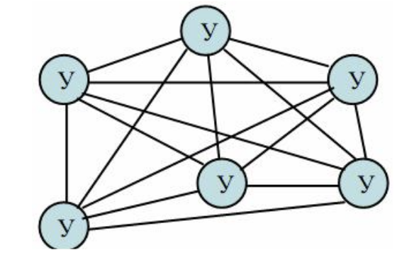
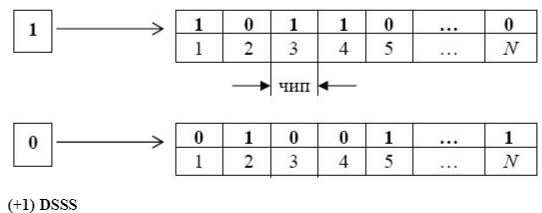
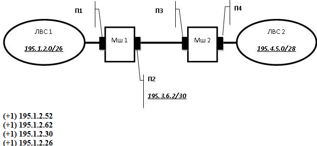
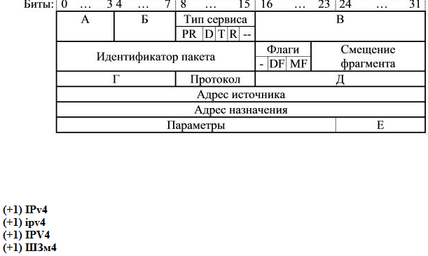

_____
### Что по определению может включать в себя ЭВМ (компьютер)?
*  один центральный процессор

*  устройства ввода/вывода
*  оперативная память
*  процессоры ввода/вывода
_____
### Что по определению может включать в себя вычислительный комплекс?
*  два и более центральных процессоров

*  устройства ввода/вывода
*  оперативная память
*  процессоры ввода/вывода
_____
### Что по определению может включать в себя вычислительная система?
*  ровно один центральный процессор
*  устройства ввода/вывода
*  оперативная память
*  процессоры ввода/вывода
*  базы данных
*  операционная система
*  прикладные программы
*  два и более центральных процессоров
_____
### Что по определению могут включать в себя средства телекоммуникаций?
*  узлы связи
*  каналы связи
_____
### Что по определению может включать в себя ЭВМ (компьютер)?
*  технические средства
*  только один из прочих вариантов ответа правильный
_____
### Выберите корректные утверждения.
*  Вычислительный комплекс - это совокупность технических средств, содержащих более одного центрального процессора.
*  Вычислительная система - это совокупность технических и программных средств.
*  Вычислительная машина (компьютер) - это совокупность технических средств.
_____
### В чем отличие информации от данных? Выберите верные утверждения.
*  Данные могут не содержать информацию
*  Мерой данных является объем
*  Мерой информации является энтропия
_____
### Как называется совокупность средств вычислительной техники, объединенных с помощью средств телекоммуникаций?
*  сеть ЭВМ
*  компьютерная сеть
_____
### Основной целью построения вычислительного комплекса является обеспечение ... (закончите фразу)
*  высокой надежности и/или производительности
_____
### В чём принято измерять системную производительность вычислительной системы?
*  задач в секунду
### В чём принято измерять производительность вычислительной системы?
*  задач в секунду
_____
### В чём принято измерять производительность компьютера (вычислительной машины)?
*  MFLOPS
*  MIPS
_____
### Что по определению включает в себя канал связи?
*  линия связи
*  каналообразующее оборудование
*  аппаратура передачи данных
_____
### Укажите, что из перечисленного может использоваться в качестве узла связи компьютерной сети.
*  мост
*  шлюз
*  маршрутизатор
*  коммутатор
_____
### Что принято называть программными средствами вычислительной системы?
*  системное программное обеспечение
*  прикладное программное обеспечение
_____
### Что принято относить к информационному обеспечению (dataware) вычислительной системы?
*  база данных
*  система управления базой данных
_____
### Укажите основные функции узла связи в компьютерной сети?
*  маршрутизация
*  коммутация
*  мультиплексирование
*  демультиплексирование
_____
### Как называется процесс установления физического или логического соединения между входным и выходным портами узла связи?
*  коммутация
*  Коммутация
*  коммутацией
_____
### Как называется процесс выбора выходного порта в узле компьютерной сети при определении направления передачи данных?

* В качестве ответа введите одно слово в именительном падеже единственного числа.
*  маршрутизация
*  Маршрутизация
*  маршрутизацией
_____
### Как называется процесс объединения нескольких входящих в узел потоков данных в один выходящий из узла поток?
*  мультиплексирование
*  Мультиплексирование
*  мультиплексированием
*  multiplexing
*  Multiplexing
_____
### Как называется процесс разделения одного входящего в узел потока данных на несколько выходящих из узла потоков?
*  демультиплексирование
*  Демультиплексирование
*  демультиплексированием
*  demultiplexing
*  Demultiplexing
_____
### Какие поля в общем случае содержатся в сообщении, передаваемом по компьютерной сети?
*  данные
*  заголовок
*  концевик
_____
### Укажите, что является узлом компьютерной сети.
*  маршрутизатор
*  центр обработки данных
*  коммутатор
_____
### Что обозначает аббревиатура PAN?
*  Персональная сеть
_____
### Установите соответствие русских терминов англоязычным аббревиатурам.
*  LAN ::: локальная сеть
*  MAN ::: городская сеть
*  PAN ::: персональная сеть
*  WAN ::: глобальная сеть
_____
### Укажите, каких типов бывают компьютерные сети в зависимости от их назначения.
*  вычислительные
*  информационные
*  информационно-вычислительные
*  информационно-управляющие
_____
### Как называется компьютерная сеть, которая используется для объединения телефонов, карманных ПК, смартфонов?
*  PAN
_____
### Какие технологии используются для построения PAN?
*  Bluetooth
*  Zigbee
_____
### Что обозначает аббревиатура MAN?
*  Городская вычислительная сеть
_____
### Что обозначает аббревиатура LAN?
*  Локальная вычислительная сеть
_____
### Что обозначает аббревиатура WAN?
*  Глобальная вычислительная сеть
_____
### Как называется компьютерная сеть, представляющая собой логичесое объединение узлов, которые физически могут находиться в разных локальных сетях?
*  Виртуальная частная сеть
*  VPN
_____
### Какие технологии используются для построения LAN?
*  Ethernet
*  Token Ring
_____
### Какие технологии используются для построения MAN?
*  IEEE 802.16 (WiMAX)
_____
### Какие технологии используются для построения WAN?
*  ATM
*  MPLS
_____
### Какие данные являются в исходном виде дискретными?
*  телеграфные
*  компьютерные
_____
### Какие данные являются в исходном виде непрерывными?
*  разговорная речь
*  видео
*  температура воздуха в помещении
*  уровень воды в Неве
_____
### Какой спектр частот имеют аудиоданные (с музыкой)?
*  от 20 Гц до 20 кГц
_____
### В чём отличие аудиоданных от телефонных?
*  у аудиоданных более широкий спектр
_____
### Какой спектр частот имеют голосовые данные?
*  от 80 Гц до 12 кГц
_____
### Какой спектр частот имеют видеоданные?
*  от 40 Гц до 6000 кГц
_____
### В какой полосе частот передаются данные в каналах тональной частоты?
*  от 300 Гц до 3400 Гц
_____
### Какие требования предъявляются к организации компьютерных сетей?
*  Открытость
*  Гибкость
*  Совместимость
*  Масштабируемость
*  Эффективность
_____
### Возможность включения дополнительных компонентов в компьютерную сеть без изменения существующих технических и программных средств называется ...
*  открытостью
_____
### Сохранение работоспособности при изменении структуры вычислительной сети в результате выхода из строя отдельных компонентов или при замене оборудования называется ...
*  гибкостью
_____
### Возможность работы в сети оборудования разного типа и разных производителей называется ...
*  совместимостью
_____
### Способность компьютерной сети увеличивать свою производительность при добавлении узлов и каналов связи называется...
*  масштабируемостью

### Способность компьютерной сети не снижать свою производительность при добавлении узлов и каналов связи называется...
*  масштабируемостью
_____
### Обеспечение требуемого качества обслуживания пользователей компьютерной сети при минимальных затратах называется ...
*  эффективностью
_____
### Укажите номера уровней OSI-модели.
*  Сетевой уровень ::: 3
*  Уровень представления ::: 6
*  Физический уровень ::: 1
*  Транспортный уровень ::: 4
*  Прикладной уровень ::: 7
*  Сеансовый уровень ::: 5
*  Канальный уровень ::: 2
_____
### Как называются уровни OSI-модели?
*  5 ::: сеансовый
*  7 ::: прикладной
*  1 ::: физический
*  4 ::: транспортный
*  2 ::: канальный
*  6 ::: представления
*  3 ::: сетевой
_____
### Установите соответствие между русскоязычными и англоязычными названиями уровней OSI-модели
*  физический уровень ::: physical layer (PHY)
*  канальный уровень ::: data link layer
*  сетевой уровень ::: network layer
*  транспортный уровень ::: transport layer
*  сеансовый уровень ::: session layer
*  уровень представления ::: presentation layer
*  прикладной уровень ::: application layer
_____
### Как называется первый уровень OSI-модели?
* В качестве ответа введите одно слово (прилагательное в именительном падеже)
*  физический
*  Физический
*  physical
*  PHY
_____
### Как называется второй уровень OSI-модели?
* В качестве ответа введите одно слово (прилагательное в именительном падеже)
*  канальный
*  Канальный
*  data link
_____
### Как называется третий уровень OSI-модели?
* В качестве ответа введите одно слово (прилагательное в именительном падеже)
*  сетевой
*  Сетевой
*  network
*  Network
_____
### Как называется четвёртый уровень OSI-модели?
* В качестве ответа введите одно слово (прилагательное в именительном падеже)
*  транспортный
*  Транспортный
*  transport
*  Transport

_____
### Как называется пятый уровень OSI-модели?
* В качестве ответа введите одно слово (прилагательное в именительном падеже)
*  сеансовый
*  Сеансовый
*  сессионный
*  Сессионный
*  session
*  Session
_____
### Как называется шестой уровень OSI-модели?
*  представления
*  Представления
*  представительский
*  Представительский
*  Presentation
*  presentation
_____
### Как называется седьмой уровень OSI-модели?
* В качестве ответа введите одно слово (прилагательное в именительном падеже)
*  прикладной
*  Прикладной
*  Application
*  application
_____
### Какая основная задача решается на 3-м уровне OSI-модели?
*  Маршрутизация
_____
### Какая основная задача решается на 2-м уровне OSI-модели?
*  управление доступом к среде передачи данных
_____
### На каком уровне OSI-модели решается задача управления доступом к среде передачи данных?
*  канальном
_____
### Сколько уровней содержит OSI-модель?
*  7
*  семь
*  Семь
_____
### На каком уровне OSI-модели реализуются методы доступа к среде передачи?
*  2
*  канальный
*  канальном
*  Канальный
*  на канальном
_____
### На каком уровне OSI-модели реализуются методы маршрутизации?
*  3
*  сетевой
*  Сетевой
*  сетевом
*  на сетевом
_____
### На каком уровне OSI-модели реализуется ...?
* контроль последовательности прохождения пакетов ::: транспортный
* маршрутизация::: сетевой
* управление доступом сетевых устройств к среде передачи ::: канальный
* модуляция передаваемого сигнала ::: физический
* интерфейс между программой пользователя и системой связи ::: прикладной
* кодирование передаваемых сигналов ::: физический
* шифрование и дешифрование данных ::: представления
* разбиение длинных сообщений на более короткие протокольные блоки данных ::: транспортный
* преобразование данных во внутренний формат компьютеров и обратно ::: представления
_____
### На какие подуровни разбивается в IEEE-модели канальный уровень?
*  MAC
*  LLC
_____
### Подуровень управления доступом к среде передачи - это ...
*  MAC
_____
### Подуровень управления логическим соединением - это ...
*  LLC
_____
### Какие типы сервисов обеспечивает LLC-подуровень канального уровня?
*  сервис без установления соединения и без подтверждения доставки
*  сервис без установления соединения с подтверждением доставки
*  сервис с установлением соединения
_____
### Как называется соглашение о взаимодействии между уровнями одной системы, определяющее структуру данных и способ обмена данными между соседними уровнями?

* В качестве ответа введите одно слово в именительном падеже единственного числа.
*  интерфейс
*  Интерфейс
*  интерфейсом
*  Интерфейсом
_____
### Как называется совокупность правил, регламентирующих формат и процедуры взаимодействия процессов одноимённых уровней на основе обмена сообщениями?

* В качестве ответа введите одно слово в именительном падеже единственного числа.
*  протокол
*  Протокол
*  протоколом
*  Протоколом

_____
### На каком уровне (название) OSI-модели реализуются методы маршрутизации?
*  Сетевой
*  сетевой
*  сетевом
*  на сетевом
*  Сетевом
*  На сетевом
_____
### На каком уровне (название) OSI-модели используются MAC-адреса?
*  Канальном
*  канальном
*  канальный
*  Канальный
*  на канальном
*  На канальном
_____
### На каком уровне (название) OSI-модели появляется используется МАС-адрес?
*  Канальный
*  канальный
*  канальном
*  Канальном
*  на канальном
*  На канальном
_____
### Что такое МАС-адрес?
*  Физический адрес
_____
### Сколько устройств в Интернете может иметь одинаковый универсальный MAC-адрес?
*  1
_____
### Что такое ISO?
*  Международная организация по стандартизации
_____
### Что такое OSI?
*  Модель взаимодействия открытых систем
_____
### Какие уровни OSI-модели относятся к высшим уровням?
*  транспортный
*  сеансовый
*  представления
*  прикладной
_____
### Какие уровни OSI-модели относятся к низшим уровням?
*  физический
*  канальный
*  сетевой
_____
### Интерфейсы подразделяются на:
*  схемные
*  программные
_____
### Какие из перечисленных характеристик используются для описания сетевых протоколов?
*  логическая
*  процедурная
_____
### На каком уровне OSI-модели используются IP-адреса?

* В качестве ответа введите целое число
*  3
_____
### PDU - это ...
*  Протокольный блок данных
_____
### Пусть некоторое приложение собирается передать сообщение в компьютерную сеть.Что будет происходить с PDU, содержащим это сообщение?
*  Размер PDU будет увеличиваться
*  PDU будет продвигаться от 7-го уровня к 1-му
_____
### Какая англоязычная аббревиатура соответствует термину "протокольный блок данных"?
*  PDU
*  pdu
*  ЗВГ
_____
### Как называется блок данных, передаваемый на канальном уровне?
*  Кадр
_____
### Как называется блок данных, передаваемый на канальном уровне?
*  кадр
*  кадром
*  Кадр
*  Кадром
*  frame
*  Frame
_____
### Как называется блок данных, передаваемый на сетевом уровне?
*  пакет
*  Пакет
*  packet
*  Packet
_____
### Установите соответствие между русскими и английскими терминами.
*  кадр ::: frame
*  пакет ::: packet
*  дейтаграмма ::: datagram
*  сообщение ::: message
_____
### Что является корректным МАС-адресом?
*  00-1А-F4-05-56-67
_____
### Что является корректным МАС-адресом?
*  00-01-05-99-95-00
*  01-AA-BB-CC-DD-EF
*  2F-01-05-95-91-90
_____
### Что не может являться МАС-адресом?
*  00-12-AA-CD-RH-34
*  AA-BB-CC-DD-EE-FF
*  00-00-00-3A-D4-F5
*  5F-11-22-33-44-55
_____
### Что не может являться МАС-адресом?
*  12-24-99-0Х-FA-08
*  45-16-A1-B2-C3-00
*  02-00-16-71-11-17-11
*  42-16-A1-B2-C3-D4
_____
### Как называется представленная на рисунке топология?

*  Полносвязная
_____
### Как называется представленная на рисунке топология?

*  Многосвязная
_____
### Как называется представленная на рисунке топология?

*  Многосвязная
_____
### Как называется представленная на рисунке топология?

*  Звезда
_____
### Как называется представленная на рисунке топология?

*  Кольцо
_____
### Как называется представленная на рисунке топология?

*  Общая шина
_____
### В каких единицах обычно измеряется длина маршрута доставки сообщений при сравнении разных топологий?

* В качестве ответа введите одно слово с маленькой буквы в именительном падеже единственного числа.
*  хоп
*  хопы
*  в хопах
*  hop
_____
### Какие характеристики используются при сравнении разных топологий сети передачи данных?
*  производительность сети (возможное снижение эффективной скорости передачи данных из-за конфликтов)
*  время доставки сообщений (или длина маршрута)
*  стоимость, зависящая как от состава оборудования, так и от сложности реализации
*  надежность, определяемая наличием альтернативных путей
*  сложность (простота) структурной и функциональной организации
_____
### Какая топология обеспечивает минимальное время доставки сообщений?
*  Полносвязная
_____
### Какая топология СПД обладает максимальной надежностью?
*  Полносвязная
_____
### Какая топология является самой простой и дешевой?
*  Общая шина

_____
### В каком месте сети передается PDU, показанный на рисунке?(Ответ в соответствии с обозначениями на рисунке)

* eth1
_____
### В каком месте сети передается PDU, показанный на рисунке?(Ответ в соответствии с обозначениями на рисунке)

* eth2
_____
### В каком месте сети передается PDU, показанный на рисунке?(Ответ в соответствии с обозначениями на рисунке)

* eth4
_____
### В каком месте сети передается PDU, показанный на рисунке?(Ответ в соответствии с обозначениями на рисунке)

* Мш2-Мш3
_____
### В каком месте сети передается PDU, показанный на рисунке?(Ответ в соответствии с обозначениями на рисунке)

* X.25

_____
### Выберите верные утверждения.
*  Физическая топология полностью определяется структурой связи узлов
*  Логическая топология зависит от последовательности передачи данных между узлами
*  Физическая топология сети "Кольцо" может совпадать с "Полносвязной" при некотором количестве узлов в сети
_____
### Чему равно количество каналов связи в сети с топологией "Дерево", состоящей из 10 узлов?

* В качестве ответа введите целое число
*  9

_____
### Чему равно количество каналов связи в сети с топологией "Дерево", состоящей из 15 узлов?

* В качестве ответа введите целое число
*  14
_____
### Чему равно количество каналов связи в сети с топологией "Звезда", состоящей из 10 узлов?

* В качестве ответа введите целое число
*  9

_____
### Чему равно количество каналов связи в сети с топологией "Звезда", состоящей из 15 узлов?

* В качестве ответа введите целое число
*  14
_____
### Чему равно количество каналов связи в сети с топологией "Кольцо", состоящей из 10 узлов?

* В качестве ответа введите целое число
*  10
_____
### Чему равно количество каналов связи в сети с топологией "Кольцо", состоящей из 15 узлов?

* В качестве ответа введите целое число
*  15
_____
### Чему равно количество каналов связи в сети с топологией "Полносвязная", состоящей из 10 узлов?

* В качестве ответа введите целое число
*  45
_____
### Чему равно количество каналов связи в сети с топологией "Полносвязная", состоящей из 15 узлов?

* В качестве ответа введите целое число
*  105
_____
### Чему равно количество каналов связи в сети с топологией "Полносвязная", состоящей из 20 узлов?

* В качестве ответа введите целое число
*  190
_____
### В сети с топологией "Кольцо" 24 компьютера. Чему равна средняя длина маршрута доставки сообщений в такой сети, если пакеты могут двигаться только в одном направлении?

* В качестве ответа укажите целое число хопов.
*  12
_____
### В сети с топологией "Кольцо" 12 компьютеров. Чему равна средняя длина маршрута доставки сообщений в такой сети, если пакеты могут двигаться только в одном направлении?

* В качестве ответа укажите целое число хопов.
*  6
_____
### В сети с топологией "Кольцо" 7 компьютеров. Чему равна средняя длина маршрута доставки сообщений в такой сети, если пакеты могут двигаться в обоих направлениях и всегда двигаются по кратчайшему маршруту?

* В качестве ответа укажите целое число хопов.
*  2
_____
### В сети с топологией "Кольцо" 23 компьютера. Чему равна средняя длина маршрута доставки сообщений в такой сети, если пакеты могут двигаться обоих направлениях и всегда двигаются по кратчайшему маршруту?

* В качестве ответа укажите целое число хопов.
*  6
_____
### Какие способы коммутации используются в компьютерных сетях?
*  коммутация пакетов
*  коммутация ячеек
*  коммутация каналов
*  коммутация сообщений
_____
### Какой способ коммутации используется в традиционных (аналоговых) телефонных сетях?
*  коммутация каналов
_____
### Какие способы коммутации используют промежуточное хранение передаваемых данных?
*  коммутация сообщений
*  коммутация пакетов
*  коммутация ячеек
_____
### При каком способе коммутации каналы связи должны иметь одинаковые пропускные способности на всем пути передачи?
*  Коммутация каналов
_____
### Какой способ коммутации эффективен при передаче больших объемов данных?
*  коммутация каналов
_____
### Какой способ коммутации непременно требует установления соединения?
*  коммутация каналов
_____
### Что относится к достоинствам коммутации каналов?
*  возможность использования существующих телефонных каналов
*  не требуется память в транзитных узлах для хранения сообщений
*  высокая эффективность при передаче больших объемов данных
_____
### Что относится к недостаткам коммутации каналов?
*  каналы связи должны иметь одинаковые пропускные способности на всем пути передачи
*  большие накладные расходы на установление соединения
_____
### Какими преимуществами обладает коммутация сообщений по сравнению с коммутацией каналов?
*  не требуется предварительное установление соединения
*  каналы связи на всем пути передачи могут иметь разные пропускные способности
_____
### Какими недостатками обладает коммутация сообщений по сравнению с коммутацией каналов?
*  необходимость хранения передаваемых сообщений в промежуточных узлах, что требует значительной ёмкости памяти при разных длинах передаваемых сообщений.
*  задержка в промежуточных узлах может оказаться значительной
_____
### Какими недостатками обладает коммутация сообщений по сравнению с коммутацией пакетов?
*  большее время доставки сообщений
*  большие затраты буферной памяти в промежуточных узлах
*  менее эффективная организация надежной передачи данных
_____
### Какими преимуществами обладает коммутация сообщений по сравнению с коммутацией пакетов?
*  меньшие накладные расходы на анализ заголовков
*  не требуется сборка сообщения в узле назначения
_____
### Какими преимуществами обладает коммутация пакетов по сравнению с коммутацией сообщений?
*  меньше время доставки сообщений
*  более эффективное использование буферной памяти
*  более эффективная организация надежной передачи данных
_____
### Какими недостатками обладает коммутация пакетов по сравнению с коммутацией сообщений?
*  более высокие накладные расходы на анализ заголовков
*  необходимость сборки из пакетов в узле назначения
_____
### Чем обусловлен тот факт, что при коммутации пакетов буферная память используется более эффективно, чем при коммутации сообщений?
*  ограниченным размером пакетов
_____
### За счёт чего время доставки сообщений при коммутации пакетов меньше, чем при коммутации сообщений?
*  разные пакеты одного и того же собщения передаются параллельно по разным каналам
_____
### При каком способе коммутации затраты на буферную память в узлах оказываются наибольшими?
*  коммутация сообщений
_____
### Почему коммутация пакетов обеспечивает более эффективную организацию надежной передачи данных, чем коммутация сообщений?
*  контроль передаваемых данных осуществляется для каждого пакета
*  в случае обнаружения ошибки переприему подлежит только один пакет
_____
### Основные достоинства коммутации ячеек?
*  маленькие задержки ячеек в узлах
*  не монополизируется канал связи
*  быстрая обработка заголовка ячейки в узлах, поскольку местоположение заголовка строго фиксировано
*  более эффективная, по сравнению с коммутацией пакетов, организация буферной памяти и надежной передачи данных
_____
### Основной недостаток коммутации ячеек?
*  большие накладные расходы на передачу заголовка
_____
### Какой способ коммутации является основным в современных компьютерных сетях?
*  коммутация пакетов
_____
### Какие способы коммутации являются основными и наиболее широко используемыми в компьютерных сетях?
*  каналов
*  пакетов
_____
### Какими способами в компьютерной сети может быть реализована коммутация пакетов?
*  дейтаграммный
*  виртуальный канал
_____
### Как называется способ передачи данных, при котором пакеты одного и того же сообщения могут передаваться между двумя взаимодействующими абонентами по разным маршрутам?

* В качестве ответа введите прилагательное в именительном падеже единственного числа с маленькой буквы
*  дейтаграммном
_____
### Как называется способ передачи данных, при котором пакеты одного и того же сообщения приходят в конечный узел в произвольной последовательности?

* В качестве ответа введите прилагательное в именительном падеже единственного числа с маленькой буквы
*  дейтаграммном
_____
### Какими достоинствами обладает дейтаграммный способ передачи пакетов?
*  простота организации и реализации передачи данных - каждый пакет сообщения передается независимо от других пакетов
*  каждый пакет выбирает наилучший путь
_____
### Какими недостатками обладает способ передачи пакетов "виртуальный канал"?
*  наличие накладных расходов на установление соединения
*  неэффективное использование ресурсов сети
_____
### Основной недостаток дейтаграммного способа передачи данных?
*  усложняется процесс сборки сообщения из пакетов, т.к. они могут приходить в конечный узел в произвольном порядке
_____
### При каком способе передачи пакеты передаются в сети по одному и тому же маршруту?
*  Виртуальный канал
_____
### При каком способе передачи пакеты одного и того же сообщения передаются в сети по разным маршрутам?
*  Дейтаграммный
_____
### Какие методы маршрутизации относятся к простым?
*  лавинообразные
*  по предыдущему опыту
*  случайные
_____
### Какие методы маршрутизации относятся к фиксированным?
*  однопутевые
*  многопутевые
_____
### Какие методы маршрутизации относятся к адаптивным?
*  локальные
*  централизованные
*  распределённые
_____
### В каком методе маршрутизации изменение маршрутной таблицы зависит от состояний выходных буферов данного узла (маршрутизатора) и не зависит от состояния соседних узлов?
*  локальный
_____
### В каком методе маршрутизации изменение маршрутной таблицы зависит от состояний соседних узлов (маршрутизаторов)?
*  распределённый
_____
### В каком методе маршрутизации изменение маршрутной таблицы осуществляется на основе анализа адресов отправителей пакетов?
*  по предыдущему опыту
_____
### Что изображено на рисунке?

* В качестве ответа введите два слова

*  маршрутная таблица
*  таблица маршрутизации
*  Маршрутная таблица
*  Таблица маршрутизации
_____
### Интервал времени, в течение которого узел сети, передавший пакет, ожидает подтверждения - это…
*  Таймаут
_____
### Из какого условия обычно определяется величина тайм-аута при единичной ширине окна?
*  минимум вдвое больше, чем время передачи кадра
_____
### Какие особенности присущи сетевому компьютерному трафику?
*  неоднородность потока данных
*  разные требования к качеству передачи данных разных типов
*  возникновение периодов перегрузок
*  нестационарность трафика
_____
### Какие цели преследует управление трафиком?
*  обеспечение надежной передачи данных
*  повышение эффективости загрузки оборудования сети
*  обеспечение требуемого уровня задержек при передаче по сети
*  предотвращение перегрузок и блокировок
_____
### Какая задача реализуется за счет механизмов квитирования и тайм-аута?
*  надежная передача данных
_____
### Какая из представленных на графике зависимостей отражает влияние числа пакетов на производительность сети?

*  5

### Какая из представленных на графике зависимостей (номер) отражает зависимость производительности сети от числа пакетов в сети?

*  5
_____
### За счёт чего в телекоммуникационной сети обеспечивается надежная передача данных?
*  за счет механизма квитирования
_____
### Как называется служебный кадр, подтверждающий, что данные переданы без ошибок?
*  положительная квитанция
_____
### Как называется служебный кадр, свидетельствующий, что переданные данные содержат ошибку?
*  отрицательная квитанция
_____
### Какой вид после реализации процедуры бит-стаффинг примет кадр:10111110111111011111110?
*  10 1111 1001 1111 0101 1111 0110 (без пробелов)
_____
### Какой вид после реализации процедуры бит-стаффинга примет кадр:11111011110111111111111?
*  11 1110 0111 1011 1110 1111 1011 (без пробелов)
_____
### Восстановите кадр, переданный в соответствии с процедурой бит-стаффинга и имеющий вид11111001111011111011111011 ?
*  111 1101 1110 1111 1111 1111 (без пробелов)
_____
### Восстановите кадр, переданный в соответствии с процедурой бит-стаффинга и имеющий вид100110111110001111101 ?
*   100 1101 1111 0011 1111 (без пробелов)
_____
### Основное назначение "механизма скользящего окна"?
*  увеличить загрузку канала связи
_____
### Что такое "ширина окна"?
*  максимальное число кадров, которые могут быть переданы без подтверждения
_____
### Ширина окна равна 128. Передающий узел, передавший 36-й кадр, получил подтверждение о приёме 28-го кадра. Какое максимальное число кадров может ещё передать узел без подтверждения?
*  120
_____
### Ширина окна равна 128. Передающий узел, передавший 39-й кадр, получил подтверждение о приёме 38-го кадра. Какое максимальное число кадров может ещё передать узел без подтверждения?
*  127
_____
### Ширина окна равна 8. Передающий узел, передавший 5-й кадр, получил подтверждение о приёме 3-го кадра. Какое максимальное число кадров может ещё передать узел без подтверждения?
*  6
_____
### Ширина окна равна 16. Передающий узел, передавший 6-й кадр, получил подтверждение о приёме 5-го кадра. Какое максимальное число кадров может ещё передать узел без подтверждения?
*  15
_____
### Какая из перечисленных задач реализуется за счет применения механизма окна?
*  увеличение загрузки канала связи
_____
### В каких единицах принято измерять пропускную способность каналов связи в сетях ЭВМ?
*  [bps]
*  [килобит* секунд]

### В каких единицах принято измерять пропускную способность каналов связи в компьютерных сетях?
*  [bps]
*  [килобит* секунд]

### В каких единицах может измеряться пропускная способность канала связи в компьютерных сетях?
*  кбит/с
*  Мбит/с
*  Гбит/с
*  Тбит/с
_____
### Чему соответствует пропускная способность канала связи в 100 кбит/с?
*  100 000 бит/с
_____
### Установите соответствие между значениями.
*  1 кбит/с ::: 1 000 бит/с
*  1 Мбит/с ::: 1 000 000 бит/с
*  1 Тбит/с ::: 1 000 000 000 000 бит/с
*  1 Гбит/с ::: 1 000 000 000 бит/с
*  1 Пбит/с ::: 1 000 000 000 000 000 бит/с
_____
### Выберите корректно заданные значения пропускных способностей канала связи в компьютерной сети?
*  128 кбит/с
*  10 Мбит/с
*  1 Гбит/с
_____
### Укажите некорректно заданные значения пропускных способностей канала связи в компьютерной сети?
*  100 Кбит/с
*  256 кбайт/с
*  512 Кбайт/с
*  10 мбит/с
_____
### Какой стек протоколов разработан компанией IBM и предназначен для удаленной связи с большими компьютерами?
*  SNA
_____
### Как называется множество протоколов разных уровней одной сетевой технологии?
*  стек
*  стек протоколов
*  Стек
*  Стек протоколов
_____
### Что являеся сетевыми стеками протоколов?
*  TCP/IP
*  XNS
*  IPX
*  AppleTalk
*  DECnet
*  SNA
_____
### Сколько уровней содержит стек протоколов TCP/IP?
*  4
_____
### Пусть некоторое приложение вот-вот получит сообщение из компьютерной сети.Что будет происходить с PDU, содержащим это сообщение, при продвижении PDU по интерфейсам между уровнями OSI-модели?
*  Размер PDU будет уменьшаться
*  PDU будет продвигаться от 1-го уровня к 7-му
_____
### Как называется преобразование данных в вид, позволяющий передавать их по выбранному каналу связи и обнаруживать ошибки, возникающие из-за помех при их передаче в этом канале связи?
*  кодирование
*  Кодирование
*  Кодированием
*  кодированием
_____
### Какие типы сигналов используются в компьютерных сетях для передачи данных?
*  электрические
*  электромагнитные
*  оптические
_____
### Какие типы сигналов для передачи данных не используются в компьютерных сетях ?
*  акустические
*  логические
_____
### Как называется способность системы противостоять воздействию помех?
*  помехоустойчивость
*  Помехоустойчивость
*  помехозащищенность
*  Помехозащищенность
_____
### Как называется количество данных, которое может быть передано по каналу связи за единицу времени?
*  пропускная способность канала связи
_____
### В каких единицах принято измерять пропускную способность канала связи в компьютерных сетях?
*  кбит/с
_____
### bps - это единица измерения ...
*  пропускной способности канала
_____
### BER - это ...
*  интенсивность битовых ошибок
_____
### Канал связи, предоставляемый на определённое время, называется ...
*  Коммутируемым
_____
### Канал связи, существующий постоянно между двумя пользователями, называется ...
*  Выделенным
_____
### Канал связи, по которому возможна передача только в одном направлении, называется ...
*  симплексным
*  симплексный
*  Симплексный
*  Симплексным
*  simplex
_____
### Канал связи, по которому возможна одновременная передача в обоих направлениях, называется ...
*  дуплексный
*  дуплексным
*  Дуплексный
*  Дуплексным
*  duplex
_____
### Канал связи, по которому возможна передача в обоих направлениях, но в разные моменты времени, называется ...
*  полудуплексным
*  полудуплексный
*  Полудуплексным
*  Полудуплексный
*  half-duplex
*  halfduplex
*  half duplex
_____
### Раскрыть обозначения элементов на схеме аналогового канала связи, предназначенного для передачи дискретных сообщений (на рисунке: ИС - источник сообщений, ПС - приёмник сообщений).

*   ::: дискретный (двоичный) сигнал
*   ::: непрерывный сигнал
*   ::: модулятор
*   ::: демодулятор
*   ::: фильтр
*   ::: линия связи
_____
### Раскрыть обозначения элементов на схеме дискретного (цифрового) канала связи (на рисунке: ИДС - источник дискретных сообщений; ПДС - приёмник дискретных сообщений).

*   ::: устройство сопряжения с КС
*   ::: устройство защиты от ошибок
*   ::: устройство преобразования сигналов
*   ::: линия связи
_____
### Для обеспечения требуемых динамических и частотных свойств передаваемого сигнала в непрерывном канале связи используются ...
*  фильтры
_____
### В каких единицах измеряется усиление и ослабление сигнала?
*  дБ
_____
### Мощность сигнала уменьшилась в 100 раз. Чему равно изменение сигнала?
*  -20 дБ
_____
### Мощность сигнала уменьшилась в 10000 раз. Чему равно изменение сигнала?
*  -40 дБ
_____
### Мощность сигнала уменьшилась в 1000 раз. Чему равно изменение сигнала?
*  -30 дБ
_____
### Как называется отношение выходной мощности сигнала ко входной?
*  коэффициент передачи
*  коэффициентом передачи
*  Коэффициент передачи
*  Коэффициентом передачи
_____
### Во сколько раз уменьшится мощность сигнала на расстоянии 100 м, если его ослабление равно: d=100 дБ/км?
*  10
_____
### Во сколько раз уменьшится мощность сигнала на расстоянии 50 м, если его ослабление равно: d=20 дБ/100 м?
*  10
_____
### Во сколько раз уменьшится мощность сигнала на расстоянии 2000 м, если его ослабление равно: d=10 дБ/км?
*  100
_____
### Во сколько раз уменьшится мощность сигнала на расстоянии 3 км, если его ослабление равно: d=10 дБ/км?
*  1000
_____
### В чем состоит удобство вычисления затухания в децибелах?
*  при каскадном включении нескольких устройств затухания в децибелах складываются
_____
### Гармоническое колебание задано уравнением F(t) = X* sin(Y* t + Z). Что такое Z?
*  фаза
_____
### Гармоническое колебание задано уравнением F(t) = X* sin(Y* t + Z). Что такое X?
*  амплитуда
_____
### Какой спектр частот имеют дискретные сигналы?
*  Бесконечный
_____
### В каких единицах измеряется линейная частота?
*  Гц
_____
### Единица измерения линейной частоты - это ...
*  Гц
*  Герц
*  Hz
*  Herz
*  герц
_____
### Как называется единица измерения линейной частоты?
*  Герц
*  Гц
*  Herz
*  Hz
_____
### Какие параметры гармонического сигнала могут нести информацию?
*  амплитуда
*  фаза
*  частота
_____
### Какие утверждения являются верными?
*  спектр - характеристика сигнала
*  полоса пропускания - характеристика среды передачи
*  для корректной передачи сигнала полоса пропускания должна быть шире спектра
_____
### Какие утверждения являются неверными?
*  спектр - характеристика среды передачи
*  полоса пропускания - характеристика сигнала
*  для корректной передачи сигнала спектр должен быть больше полосы пропускания
*  для корректной передачи сигнала спектр может быть как больше, так и меньше полосы пропускания
_____
### Выберите правильные утверждения
*  Спектр - это характеристика сигнала.
*  Полоса пропускания - это характеристика канала связи.
_____
### Полоса пропускания - это характеристика ...
*  среды передачи
_____
### В каких единицах измеряется спектр?
*  Гц
*  Герц
*  Hz
*  Herz
_____
### В каких единицах измеряется полоса пропускания?
*  Гц
*  Герц
*  Hz
*  Herz
_____
### При каком условии обеспечивается качественная передача сигнала?
*  Спектр сигнала меньше полосы пропускания
_____
### Какую ширину полосы пропускания (в Гц) имеет телефонный канал? Ответ округлите до целых.
*  3100
_____
### Какую ширину полосы пропускания (в кГц) имеет телефонный канал? Ответ округлить до 1-го знака после запятой.
*  3,1
*  3.1
_____
### В каком интервале находится полоса пропускания телефонного канала?
*  От 300 до 3400 Гц
_____
### Какие данные являются в исходном виде дискретными?
*  телеграфные
*  компьютерные
_____
### Какие данные являются в исходном виде непрерывными?
*  разговорная речь
*  видео
*  температура воздуха в помещении
*  уровень воды в Неве
_____
### Какой спектр частот имеют аудиоданные / голосовые данные / видеоданные? В какой полосе частот передаются данные в каналах тональной частоты?
*  от 20 Гц до 20 кГц
_____
### В чём отличие аудиоданных от телефонных?
*  более широкий спектр
_____
### Рассчитать максимально возможную пропускную способность (кбит/с) канала связи при условии, что полоса пропускания равна 100 МГц, а мощность сигнала равна мощности шума.
*  100.000 (без точки)
_____
### Какой английской аббревиатурой обозначается отношение мощности передаваемого сигнала к мощности шума на линии связи?
*  SNR
*  snr
_____
### Какая формула позволяет рассчитать максимально возможную пропускную способность канала связи, зная его полосу пропускания и SNR?
*  Формула Шеннона
_____
### Рассчитать максимально возможную пропускную способность (кбит/с) канала связи при условии, что полоса пропускания равна 100 МГц, а отношение мощности сигнала к мощности шума равно 3.
*  200.000 (без точки)
_____
### Рассчитать максимально возможную пропускную способность (Мбит/с) канала связи при условии, что полоса пропускания равна 100 МГц, а отношение мощности сигнала к мощности шума равно 3.
*  200
_____
### Рассчитать максимально возможную пропускную способность (бит/с) канала связи при условии, что полоса пропускания равна 100 МГц, а отношение мощности сигнала к мощности шума равно 3.
*  200.000.000 (без точки)
_____
### Рассчитать максимально возможную пропускную способность (бит/с) канала связи при условии, что полоса пропускания равна 20 МГц, а отношение мощности сигнала к мощности шума равно 3.
*  40.000.000 (без точки)
_____
### Рассчитать максимально возможную пропускную способность (кбит/с) канала связи при условии, что полоса пропускания равна 20 МГц, а отношение мощности сигнала к мощности шума равно 3.
*  40.000 (без точки)
_____
### Рассчитать максимально возможную пропускную способность (Мбит/с) канала связи при условии, что полоса пропускания равна 20 МГц, а отношение мощности сигнала к мощности шума равно 3.
*  40
_____
### Рассчитать максимально возможную пропускную способность (Мбит/с) канала связи при условии, что полоса пропускания равна 100 МГц, а отношение мощности сигнала к мощности шума равно 7.
*  300
_____
### Рассчитать максимально возможную пропускную способность (кбит/с) канала связи при условии, что полоса пропускания равна 100 МГц, а отношение мощности сигнала к мощности шума равно 7.
*  300.000 (без точки)
_____
### Рассчитать максимально возможную пропускную способность (бит/с) канала связи при условии, что полоса пропускания равна 100 МГц, а отношение мощности сигнала к мощности шума равно 7.
*  300.000.000 (без точки)
_____
### Рассчитать максимально возможную пропускную способность (бит/с) канала связи при условии, что полоса пропускания равна 10 МГц, а отношение мощности сигнала к мощности шума равно 15.
*  40.000.000 (без точки)
_____
### Рассчитать максимально возможную пропускную способность (кбит/с) канала связи при условии, что полоса пропускания равна 100 кГц, а отношение мощности сигнала к мощности шума равно 127.
*  700
_____
### Рассчитать максимально возможную пропускную способность (бит/с) канала связи при условии, что полоса пропускания равна 100 кГц, а отношение мощности сигнала к мощности шума равно 1023.
*  1.000.000 (без точки)
_____
### Изменение характеристик несущей в соответствии с информативным сигналом - это…
*  модуляция
*  Модуляция
_____
### Какие бывают методы модуляции?
*  Амплитудная
*  Фазовая
_____
### Какие бывают методы модуляции?
*  Частотная
*  Амплитудная
_____
### Какие из перечисленных методов модуляции используются для представления непрерывных данных в виде непрерывных сигналов?
*  амплитудная
*  частотная
_____
### Какие из перечисленных методов модуляции используются для представления непрерывных данных в виде дискретных сигналов?
*  импульсно-кодовая
*  амплитудно-импульсная
_____
### Какие из перечисленных методов модуляции используются для представления дискретных данных в виде непрерывных сигналов?
*  амплитудная
*  фазовая
*  частотная
_____
### Какие методы модуляции представлены на рисунке?

*  :: амплитудная
*  :: частотная
*  :: фазовая
_____
### От чего зависит спектр результирующего модулированного сигнала?
* от метода модуляции
* от скорости модуляции
_____
### Как называется аналоговый высокочастотный сигнал, подвергаемый модуляции в соответствии с некоторым информативным сигналом?
* несущая
* несущей
* Несущая
* Несущей
_____
### Чему равна скорость передачи речевых данных при использовании адаптивной дифференциальной импульсно-кодовой модуляции?
* 32 кбит/с
_____
### Чему равна скорость передачи речевых данных (бит/с) при использовании адаптивной дифференциальной импульсно-кодовой модуляции?
* 32000
_____
### Чему равна скорость передачи речевых данных (кбит/с) при использовании импульсно-кодовой модуляции?
* 64
_____
### Чему равна скорость передачи речевых данных (бит/с) при использовании импульсно-кодовой модуляции?
* 64000
_____
### При каком способе модуляции по каналу связи передается разность между текущим значением сигнала и предыдущим?
* адаптивная дифференциальная импульсно-кодовая модуляция
_____
### Модуляция, при которой непрерывный сигнал представляется совокупностью дискретных сигналов с определенной амплитудой, называется ...
* Амплитудно-импульсной модуляцией
_____
### Что такое АИМ?
* Амплитудно-импульсная модуляция
_____
### Как называется метод модуляции, показанный на рисунке?

* амплитудно-импульсная модуляция
* амплитудно-импульсной модуляцией
* амплитудно-импульсная
* амплитудно-импульсной
* АИМ
_____
### Чему равна частота квантования речевого сигнала в методе модуляции, показанном на рисунке? Ответ указать в Герцах.

* 8000
* восемь тысяч
* 8 000
_____
### Что такое ИКМ?
* Импульсно-кодовая модуляция

_____
### Модуляция, при которой аналоговый сигнал кодируется сериями импульсов, представляющими собой цифровые коды амплитуд в точках отсчета аналогового сигнала, называется ...
* Импульсно-кодовой модуляцией

_____
### Как называется метод модуляции, показанный на рисунке?

* импульсно-кодовая модуляция
* импульсно-кодовой модуляцией
* импульсно-кодовая
* импульсно-кодовой
* ИКМ
* PCM
_____
### Чему равен интервал Δt квантования по времени в методе модуляции, показанном на рисунке, при использовании этого метода в телефонии? Ответ укажите в микросекундах.

* 125

_____
### Чему равен интервал квантования по времени Δt в методе модуляции, показанном на рисунке, при использовании этого метода в телефонии? Ответ укажите в миллисекундах.

* 0,125
* 0.125
* 1/8
_____
### Чему равно количество N уровней квантования по значению сигнала в методе модуляции, показанном на рисунке, при использовании этого метода в телефонии?

* 256
_____
### Какая минимальная пропускная способность необходима для передачи речевого сигнала с использованием метода модуляции, показанного на рисунке, при условии, что количество уровней квантования по значению сигнала равно 256, а интервал квантования по времени равен 125 мкс? Ответ укажите в кбит/с

* 64

_____
### Чему равна частота квантования речевого сигнала в методе модуляции, показанном на рисунке, при использовании этого метода в телефонии? Ответ указать в кГц

* 8
* восемь
_____
### Чему равна частота квантования речевого сигнала в методе модуляции, показанном на рисунке, при использовании этого метода в телефонии? Ответ указать в Гц

* 8000
_____
### Какие коды применяют при цифровом кодировании дискретных данных?
* потенциальные
* импульсные
_____
### Какой метод кодирования изображен на рисунке?

* RZ
_____
### Какие коды применяют при цифровом кодировании дискретных данных?
* потенциальные
* импульсные
_____
### Какой метод кодирования изображен на рисунке?

_____
### Какой метод кодирования изображен на рисунке?

* NRZ
* nrz
_____
### Какой метод кодирования изображен на рисунке?

* AMI
_____
### Какой метод кодирования изображен на рисунке?

* AMI
_____
### Какой метод кодирования изображен на рисунке?

* Манчестерский
_____
### Какой метод кодирования изображен на рисунке?

* MLT-3
_____
### Какой метод кодирования изображен на рисунке (англоязычная аббревиатура)?

* MLT-3
* MLT3
* ЬДЕ-3
* ЬДЕ3

_____
### Какой метод кодирования изображен на рисунке (англоязычная аббревиатура)?

* PAM-5
* PAM5
* PAM 5
_____
### Что не является методом физического кодирования?
* ISDN
_____
### Что является методом физического кодирования?
* MLT-3
* NRZ
_____
### Какой метод является методом логического кодирования?
* 4B/5B
_____
### Какие методы не относятся к методам логического кодирования?
* MLT-3
* РАМ-5
* NRZI
_____
### Какими достоинствами обладает метод кодирования NRZ?
* наличие только двух уровней потенциала
* низкая частота основной гармоники
* простота реализации
_____
### Какими недостатками обладает метод кодирования NRZ?
* не обладает свойством самосинхронизации
* наличие низкочастотной составляющей
_____
### Какими достоинствами обладает метод кодирования RZ?
* обладает свойством самосинхронизации
* отсутствие постоянной низкочастотной составляющей
_____
### Какими недостатками обладает метод кодирования RZ?
* наличие трех уровней сигнала
* спектр сигнала шире, чем у потенциальных кодов NRZ
_____
### В каких методах кодирования используются только два уровня сигнала?
* NRZ
* NRZI
* Манчестерское кодирование
_____
### В каких методах кодирования используются три уровня сигнала?
* RZ
* AMI
* MLT-3
_____
### В каких методах кодирования используется более двух уровней сигнала?
* AMI
* PAM-5
* MLT-3
* RZ
_____
### Какими достоинствами обладает манчестерское кодирование?
* обладает свойством самосинхронизации
* наличие только двух уровней сигнала
* нет постоянной составляющей
_____
### Основной недостаток манчестерского кодирования?
* спектр сигнала шире, чем у кода NRZ и кода AMI
_____
### Какими недостатками обладает метод кодирования MLT-3?
* наличие трех уровней сигнала
* отсутствие самосинхронизации
_____
### Сколько уровней сигнала используется для передачи данных в методе кодирования PAM-5?
* 4
_____
### В каком методе используется двухбитовое кодирование?
* PAM-5
_____
### Какая битовая последовательность закодирована методом "Манчестер 2"?

_____
### Какая битовая последовательность закодирована методом "Манчестер 2"?

_____
### Какая битовая последовательность закодирована методом "Манчестер 2"?

_____
### Какая битовая последовательность закодирована методом "Манчестер 2"?

_____
### Какая битовая последовательность закодирована методом "MLT-3"?

_____
### Какая битовая последовательность закодирована методом "MLT-3"?

_____
### Какая битовая последовательность закодирована методом "MLT-3"?

_____
### Какая битовая последовательность закодирована методом "MLT-3"?

_____
### Какая битовая последовательность закодирована методом "РАМ-5"?

_____
### Какая битовая последовательность закодирована методом "РАМ-5"?

_____
### Какая битовая последовательность закодирована методом "РАМ-5"?

_____
### Выполнить скремблирование последовательности 10000001 с использованием сотношения:

_____
### Выполнить скремблирование последовательности 11000001
с использованием сотношения:

_____
### Выполнить скремблирование последовательности 10010001
с использованием сотношения:

_____
### Выполнить скремблирование последовательности 11111001
с использованием сотношения:

_____
### Выполнить скремблирование последовательности 10011111
с использованием сотношения:

_____
### Выполнить скремблирование последовательности 01000010
с использованием сотношения:

_____
### Выполнить скремблирование последовательности 11111001
с использованием сотношения:

_____
### Выполнить скремблирование последовательности 01111110
с использованием сотношения:

_____
### Какими достоинствами обладает избыточное кодирование?
* код становится самосинхронизирующимся
* исчезает постоянная составляющая

_____
### Какими недостатками обладает избыточное кодирование?
* уменьшается полезная пропускная способность канала связи
* дополнительные затраты времени на реализацию кодирования

_____
### Как называется способ улучшения потенциальных кодов, основанный на предварительном "перемешивании" исходной информации по определенному алгоритму с целью исключения длинных последовательностей нулей или единиц?
* скремблирование
* скрэмблирование
* scrambling
* Скремблирование
* Скрэмблирование
* Scrambling

_____
### Каким преимуществом обладает скремблирование по сравнению с избыточным кодированием?
* выше полезная пропускная способность канала связи

_____
### Каким недостатком обладает скремблирование по сравнению с избыточным кодированием?
* нет гарантии исключения длинных последовательностей нулей или единиц

_____
### Сколько избыточных (запрещённых) кодов содержится в методе логического кодирования 4В/5В?
* 16

_____
### Сколько избыточных (запрещённых) кодов содержится в методе логического кодирования 5В/6В?
* 32
_____
### Сколько избыточных (запрещённых) кодов содержится в методе логического кодирования 8В/10В?
* 768

_____
### Сколько избыточных (запрещённых) кодов содержится в методе логического кодирования 8В/6Т?
* 473

_____
### Чему равна избыточность (в процентах) логического кодирования 4В/5В?
* 25

_____
### Чему равна избыточность (в процентах) логического кодирования 5В/6В?
* 20

_____
### Чему равна избыточность (в процентах) логического кодирования 8В/10В?
* 25

_____
### Что такое FDM?
* Частотное мультиплексирование

_____
### Что такое TDM?
* Временное мультиплексирование

_____
### Что такое WDM?
* Волновое мультиплексирование

_____
### Какие методы мультиплексирования используются в современных вычислительных сетях?
* частотное мультиплексирование
* временное мультиплексирование
* волновое мультиплексирование

_____
### Какая англоязычная аббревиатура означает частотное мультиплексирование?
* FDM
* АВЬ

_____
### Какая англоязычная аббревиатура означает временно'е мультиплексирование?
* TDM
* ЕВЬ

_____
### Какая англоязычная аббревиатура означает волновое мультиплексирование?
* WDM
* ЦВЬ

_____
### Какие электрические кабели связи применяются в сетях передачи данных?
* витая пара
* коаксиальный кабель

_____
### Что относится к характеристикам линии связи?
* полоса пропускания
* помехоустойчивость
* удельная стоимость

_____
### В каких единицах измеряется затухание сигнала?
* дБ
* децибел
* децибелы

_____
### В каких единицах измеряется импеданс?
* Ом
* ом

_____
### С какой целью применяется скручивание электрических проводников?
* с целью уменьшения излучения и повышения помехозащищенности кабеля

_____
### Иерархическая кабельная система здания или группы зданий, разделенная на структурные подсистемы, называется ...
* структурированной кабельной системой

_____
### СКС - это ...
* структурированная кабельная система

_____
### Какие недостатки присущи кабельным линиям связи (включая оптоволоконные)?
* высокая стоимость арендуемых выделенных каналов
* подверженность механическим воздействиям
* невозможность организации мобильной связи

_____
### Кабель витой пары какой категории (номер) применяется в настоящее время наиболее широко?
* 5

_____
### Какую полосу пропускания (в МГц) имеют электрические кабели 3-й категории?
* 16

_____
### Какую полосу пропускания (в МГц) имеют электрические кабели 5-й категории?
* 100

_____
### Расположите (пронумеруйте) кабели в порядке возрастания их качества для передачи данных.
*  неэкранированная витая пара
*  экранированная витая пара
*  тонкий коаксиальный кабель
*  толстый коаксиальный кабель
*  многомодовый кабель
*  одномодовый кабель

_____
### Расположите (пронумеруйте) кабели в порядке убывания их качества для передачи данных.
*  одномодовый
*  многомодовый
*  толстый коаксиальный
*  тонкий коаксиальный
*  экранированная витая пара
*  неэкранированная витая пара

_____
### Какая англоязычная аббревиатура используется для неэкранированной витой пары?
*  UTP
*  ГЕЗ

_____
### Какая англоязычная аббревиатура используется для электрического кабеля с одним общим экраном для всех витых пар?
*  FTP

_____
### Какая англоязычная аббревиатура используется для электрического кабеля с экранированием каждой витой пары и с общим экраном для всех пар?
*  STP

_____
### Какие кабели на основе витой пары относятся к экранированным?
*  FTP
*  STP

_____
### Какие бывают типы коаксиального кабеля?
*  толстый
*  тонкий

_____
### Что представляет собой кабель UTP?
*  Неэкранированная витая пара

_____
### Что представляет собой кабель STP?
*  Экранированная витая пара

_____
### Неэкранированная витая пара - это ...
*  UTP

_____
### Экранированная витая пара - это ...
*  STP
*  FTP

_____
### Оптическое волокно, в котором передается только один луч, называется ...
*  одномодовым
*  одномодовое
*  одномодовое волокно

_____
### Оптическое волокно, в котором передается несколько лучей, называется ...
*  многомодовым
*  многомодовое

_____
### Какие достоинства присущи волоконно-оптическим кабелям?
*  высокая пропускная способность
*  отсутствие электромагнитного излучения
*  высокая помехоустойчивость
*  малый вес
*  высокое электрическое сопротивление, обеспечивающее гальваническую развязку

_____
### Какие недостатки присущи волоконно-оптическим кабелям?
*  трудоемкость монтажа, требующая специального оборудования
*  высокая стоимость сетевых устройств

_____
### Какими достоинствами обладают одномодовые оптические волокна по сравнению с многомодовыми?
*  меньше затухание
*  больше полоса пропускания

_____
### Какими недостатками обладают одномодовые оптические волокна по сравнению с многомодовыми?
*  дороже многомодовых
*  труднее ввести световой луч

_____
### Какими достоинствами обладают многомодовые оптические волокна по сравнению с одномодовыми?
*  более удобны при монтаже
*  дешевле

_____
### Какими недостатками обладают многомодовые оптические волокна по сравнению с одномодовыми?
*  большое затухание
*  меньше полоса пропускания

_____
### На каких длинах волн осуществляется передача сигналов по оптическому волокну?
*  0,85 мкм
*  1,31 мкм
*  1,55 мкм

_____
### На каких длинах волн не осуществляется передача сигналов по оптическому волокну?
*  2,95 мкм
*  1,85 мкм
*  0,55 мкм

_____
### Чему равен диаметр световодной жилы одномодового оптического волокна?
*  8-10 мкм

_____
### Чему равен диаметр световодной жилы многомодового оптического волокна?
*  50-60 мкм

_____
### В каких пределах находится затухание в оптических волокнах?
*  от 0,2 до 3 дБ/км

_____
### Чему равно значение длины волны L1 на графике, иллюстрирующем зависимость затухания от длины волны в оптическом волокне? Ответ укажите в микрометрах с точностью до второго знака после запятой.

_____
### Чему равно значение длины волны L2 на графике, иллюстрирующем зависимость затухания от длины волны в оптическом волокне? Ответ укажите в микрометрах с точностью до первого знака после запятой.

_____
### Чему равно значение длины волны L3 на графике, иллюстрирующем зависимость затухания от длины волны в оптическом волокне? Ответ укажите в микрометрах с точностью до второго знака после запятой.

_____
### Чему равно значение длины волны L1 на графике, иллюстрирующем зависимость затухания от длины волны в оптическом волокне? Ответ укажите в нанометрах, округлив до целых

_____
### Чему равно значение длины волны L3 на графике, иллюстрирующем зависимость затухания от длины волны в оптическом волокне? Ответ укажите в нанометрах, округлив до целых.

_____
### Чему равно значение длины волны L2 на графике, иллюстрирующем зависимость затухания от длины волны в оптическом волокне? Ответ укажите в нанометрах, округлив до целых.

_____
### ЭПИ в беспроводной системе связи - это ...
*  электромагнитное поле излучения

_____
### Какие фундаментальные физические процессы оказывают влияние на передачу ЭПИ?
*  отражение электромагнитного поля от Земли, зданий и т.п.
*  преломление его лучей в ионизированных слоях атмосферы
*  явление дифракции

_____
### Какое из утверждений является верным (f1, f2 - частота ЭПИ)?

_____
### Как называется явление, показанное на рисунке?

_____
### Как называется луч, показанный на рисунке?

_____
### Как называется явление огибания препятствий ЭПИ?

_____
### В каких случаях явление дифракции слабее (больше ослабление поля в точке приема)?
*  чем больше расстояние и чем больше частота

_____
### Как называется эффект замирания электромагнитного поля излучения?
*  фединг
*  федингом
*  fading
*  Fading
*  Фединг
*  Фейдинг

_____
### Что такое фединг (fading)?
*  эффект замирания электромагнитного поля излучения

_____
### Как называется явление распространения радиоволн не по прямым линиям, а по дугам?
*  рефракция
*  рефракцией
*  рефракции

_____
### Что такое рефракция?
*  эффект распространения электромагнитного поля излучения по дугам

_____
### Для каких радиоволн ионизированный слой атмосферы является практически "прозрачным"?
*  Для высокочастотных

_____
### Какие радиоволны распространяются практически только в пределах прямой видимости?
*  Высокочастотные

_____
### Какие достоинства присущи наземной радиосвязи?
*  невысокая стоимость передачи данных
*  возможность организации мобильной связи

_____
### Как называется круговая экваториальная синхронная орбита с периодом обращения 24 ч?
*  геостационарная
*  геостационарной

_____
### Чему равен угол наклона плоскости геостационарной орбиты по отношению к плоскости экватора? *  Ответ укажите в градусах.
*  0
*  нулю
*  ноль
*  нуль

_____
### На какой высоте расположен геостационарный спутник?
*  36 000 км

_____
### Чему равен период обращения геостационарного спутника?
*  24 часа

_____
### Связь с геостационарным спутником может осуществляться ...
*  Круглосуточно

_____
### Основное достоинство высокоэллиптической орбиты.
*  Возможность организации радиосвязи в высоких широтах

_____
### Как в спутниковых системах связи называется наиболее удаленная точка орбиты?
*  апогей
*  апогеем
*  Апогей
*  Апогеем

_____
### Как в спутниковых системах связи называется наименее удаленная точка орбиты?
*  перигей
*  перигеем
*  Перигей
*  Перигеем

_____
### На основе каких технологий могут быть реализованы цифровые транспортные системы?
*  PDH
*  SDH
*  АТМ

_____
### Какая англоязычная аббревиатура соответствует плезиохронной цифровой иерархии? (Английская раскладка клавиатуры)
*  PDH
*  pdh

_____
### Какая англоязычная аббревиатура соответствует синхронной цифровой иерархии? (Английская раскладка клавиатуры)
*  SDH
*  sdh

_____
### Что в PDH означает термин "плезиохронная"?
*  почти синхронная

_____
### Каково назначение аппаратуры Т1 в технологии PDH?
*  мультиплексирование, коммутирование и передача данных 24-х абонентов в цифровом виде

_____
### Сколько уровней мультиплексирования потоков реализовано в технологии PDH?
*  4

_____
### Какие каналы технологии PDH используются обычно на практике?
*  Т1/Е1
*  Т3/Е3

_____
### Какие функции реализуются аппаратурой Т1?
*  мультиплексирование цифровых данных
*  коммутация цифровых данных
*  передача цифровых данных

_____
### Какие недостатки присущи PDH?
*  сложность операций мультиплексирования и демультиплексирования
*  отсутствие встроенных процедур контроля и управления сетью, а также процедур поддержки отказоустойчивости
*  низкие по современным понятиям скорости передачи данных

_____
### Что такое ADSL?
*  Асимметричная цифровая абонентская линия

_____
### Что такое xDSL?
*  цифровая абонентская линия

_____
### Какая англоязычная аббревиатура означает асимметричную цифровую абонентскую линию, позволяющую передавать данные по телефонным каналам? (Переключить клавиатуру на английскую раскладку!)
*  ADSL
*  adsl

_____
### Какие протоколы канального уровня разработаны для выделенных линий связи?
*  SLIP
*  протоколы семейства HDLC
*  РРР

_____
### Реализация какого протокола канального уровня показана на рисунке? (Англоязычная аббревиатура)

_____
### Какой протокол канального уровня для выделенных линий наиболее широко используется в современных сетях? (Англоязычная аббревиатура)
*  PPP
*  ppp
*  ЗЗЗ

_____
### Какая англоязычная аббревиатура соответствует протоколу "точка-точка" канального уровня для выделенных линий?
*  PPP
*  ppp
*  ЗЗЗ

_____
### Какая англоязычная аббревиатура соответствует мобильному коммутационному центру? (Английская раскладка клавиатуры)
*  MSC
*  msc

_____
### Какое поколение мобильной сотовой связи относится к аналоговой связи?
*  1G
*  1g
*  1 G
*  1 g

_____
### Укажите поколения мобильной сотовой связи. относящиеся к цифровой связи
*  2G
*  3G
*  4G

_____
### Укажите стандарты мобильной сотовой связи первого поколения
*  AMPS
*  NMT

_____
### Укажите стандарты мобильной сотовой связи второго поколения
*  D-AMPS
*  GSM
*  CDMA

_____
### Укажите стандарты мобильной сотовой связи 2.5G поколения
*  GPRS
*  EDGE
*  1xRTT

_____
### Укажите стандарты мобильной сотовой связи третьего поколения
*  UMTS
*  CDMA2000
*  WCDMA

_____
### Укажите стандарт мобильной сотовой связи 3.5G поколения
*  HSDPA

_____
### Укажите стандарты мобильной сотовой связи четвертого поколения
*  WiMAX
*  LTE

_____
### Какие компоненты содержит подсистема сетевой коммутации?
*  центр коммутации
*  домашний реестр местоположения
*  гостевой реестр местоположения
*  реестр идентификации оборудования
*  центр аутентификации

_____
### Какие из перечисленных особенностей присущи ЛВС?
*  высокая пропускная способность
*  немодулированная передача данных
*  отсутствует маршрутизация
*  простые типовые топологии

_____
### Какие из перечисленных особенностей присущи ЛВС?
*  высокая пропускная способность
*  используется основополосная передача данных (baseband)
*  отсутствует маршрутизация

_____
### Какие из перечисленных особенностей не присущи ЛВС?
*  полносвязная или распределенная топологии
*  наличие разных видов маршрутизации
*  наличие аппаратуры передачи данных для модуляции сигнала
*  используется широкополосная передача

_____
### Какие функциии не относятся к магистральным функциям сетевого адаптера?
*  подсчет контрольной суммы кадра
*  кодирование и декодирование сигналов
*  преобразование кода из параллельного в последовательный и наоборот

_____
### Какие функциии не относятся к сетевым функциям сетевого адаптера?
*  электрическое буферирование сигналов магистрали
*  обработка стробов обмена на магистрали (выработка внутренних управляющих сигналов)

_____
### Какие функциии относятся к сетевым функциям сетевого адаптера?
*  кодирование и декодирование сигналов
*  распознавание своего кадра при приеме
*  подсчет контрольной суммы кадра
*  преобразование кода из параллельного в последовательный и наоборот

_____
### В какой последовательности реализуются сетевым адаптером перечисленные функции при передаче кадра?
*  передача данных из ОЗУ ПК в буфер сетевого адаптера
*  разделение сообщения на кадры и добавление заголовка и концевика
*  доступ к среде передачи
*  преобразование данных из параллельной формы в последовательную
*  кодирование данных
*  передача импульсов

_____
### В какой последовательности реализуются сетевым адаптером перечисленные функции при приёме кадра?
*  прием импульсов
*  декодирование данных
*  преобразование данных из последовательной формы в параллельную
*  объединение кадров и формирование сообщения
*  передача данных из адаптера в память ПК

_____
### Как называется электрическое устройство, осуществляющее физическую передачу и прием сигналов в телекоммуникационной среде?
*  трансивер

_____
### Какие названия соответствуют методу передачи данных, при котором вся полоса пропускания используется для передачи только одного цифрового сигнала?
*  Основополосная передача
*  Немодулированная передача
*  Baseband networking

_____
### Какие названия соответствуют методу передачи данных, основанному на мультиплексировании?
*  Broadband networking
*  Широкополосная передача данных

_____
### Какой метод физического кодирования используется в ЛВС Ethernet 10 Мбит/с?
*  Манчестерский

_____
### Какие методы физического кодирования используются в ЛВС Fast Ethernet?
*  NRZI
*  MLT-3

_____
### Какие методы логического кодирования используются в ЛВС Fast Ethernet?
*  4В/5В
*  8В/6Т

_____
### Какой метод физического кодирования используется в ЛВС Gigabit Ethernet?
*  PAM-5

_____
### Какие методы логического кодирования используются в ЛВС 10Gigabit Ethernet?
*  8B/10B
*  64B/66B

_____
### Укажите методы кодирования, используемые в каждой из приведенных технологий ЛВС:
*  Ethernet:::Манчестерский
*  Fast Ethernet:::NRZI
*  Gigabit Ethernet:::PAM-5
*  10Gigabit Ethernet:::64B/66B

_____
### Укажите методы кодирования, используемые в каждой из приведенных технологий ЛВС:
*  Ethernet:::Манчестерское
*  Fast Ethernet:::8B/6T
*  Gigabit Ethernet:::PAM-5
*  10Gigabit Ethernet:::8B/10B

_____
### Какие топологии ЛВС получили наибольшее распространение?
*  Общая шина
*  Звезда
*  Кольцо

_____
### Какую топологию имеет сеть Ethernet в соответствии со спецификацией 10Base2?
*  Общая шина

_____
### Какую топологию имеет сеть Ethernet в соответствии со спецификацией 10Base5?
*  Общая шина
*  общая шина

_____
### Какую логическую топологию имеет сеть Token Ring?
*  Кольцо
*  кольцо
*  кольцевую

_____
### Какую физическую топологию имеет сеть FDDI?
*  Кольцо

_____
### Для какого кабеля обеспечивается наименьшая длина сегмента ЛВС?
*  Неэкранированная витая пара

_____
### Для какого кабеля обеспечивается наибольшая длина сегмента ЛВС?
*  Волоконно-оптический кабель

_____
### Для какого кабеля обеспечивается наибольшая длина сегмента ЛВС?
*  Толстый коаксиальный кабель

_____
### Для какого кабеля обеспечивается наименьшая длина сегмента ЛВС?
*  UTP

_____
### Для предотвращения отражения электрических сигналов в общей шине на каждом конце коаксиального кабеля устанавливают ...
*  Терминаторы

_____
### Какое сетевое устройство используется в ЛВС типа 10Base-T и 100Base-TХ?
*  концентратор

_____
### Какое сетевое устройство изображено на рисунке (англоязычная аббревиатура)?

* LSR
_____
### Какая сетевая технология может передавать кадры Ethernet и кадры Token Ring?
*  100VG-AnyLAN

_____
### Какая беспроводная технология широко используется при построении персональных сетей?
*  Bluetooth

_____
### Что означает слово "Base" в обозначении ЛВС 100Base-TX?
*  Данные при передаче не модулируются

_____
### Что означает слово "Base" в обозначении ЛВС 10Base-5?
*  Используется основополосная передача данных

_____
### Какую ЛВС описывает обозначение "10Base-2"?
*  Пропускная способность 10 Мбит/с
*  Используется тонкий коаксиальный кабель

_____
### Какую ЛВС описывает обозначение "10Base-5"?
*  Пропускная способность 10 Мбит/с
*  Используется толстый коаксиальный кабель
*  Используется трансиверный кабель

_____
### Какую ЛВС описывает обозначение "10Base-T"?
*  Пропускная способность 10 Мбит/с
*  Используется витая пара

_____
### Какую ЛВС описывает обозначение "100Base-FX"?
*  Пропускная способность 100 Мбит/с
*  Передача данных ведется по двум волокнам многомодового ВОК.

_____
### Какую ЛВС описывает обозначение "100Base-ТX"?
*  Пропускная способность 100 Мбит/с
*  Используется витая пара

_____
### Какую ЛВС описывает обозначение "100Base-Т4"?
*  Пропускная способность 100 Мбит/с
*  Используется витая пара

_____
### Какую ЛВС описывает обозначение "1000Base-SX"?
*  Пропускная способность 1 Гбит/с
*  Используется оптоволоконный кабель

_____
### Какие технологии физического уровня обозначаются "Fast Ethernet"
*  100Base-ТX
*  100Base-Т4
*  100Base-FX

_____
### Чему равно максимальное расстояние (в метрах) от рабочей станции до концентратора в стандартах 10Base-T и 100Base-TX?
*  100

_____
### Чему равно максимальное число рабочих станций в одном сегменте кабеля в соответствии со стандартом 10Base2?
*  30

_____
### Чему равно максимальное число рабочих станций в одном сегменте кабеля в соответствии со стандартом 10Base5?
*  100

_____
### Чему равна максимальная длина одного сегмента кабеля ЛВС в соответствии со стандартом 10Base2?
*  185 м

_____
### Чему равна максимальная длина кабеля (в метрах) одного сегмента ЛВС в соответствии со стандартом 10Base5?
*  500

_____
### Чему равно максимальное число рабочих станций в одном домене коллизий ЛВС (Fast) Ethernet?
*  1024

_____
### Чему  в соответствии со стандартом равен диаметр (метров) сети ЛВС

*  370

_____
### За счет чего в ЛВС Gigabit Ethernet удалось обеспечить максимальный диаметр сети 200 м (при использовании одного повторителя)?
*  Минимальная длина кадра увеличена до 512 байт

_____
### Расстояние между двумя наиболее удаленными (крайними) станциями ЛВС называется ...
*  диаметр сети
*  диаметр
*  диаметром
*  диаметром сети
*  диаметром ЛВС
*  диаметр ЛВС

_____
### Какие названия применяются для ЛВС с равноправными компьютерами, которые могут использовать общие ресурсы?
*  одноранговые
*  peer-to-peer
*  P2P
*  пиринговые

_____
### Какие утверждения справедливы для ЛВС?

* пропускная способность 100 Мбит/с
* используется тонкий коаксиальный кабель
* диаметр сети 185 метров

_____
### Какие утверждения справедливы для ЛВС?

* пропускная способность 10 Мбит/с
* кабельная система - витая пара
* максимальное расстоение "компьютер - порт концентратора" - 100 метровы

_____
### Чему равно максимальное число рабочих станций в соответствии со стандартом для ЛВС?

* 30
_____
### Какими достоинствами обладают одноранговые ЛВС?
*  умеренная стоимость
*  простота построения
*  нет необходимости в сетевом администрировании

_____
### Какие недостатки присущи одноранговым ЛВС?
*  небольшой размер сети
*  трудно обеспечить должную защиту информации

_____
### Какими достоинствами обладают ЛВС типа "клиент-сервер"?
*  высокая производительность за счет разделения ресурсов сети
*  эффективная организация резервного копирования данных
*  способность поддерживать работу в сети сотен и тысяч пользователей
*  хорошие возможности для расширения
*  возможность организации эффективной защиты данных

_____
### Какими недостатками обладают ЛВС типа "клиент-сервер"?
*  требуются постоянное квалифицированное обслуживание (администрирование)
*  высокая стоимость по сравнению с одноранговыми ЛВС

_____
### Какой метод доступа используется в сетях Ethernet 802.3?
*  CSMA/CD

_____
### Сколько кадров может передаваться в сегменте ЛВС с методом доступа CSMA/CD в один момент времени?
*  1

_____
### CSMA/CD - это метод ...
*  множественного доступа с контролем несущей и обнаружением конфликтов

_____
### CSMA/CА - это метод ...
*  множественного доступа с контролем несущей и предотвращением конфликтов

_____
### Какой метод доступа используется в ЛВС Token Ring?
*  Маркерный

_____
### Какой метод доступа используется в ЛВС FDDI?
*  Маркерный

_____
### Что такое маркер в сетях Token Ring?
*  Кадр специального типа.

_____
### Какие пропускные способности обеспечиваются в ЛВС Token Ring?
*  4 Мбит/с
*  16 Мбит/с

_____
### Что представляет собой устройство множественного доступа MSAU?
*  Концентратор

_____
### В каких сетях используются MSAU?
*  Token Ring

_____
### Что используется в качестве среды передачи в сетях FDDI?
*  Волоконно-оптический кабель

_____
### Какая пропускная способность обеспечивается в ЛВС FDDI?
*  100 Мбит/с

_____
### Чему равен межкадровый интервал в ЛВС Ethernet (в битовых интервалах)?
*  96

_____
### Чему равен межкадровый интервал (в микросекундах) в ЛВС Ethernet с пропускной способностью 10 Мбит/с?
*  9,6
*  9.6

_____
### Чему равен межкадровый интервал (в наносекундах) в ЛВС Ethernet с пропускной способностью 10 Мбит/с?
*  9600

_____
### Чему равен межкадровый интервал (в микросекундах) в ЛВС Ethernet с пропускной способностью 100 Мбит/с?
*  0,96
*  0.96

_____
### Зачем нужен межкадровый интервал в семействе технологий Ethernet?
*  Для приведения сетевых адаптеров в исходное состояние
*  Для предотвращения монопольного захвата среды одной станцией

_____
### Кадр ЛВС (Fast) Ethernet остается не переданным рабочей станцией после ...
*  16 коллизий

_____
### Часть сети Ethernet, все узлы которой распознают коллизию, независимо от того, в какой части этой сети коллизия возникла, называется ... коллизий.
*  домен
*  доменом

_____
### Как называется кадр ЛВС Ethernet, вовлеченный в коллизию?
*  фрагмент кадра

_____
### Станция ЛВС Ethernet считает, что она управляет сегментом кабеля, если ею уже передано более ... байт. * В ответе укажите число
*  64

_____
### На какое максимальное время (мкс) может быть отложена передача кадра в ЛВС Fast Ethernet после второй коллизии?
*  20,48
*  20.48

_____
### На какое максимальное время (нс) может быть отложена передача кадра в ЛВС Fast Ethernet после второй коллизии?
*  20480

_____
### На какое максимальное время (мкс) может быть отложена передача кадра в ЛВС Fast Ethernet после третьей коллизии?
*  40,96
*  40.96

_____
### На какое максимальное время (нс) может быть отложена передача кадра в ЛВС Fast Ethernet после третьей коллизии?
*  40960

_____
### На какое максимальное время (мкс) может быть отложена передача кадра в ЛВС Fast Ethernet после четвертой коллизии?
*  81,92

_____
### На какое максимальное время (нс) может быть отложена передача кадра в ЛВС Fast Ethernet после четвертой коллизии?
*  81920

_____
### На какое максимальное время (мкс) может быть отложена передача кадра в ЛВС Ethernet (10 Мбит/с) после четвертой коллизии?
*  819,2

_____
### На какое максимальное время (нс) может быть отложена передача кадра в ЛВС Ethernet (10 Мбит/с) после четвертой коллизии?
*  819200

_____
### На какое максимальное время (мкс) может быть отложена передача кадра в ЛВС Ethernet (10 Мбит/с) после третьей коллизии?
*  409,6

_____
### На какое максимальное время (нс) может быть отложена передача кадра в ЛВС Ethernet (10 Мбит/с) после третьей коллизии?
*  409600

_____
### На какое максимальное время (мкс) может быть отложена передача кадра в ЛВС Ethernet (10 Мбит/с) после второй коллизии?
*  204,8

_____
### На какое максимальное время (нс) может быть отложена передача кадра в ЛВС Ethernet (10 Мбит/с) после второй коллизии?
*  204800

_____
### Чему равна длина поля адреса источника в кадре Ethernet 802.3? Ответ укажите в битах
*  48

_____
### Чему равна длина поля адреса назначения в кадре Ethernet 802.3? Ответ укажите в байтах
*  6

_____
### Чему равна длина поля адреса источника в кадре Gigabit Ethernet? Ответ укажите в байтах
*  6

_____
### Чему равна длина поля адреса источника в кадре Fast Ethernet? Ответ укажите в байтах
*  6

_____
### Чему равна длина поля адреса назначения в кадре Fast Ethernet? Ответ укажите в битах
*  48

_____
### Адрес назначения в кадре Ethernet имеет вид: 0C-21-00-04-B2-30. Этот адрес ...
*  уникальный
*  глобальный
*  может быть адресом отправителя
*  индивидуальный
*  МАС

_____
### Какие адреса являются групповыми глобальными?
*  21-A3-01-00-2B-CD
*  A9-D0-31-11-FF-00
*  FD-00-01-16-2C-57

_____
### Какие адреса являются групповыми локальными?
*  А3-00-12-48-С0-22
*  С7-01-00-53-00-02
*  АB-01-10-98-65-02
*  EF-BA-C0-55-00-14

_____
### Какие МАС-адреса являются уникальными глобальными?
*  20-00-02-17-С1-FE
*  C4-12-77-4D-00-09
*  A8-11-00-41-B0-00
*  CC-22-00-0D-00-50

_____
### Признаком чего является бит 0 первого байта поля "адрес назначения" кадра Ethernet?

_____
### Признаком чего является бит 1 первого байта поля "адрес назначения" кадра Ethernet?

_____
### Как называется МАС-адрес, представленный в шестнадцатеричном ввиде как FF-FF-FF-FF-FF-FF?
*  Широковещательный
*  широковещательный
*  широковещательным
*  broadcast

_____
### Какие поля содержит кадр ЛВС Ethernet II?
*  тип протокола
* адрес назначения
* адрес источника
* контрольная сумма кадра

_____
### Чему равна максимальная длина поля данных кадра Ethernet (байт)?
*  1500

_____
### Каково назначение преамбулы кадра Ethernet?
*  Синхронизация рабочих станций ЛВС перед началом передачи

_____
### В каком диапазоне находится длина кадра Ethernet 802.3?
*  64 - 1518 байт

_____
### Для каких полей кадра Ethernet вычисляется значение CRC?
*  Адрес назначения
*  Адрес источника
*  Тип / Длина
*  Данные

_____
### Для каких полей кадра Ethernet вычисляется значение контрольная сумма?
* Адрес назначения
* Адрес источника
* Тип / Длина
* Данные
_____
### Чему равна длина контрольной суммы в кадре Ethernet 802.3? Ответ укажите в байтах.
*  4

_____
### На каком уровне (название) OSI-модели работают повторители?
*  физическом
*  на физическом
*  физический
*  Физический

_____
### На каком уровне (номер) OSI-модели работают повторители?
*  1

_____
### На каком уровне OSI-модели работают концентраторы?
*  Физическом

_____
### На каком уровне OSI-модели работают концентраторы?
*  1

_____
### На каком уровне OSI-модели реализуются методы управления доступом в ЛВС?
*  2

_____
### На каком уровне OSI-модели реализуются методы управления доступом в ЛВС?
*  Канальном

_____
### На каких уровнях OSI-модели работают коммутаторы ЛВС?
*  Физический
*  Канальный

_____
### На каких уровнях OSI-модели работают мосты?
*  Физический
*  Канальный

_____
### На каких уровнях OSI-модели работают маршрутизаторы?
*  Физический
*  Канальный
*  Сетевой

_____
### Repeater - это ...
*  повторитель

_____
### Router - это ...
*  маршрутизатор

_____
### Hub - это ...
*  концентратор

_____
### Switch - это...
*  коммутатор

_____
### Nibble - это
*  полубайт (4 бит)

_____
### Token в сетях Token Ring - это ...
*  маркер

_____
### Назовите преимущества беспроводных ЛВС по сравнению с проводными
*  проще и дешевле разворачивать и модифицировать
*  обеспечивается мобильность пользователей

_____
### Какая беспроводная технология наиболее эффективна при построении персональных сетей?
*  Bluetooth

_____
### Укажите методы расширения спектра, применяемые в беспроводных ЛВС
*  FHSS
*  DSSS

_____
### В чем суть технологии OFDM?
*  Битовый поток разделяется на подпотоки, каждый из которых модулируется своей несущей частотой

_____
### При передаче данных в беспроводной сети через один канал связи каждый узел сети использует собственную расширяющую последовательность, которая выбирается так, чтобы принимающий узел мог выделить данные из суммарного сигнала. В какой технологии используется этот принцип?
*  CDMA

_____
### При передаче данных в беспроводной сети частота несущей меняется случайным образом на основе псевдослучайной последовательности. В какой технологии используется этот принцип?
*  FHSS

_____
### Каждый "единичный" бит заменяется двоичной последовательностью из N бит, а каждый "нулевой" бит кодируется инверсным значением расширяющей последовательности. В какой технологии используется этот принцип?
*  DSSS

_____
### Какую технологию иллюстрирует рисунок? *В качестве ответа введите англоязычную аббревиатуру.

_____
### Какую технологию иллюстрирует рисунок? *В качестве ответа введите англоязычную аббревиатуру.

_____
### Выберите правильные утверждения?

_____
### Какую технологию иллюстрирует рисунок? *В качестве ответа введите англоязычную аббревиатуру.

_____
### Перечислите особенности технологии Bluetooth (IEEE 802.15.1)
*  кадры имеют длину до 343 байт;
*  одновременно взаимодействовать могут не более 8 устройств
*  диапазон частот в районе 2.4 ГГц
*  количество устройств в сети до 255
*  Bluetooth – это технология для построения персональных сетей

_____
### Как назвается семейство стандартов IEEE 802.11?
*  WiFi

_____
### Как назвается семейство стандартов IEEE 802.15.1?
*  Bluetooth

_____
### Как назвается семейство стандартов IEEE 802.15.4?
*  ZigBee

_____
### Как назвается семейство стандартов IEEE 802.16?
*  WiMAX

_____
### Основное преимущество коммутатора по сравнению с маршрутизатором.
*  Меньшая задержка блоков данных

_____
### В чем состоят недостатки сетевых мостов по сравнению с маршрутизаторами?
*  мосты не могут использовать несколько маршрутов для доставки кадров
*  мосты не могут предотвращать "широковещательные штормы"

_____
### Какие типы сетевых мостов существуют?
*  прозрачные
*  транслирующие
*  инкапсулирующие

_____
### Какие мосты предназначены для непосредственного объединения сетей с идентичными протоколами на канальном и физическом уровнях?
*  Прозрачные.

_____
### Какие мосты предназначены для объединения сетей с разными протоколами на канальном и физическом уровнях.
*  Транслирующие.

_____
### Какие мосты предназначены для объединения сетей с одинаковыми протоколами канального и физического уровня через высокоскоростную магистральную сеть с другими протоколами.
*  Инкапсулирующие.

_____
### Для чего используется алгоритм STA (Spanning Tree Algorithm ) в ЛВС с коммутаторами?
*  Для исключения зацикливания кадров в сети при наличии в ней нескольких марштутов.
*  Для построения покрывающего дерева, исключающего петли в топологии сети

_____
### Отметьте присущие маршрутизатору свойства.
*  Маршрутизатор работает на сетевом уровне OSI-модели
*  У каждого интерфейса маршрутизатора есть IP-адрес
*  У каждого интерфейса маршрутизатора есть МАС-адрес
*  Марштутизатор не пропускает широковещательные пакеты в другую подсеть

_____
### Укажите отличительные особенности магистральных марштутизаторов с распределенной архитектурой (по сравнению с другими видами маршрутизаторов)
*  имеют модульную конструкцию, и каждый модуль маршрутизатора снабжен собственным процессором
*  возможна замена модулей марштутизатора в "горячем" режиме (без выключения питания)
*  используются избыточные источники питания

_____
### Как называется вид маршрутизации, при котором маршрут передачи данных формируется узлом-отправителем путем указания всех промежуточных маршрутизаторов?
*  Марштутизация от источника

_____
### Как называется вид маршрутизации, при котором пакеты передаются по определенному пути, установленному администратором и не изменяемому в течение длительного времени?
*  Статическая маршрутизация

_____
### Как называется вид маршрутизации, при котором маршрутные таблицы строятся в пределах автономной системы (autonomous system).
*  Внутренняя маршрутизация

_____
### Как называется вид маршрутизации, который используется для обмена маршрутной информацией между различными автономными системами (autonomous system).
*  Внешняя маршрутизация

_____
### Как называется алгоритм маршрутизации, при котором периодически (даже если в сети не происходит изменений) посылаются широковещательные пакеты с таблицами маршрутизации, содержащими иноформацию об адресах подключенных сетей и расстояниях до них.
*  Маршрутизация по алгоритму DVA

_____
### Как называется вид маршрутизации, при котором при изменении состояния своих каналов маршрутизатор немедленно распространяет соответствующую информацию по сети всем остальным маршрутизаторам, которые, получив сообщения, обновляют свои карты сети и заново вычисляют кратчайшие пути во все точки назначения.
*  Маршрутизация по алгоритму LSA

_____
### Как называется совокупность сетей и маршрутизаторов с единым административным подчинением?
*  Автономная система (аutonomous system)

_____
### Какую длину в байтах имеет адрес IPv4?
*  4

_____
### Какую длину в битах имеет адрес IPv4?
*  32

_____
### Чему равен минимальный размер заголовка IPv4-пакета? Ответ укажите в битах.
*  160

_____
### Чему равен максимальный размер заголовка IPv4-пакета? Ответ укажите в битах.
*  480

_____
### Чему равен максимально возможный размер IPv4-пакета?
*  65535 байт

_____
### Чему равна минимальная длина заголовка пакета IPv4 (в байтах)?
*  20

_____
### Чему равна минимальная длина заголовка пакета IPv4 (в 32-битовых словах)?
*  5

_____
### Чему равна максимальная длина заголовка пакета IPv4 (в байтах)?
*  60

_____
### Чему равна максимальная длина заголовка пакета IPv4 (в 32-битовых словах)?
*  15

_____
### Сколько уровней приоритета может иметь пакет IPv4?
(+2) 8

_____
### Чему равна максимальная длина пакета IPv4 (в байтах)?
(+2) 65535

_____
### Чему равно максимальное время жизни пакета IPv4 (выраженное в единицах, задаваемых полем TTL)?
*  255

_____
### Чему может быть равно максимальное количество маршрутизаторов на пути пакета IPv4?
*  255

_____
### Сколько бит отведено в заголовке пакета IPv4 под поле "Время жизни (TTL)"?
*  8

_____
### Сколько байт отведено в заголовке пакета IPv4 под поле "Время жизни (TTL)"?
*  1

_____
### Сколько бит отведено в заголовке пакета IPv4 под поле "Адрес источника"?
*  32

_____
### Сколько байт отведено в заголовке пакета IPv4 под поле "Адрес источника"?
*  4

_____
### Сколько бит отведено в заголовке пакета IPv4 под поле "Адрес назначения"?
* 

_____
### Сколько байт отведено в заголовке пакета IPv4 под поле "Адрес назначения"?
*  4

_____
### Какое утверждение по отношению к пакету IPv4 является правильным?
*  Контрольная сумма рассчитывается только для заголовка пакета

_____
### Какое утверждение по отношению к пакету IPv4 является правильным?
*  Контрольная сумма заголовка пересчитывается в каждом маршрутизаторе

_____
### Какие утверждения по отношению к пакету IPv4 являются правильными?
*  Контрольная сумма рассчитывается только для заголовка пакета
*  Контрольная сумма заголовка пересчитывается в каждом маршрутизаторе
*  В каждом маршрутизаторе из поля "время жизни" вычитается по единице

_____
### Чему равно максимальное количество сетей класса 'A' (без учета loopback)?
*  126

_____
### Чему равно максимальное количество хостов в сети класса 'C'?
*  254

_____
### Чему равно максимальное количество хостов в сети класса 'B'?
*  65534

_____
### Установите соответствие между IP-адресом хоста и классом сети, к которому он относится
*  13.2.0.10:::класс 'A'
*  140.0.101.34:::класс 'B'
*  192.168.3.5:::класс 'C'
*  224.1.1.7:::Multicast
*  127.0.0.1:::loopback

_____
### Установите соответствие между IP-адресом хоста и классом сети, к которому он относится
*  100.54.11.69:::класс 'A'
*  188.92.81.14:::класс 'B'
*  202.255.4.19:::класс 'C'
*  230.56.3.103:::Multicast
*  127.34.205.100:::loopback

_____
### Какой вид может иметь маска для сетей класса 'А'?
*  255.0.0.0
*  /8
*  FF000000

_____
### Какой вид может иметь маска для сетей класса 'А'?
*  11111111000000000000000000000000
*  /8
*  255.0.0.0

_____
### Какой вид может иметь маска для сетей класса 'B'?
*  11111111111111110000000000000000
*  /16

_____
### Какой вид может иметь маска для сетей класса 'C'?
*  255.255.255.0
*  FFFFFF00
*  11111111111111111111111100000000

_____
### Какой вид может иметь маска для сетей класса 'C'?
*  FFFFFF00
*  /24

_____
### Сколько узлов (хостов) может иметь сеть с адресом 128.0.0.0 при классовой адресации?
*  65534

_____
### Сколько узлов (хостов) может иметь сеть с адресом 190.0.0.0 при классовой адресации?
*  65534

_____
### Сколько узлов (хостов) может иметь сеть с адресом 192.168.0.0 при классовой адресации?
*  254

_____
### Сколько узлов (хостов) может иметь сеть с адресом 222.65.0.0 при классовой адресации?
*  254

_____
### Чему равно максимальное количество хостов в сети с маской 255.255.255.252?
*  2

_____
### Чему равно максимальное количество хостов в сети с маской 255.255.255.248?
*  6

_____
### Чему равно максимальное количество хостов в сети с маской 255.255.255.240?
*  14

_____
### Чему равно максимальное количество хостов в сети с маской 255.255.255.224?
*  30

_____
### Чему равно максимальное количество хостов в сети с маской 255.255.255.192?
*  62

_____
### Чему равно максимальное количество хостов в сети с маской 255.255.255.128?
*  126

_____
### Чему равно максимальное количество хостов в сети с маской 255.255.255.0?
*  254

_____
### Чему равно максимальное количество хостов в сети с маской 255.255.254.0?
*  510

_____
### Чему равно максимальное количество хостов в сети с маской 255.255.252.0?
*  1022

_____
### Чему равно максимальное количество хостов в сети с маской 255.255.248.0?
*  2046

_____
### Чему равно максимальное количество хостов в сети с маской 255.255.240.0?
*  4094

_____
### Чему равно максимальное количество хостов в сети с маской 255.255.224.0?
*  8190

_____
### Чему равно максимальное количество хостов в сети с маской 255.255.192.0?
*  16382

_____
### Чему равно максимальное количество хостов в сети с маской 255.255.128.0?
*  32766

_____
### Чему равно максимальное количество хостов в сети с маской 255.255.0.0?
*  65534

_____
### Чему равно максимальное количество хостов в сети с маской
*  2

_____
### Чему равно максимальное количество хостов в сети с маской
*  6

_____
### Чему равно максимальное количество хостов в сети с маской
*  14

_____
### Чему равно максимальное количество хостов в сети с маской
*  30

_____
### Чему равно максимальное количество хостов в сети с маской
*  62

_____
### Чему равно максимальное количество хостов в сети с маской
*  126

_____
### Чему равно максимальное количество хостов в сети с маской
*  254

_____
### Чему равно максимальное количество хостов в сети с маской
*  510

_____
### Чему равно максимальное количество хостов в сети с маской
*  1022

_____
### Чему равно максимальное количество хостов в сети с маской
*  2046

_____
### Чему равно максимальное количество хостов в сети с маской
*  4094

_____
### Чему равно максимальное количество хостов в сети с маской
*  8190

_____
### Чему равно максимальное количество хостов в сети с маской
*  16382

_____
### Чему равно максимальное количество хостов в сети с маской
*  32766

_____
### Чему равно максимальное количество хостов в сети с маской
*  65534

_____
### Укажите корректные адреса подсетей при использовании беcклассовой адресации (CIDR) с соответствующими масками.
*  192.168.255.0/24
*  192.168.0.0/16

_____
### Укажите корректные адреса подсетей при использовании беcклассовой адресации (CIDR) с соответствующими масками.
*  192.168.254.0/23
*  192.168.192.0/18
*  192.168.207.224/29

_____
### Укажите корректные адреса подсетей при использовании беcклассовой адресации (CIDR) с соответствующими масками.
*  10.56.12.4/30
*  10.0.128.0/19

_____
### Укажите корректные адреса подсетей при использовании беcклассовой адресации (CIDR) с соответствующими масками.
*  10.0.0.16/29
*  10.0.0.0/9
*  10.59.192.0/19

_____
### Укажите корректные адреса подсетей при использовании беcклассовой адресации (CIDR) с соответствующими масками.
*  172.16.24.0/13
*  172.30.0.0/15

_____
### Укажите корректные адреса подсетей при использовании беcклассовой адресации (CIDR) с соответствующими масками.
*  172.22.0.0/18
*  172.25.8.8/30
*  172.17.0.192/28

_____
### Какой подсети принадлежит узел с ip-адресом 192.168.11.30 при использовании CIDR c маской 255.255.254.0? * Ответ укажите в виде "A.B.C.D" (без кавычек), где A, B, C и D - десятичные числа.
*  192.168.10.0

_____
### Какой подсети принадлежит узел с ip-адресом 192.168.239.30 при использовании CIDR c маской 255.255.128.0? * Ответ укажите в виде "A.B.C.D" (без кавычек), где A, B, C и D - десятичные числа.
*  192.168.128.0

_____
### Какой подсети принадлежит узел с ip-адресом 172.18.0.30 при использовании CIDR c маской 255.255.255.192? * Ответ укажите в виде "A.B.C.D" (без кавычек), где A, B, C и D - десятичные числа.
*  172.18.0.0

_____
### Какой подсети принадлежит узел с ip-адресом 172.30.255.130 при использовании CIDR c маской 255.240.0.0? * Ответ укажите в виде "A.B.C.D" (без кавычек), где A, B, C и D - десятичные числа.
*  172.16.0.0

_____
### Какой подсети принадлежит узел с ip-адресом 10.4.56.11 при использовании CIDR c маской 255.255.255.252? * Ответ укажите в виде "A.B.C.D" (без кавычек), где A, B, C и D - десятичные числа.
*  10.4.56.8

_____
### Какой подсети принадлежит узел с ip-адресом 10.211.68.113 при использовании CIDR c маской 255.224.0.0? * Ответ укажите в виде "A.B.C.D" (без кавычек), где A, B, C и D - десятичные числа.
*  10.192.0.0

_____
### Какие IP-адреса в Интернете используются автономно и не обрабатываются маршрутизаторами для отправки пакетов в Интернет?
*  от 10.0.0.0 до 10.255.255.255
*  от 172.16.0.0 до 172.31.255.255
*  от 192.168.0.0 до 192.168.255.255

_____
### C помощью какого механизма удается частично решить проблему дефицита IPv4-адресов?
*  NAT

_____
### Какой механизм позволяет компьютерам в локальной сети с адресами вида 192.168.1.Х выходить в Интернет, используя один предоставленный провайдером внешний IPv4-адрес?
*  NAT

_____
### Какой механизм позволяет компьютерам в локальной сети с адресами вида 10.5.X.Х выходить в интернет, используя один предоставленный провайдером внешний IPv4-адрес?
*  NAT

_____
### Протокол для назначения IP-адресов хостам - это ...
*  DHCP

_____
### Укажите наиболее распространенный протокол, используемый для автоматического назначения IP-адресов хостам в сети?
*  DHCP
*  dhcp
*  ВРСЗ

_____
### Какой протокол используется для определения физического МАС-адреса устройства по его известному IP-адресу?
*  ARP
*  arp
*  ФКЗ

_____
### Какой протокол используется для определения IP-адреса устройства по его известному физическому МАС-адресу?
*  RARP

_____
### Что такое DNS?
*  Система доменных имён

_____
### Какой протокол используется для определения IP-адреса устройства по его известному символьному адресу (имени)?
*  DNS
*  dns
*  ВТЫ

_____
### Чему равен IP-адрес порта П3 маршрутизатора Мш 2? *В качестве ответа введите IP-адрес в десятичной записи без маски.

_____
### Из какого диапазона должен быть выбран IP-адрес порта П1 маршрутизатора Мш 1?

_____
### Из какого диапазона должен быть выбран IP-адрес порта П4 маршрутизатора Мш 2?

_____
### Какие из нижеперечисленных IP-адресов могут быть назначены порту П1 маршрутизатора Мш 1, если известно, что в ЛВС 1 уже заняты и используются адреса 195.1.2.1 - 195.1.2.25, в ЛВС 2 уже заняты и используются адреса 195.4.5.1 - 195.4.5.5?

_____
### Какие из нижеперечисленных IP-адресов могут быть назначены порту П4 маршрутизатора Мш 2, если известно, что в ЛВС 1 уже заняты и используются адреса 195.1.2.1 - 195.1.2.15, в ЛВС 2 уже заняты и используются адреса 195.4.5.1 - 195.4.5.9?

_____
### Чему равен IP-адрес порта П3 маршрутизатора Мш 2? *В качестве ответа введите IP-адрес в десятичной записи без маски.

_____
### Из какого диапазона должен быть выбран IP-адрес порта П1 маршрутизатора Мш 1?

_____
### Из какого диапазона должен быть выбран IP-адрес порта П4 маршрутизатора Мш 2?

_____
### Какие из нижеперечисленных IP-адресов могут быть назначены порту П1 маршрутизатора Мш 1, если известно, что в ЛВС 1 уже заняты и используются адреса 200.7.5.10 - 200.7.5.20, в ЛВС 2 уже заняты и используются адреса 200.7.1.1 - 200.7.1.5?

_____
### Какие из нижеперечисленных IP-адресов могут быть назначены порту П4 маршрутизатора Мш 2, если известно, что в ЛВС 1 уже заняты и используются адреса 200.7.5.3 - 200.7.5.15, в ЛВС 2 уже заняты и используются адреса 200.7.1.1 - 200.7.1.4?

_____
### Какую длину в байтах имеет адрес IPv6?
*  16

_____
### Какую длину в битах имеет адрес IPv6?
*  128

_____
### Какая из записей является корректным адресом IPv6?
*  36::a1:bb:23

_____
### Какие записи не могут быть адресами IPv6?
*  16::96:34::cb
*  c1:2d:3c:4h::55

_____
### Какие записи могут быть адресами IPv6?
*  2456:50:30:a0cb:aabc:0:b0:cda1
*  3ae6:0:0:45bc:0:0:5a:0
*  2abc:d::e

_____
### Чему равна длина основного заголовка пакета IPv6 (в 32-битовых словах)?
*  10

_____
### Чему равна длина основного заголовка пакета IPv6 (в байтах)?
*  40

_____
### Чему равна длина основного заголовка пакета IPv6 (в битах)?
*  320

_____
### Сколько уровней приоритета может иметь пакет IPv6?
*  64

_____
### Сколько байт отведено в заголовке пакета IPv6 под поле "Адрес назначения"?
*  16

_____
### Сколько бит отведено в заголовке пакета IPv6 под поле "Адрес назначения"?
*  128

_____
### Сколько байт отведено в заголовке пакета IPv6 под поле "Адрес источника"?
*  16

_____
### Сколько бит отведено в заголовке пакета IPv6 под поле "Адрес источника"?
*  128

_____
### Сколько байт отведено в заголовке пакета IPv6 под адреса?
*  32

_____
### Сколько бит отведено в заголовке пакета IPv6 под адреса?
*  256

_____
### Сколько 32-разрядных слов отведено в заголовке пакета IPv6 под адреса?
*  8

_____
### Сколько 32-разрядных слов отведено в заголовке пакета IPv6 под адрес источника?
*  4

_____
### Сколько 32-разрядных слов отведено в заголовке пакета IPv6 под адрес назначения?
*  4

_____
### Какие типы адресов используются в протоколе IPv6?
*  индивидуальный
*  групповой
*  произвольной рассылки

_____
### Какие типы адресов не используются в протоколе IPv6?
*  глобальный адрес подсети
*  универсальный
*  глобальный групповой
*  локальный уникальный

_____
### Как называются поля глобального агрегируемого уникального адреса IPv6, показанного на рисунке?

_____
### Какой вид имеет адрес обратной петли в протоколе IPv6?
* 0:0:0:0:0:0:0:1
* ::1

_____
### Как в сокращённом виде выглядит адрес обратной петли в протоколе IPv6?
* ::1

_____
### Какое поле (a, b, c, d, e, f) глобального агрегируемого уникального адреса IPv6, показанного на рисунке, называется "агрегированием верхнего уровня"?

_____
### Какое поле (a, b, c, d, e, f) глобального агрегируемого уникального адреса IPv6, показанного на рисунке, называется "агрегированием следующего уровня"?

_____
### Какое поле (a, b, c, d, e, f) глобального агрегируемого уникального адреса IPv6, показанного на рисунке, называется "агрегированием местного уровня"?

_____
### В каком поле (a, b, c, d, e, f) глобального агрегируемого уникального адреса IPv6, показанного на рисунке, указывается МАС-адрес?

_____
### Какой протокол обеспечивает надежную передачу данных между прикладными процессами c установлением логического соединения между взаимодействующими процессами?
* TCP
* tcp
* ЕСЗ

_____
### Что представляет собой сокет?
* Двойка параметров: (IP-адрес, номер порта)

_____
### Сколько сокетов необходимо для описания логического соединения?
* 2

_____
### Какое максимальное значение может иметь UDP-порт?
* 65535

_____
### Какое максимальное значение может иметь ТСР-порт?
* 65535

_____
### Какой порт по умолчанию использует система DNS?
* 53

_____
### В каком случае рационально использовать протокол ТСР вместо UDP?
* Требуется установка соединения перед передачей пакетов
* Источнику пакетов требуется знать о правильной доставке пакетов
* Требуется гибко управлять скоростью соединения с помощью механизма окна

_____
### Сколько бит используется в заголовке UDP-дейтаграммы под поле "Порт источника"?
* 16

_____
### Сколько байт используется в заголовке UDP-дейтаграммы под поле "Порт назначения"?
* 2

_____
### Сколько уровней содержит стек протоколов TCP/IP?
* 4

_____
### Как называется блок данных протокола ТСР?
* сегмент
* сегменгтом
* Сегмент
* Сегментом

_____
### Как называется блок данных протокола UDР?
* дейтаграмма
* датаграмма
* Дейтаграмма
* Датаграмма

_____
### Как называется блок данных протокола IР?
* пакет
* Пакет

_____
### К какому уровню OSI-модели относится протокол IP?
* Сетевому

_____
### Какой из протоколов принадлежит сетевому уровню?
* IP

_____
### Какие протоколы относятся к протоколам сетевого уровня?
* IP
* RIP
* OSPF

_____
### Какие протоколы относятся к протоколам транспортного уровня?
* TCP
* UDP

_____
### Какие протоколы относятся к протоколам прикладного уровня?
* FTP
* SMTP
* SNMP

_____
### Что такое АТМ?
* Технология асинхронной передачи данных

_____
### Назначение АТМ-технологии.
* Передача компьютерного и мультимедийного трафика.
* Иерархия скоростей передачи данных.
* Общие транспортные протоколы для локальных и глобальных сетей.
* Сохранение имеющейся инфраструктуры физических каналов.

_____
### Какие скорости передачи данных предусмотрены в АТМ-технологии?
* 155 Мбит/с
* 622 Мбит/с

_____
### Чему равен размер ячейки ATM? Ответ укажите в битах.
* 424

_____
### Чему равен размер заголовка ячейки ATM? Ответ укажите в битах.
* 40

_____
### Чему равен размер заголовка ячейки ATM? Ответ укажите в байтах.
* 5

_____
### Чему равен размер ячейки ATM? Ответ укажите в байтах.
* 53

_____
### Что является центральным элементом в АТМ-сетях?
* Коммутатор

_____
### Почему размер ячейки в АТМ-сетях сделан таким маленьким?
* Чтобы уменьшить задержку при передаче

_____
### Максимальное число виртуальных путей в АТМ-сети равно ...
* 255

_____
### Максимальное число виртуальных каналов в пределах одного виртуального пути в АТМ-сети равно ...
* 65535

_____
### Максимальное число виртуальных путей в пределах одного виртуального канала в АТМ-сети равно ...
* виртуальный канал не может содержать виртуальных путей

_____
### Какие из перечисленных параметров относятся к показателям качества передачи данных в АТМ- сетях?
* пиковая скорость передачи ячеек
* средняя скорость передачи ячеек
* максимальная величина пульсаций
* доля потерянных ячеек

_____
### Какие из перечисленных параметров относятся к показателям качества передачи данных в АТМ- сетях?
* доля потерянных ячеек
* задержка ячеек
* вариация задержек ячеек

_____
### Какие из перечисленных параметров не относятся к показателям качества передачи данных в АТМ- сетях?
* минимальная величина пульсаций
* количество потерянных ячеек
* вариация скорости передачи

_____
### Какие из перечисленных параметров не относятся к показателям качества передачи данных в АТМ- сетях?
* средняя вариация потери заявок
* скорость задержки заявок
* пропускная способность передачи ячеек
* минимальная задержка ячеек

_____
### Какой трафик является альтернативой пульсирующему трафику?
* потоковый

_____
### Какой трафик является альтернативой потоковому трафику?
* пульсирующий

_____
### Какие из перечисленных параметров соответствуют голосовому и видео трафику в АТМ-сетях?
* скорость передачи постоянная
* чувствителен к задержке
* с установлением соединения

_____
### Какие из перечисленных параметров не соответствуют голосовому и видео трафику в АТМ-сетях?
* скорость передачи переменная
* без установления соединения
* не чувствительны к задержке

_____
### Какие из перечисленных параметров соответствуют трафику компьютерных данных в АТМ-сетях?
* скорость передачи переменная
* с установлением соединения
* не чувствительны к задержке

_____
### Что такое X.25?
* Сетевая технология.

_____
### Какие особенности присущи сетям Х.25?
* Наличие "сборщика-разборщика пакетов".
* Трехуровневый стек протоколов
* С установлением соединения
* Сетевой уровень рассчитан на работу только с одним протоколом канального уровня

_____
### Какие особенности не присущи сетям Х.25?
* Наличие маршрутизаторов
* Двухуровневый стек протоколов
* Сетевой уровень рассчитан на работу только с разными протоколами канального уровня
* Без установления соединения

_____
### Что такое PAD в сетях Х.25,
* сборщик-разборщик пакетов

_____
### Сколько уровней содержит стек протоколов Х.25?
* 3

_____
### Чему равна максимальная скорость (кбит/с) передачи данных в сети Х.25?
* 64

_____
### Чему равна максимальная скорость (бит/с) передачи данных в сети Х.25?
* 64000

_____
### Что такое QoS?
* Качество обслуживания

_____
### В какой сетевой технологии впервые появилась поддержка качества обслуживания?
* Frame Relay

_____
### Какая максимальная скорость передачи данных в сетях Frame Relay?
* 2 Мбит/с

_____
### Какие из ниже перечисленных особенностей присущи сетям Frame Relay?
* более высокая пропускная способность по сравнению с Х.25
* обеспечивает поддержку качества обслуживания
* не обеспечивает надежную передачу кадров

_____
### Какие из ниже перечисленных особенностей не присущи сетям Frame Relay?
* не обеспечивает поддержку QoS
* обеспечивает надежную передачу кадров
* более низкая пропускная способность по сравнению с Х.25

_____
### Какие параметры качества обслуживания поддерживаются с сетях Frame Relay?
* согласованная скорость передачи данных
* согласованная величина пульсации
* дополнительная величина пульсации

_____
### Какие параметры качества обслуживания не поддерживаются с сетях Frame Relay?
* максимальная величина пульсации
* средняя задержка передачи данных
* вариация задержки
* вероятность потери данных

_____
### Какие параметры качества обслуживания поддерживаются с сетях Frame Relay?
* CIR (Committed Information Rate)
* Bс (Committed Burst Size)
* Be (Excess Burst Size)

_____
### Многопротокольная коммутация на основе меток - это ... (англоязычная аббревиатура)
* MPLS

_____
### Что такое MPLS?
* многопротокольная коммутация по меткам

_____
### Что такое LSR в MPLS-сетях?
* коммутирующий по меткам маршрутизатор

_____
### Что такое LЕR в MPLS-сетях?
* пограничный коммутирующий по меткам маршрутизатор
_____
### Что такое LDP в MPLS-сетях?
* протокол распределения меток

_____
### Запишите англоязычную аббревиатуру, соответствующую коммутирующему по меткам маршрутизатору
* LSR

_____
### Запишите англоязычную аббревиатуру, соответствующую пограничному коммутирующему по меткам маршрутизатору
* LER

_____
### Запишите англоязычную аббревиатуру, соответствующую протоколу распределения меток в MPLS-сетях
* LDP

_____
### В чем основное отличие MPLS-сетей от ATM-сетей?
* отсутствие предварительного установления соединения

_____
### Какие данные содержат таблицы продвижения в MPLS-сетях?
* входной интерфейс
* метка
* следующий хоп
* действие

_____
### Чему равна длина заголовка MPLS в битах?
* 32

_____
### Чему равна длина заголовка MPLS в байтах?
* 4

_____
### Какие поля содержит MPLS-заголовок?
* класс сервиса
* признак дна стека меток
* время жизни
* метка

_____
### Какие поля не содержит MPLS-заголовок?
* метрика
* приоритет
* признак начала стека меток
* тип MPLS

_____
### Чему равна длина поля метки (в битах) в MPLS-заголовке?
* 20

_____
### В каком месте кадра расположен MPLS-заголовок?
* между заголовками второго и третьего уровней

_____
### Для чего используется стек меток в MPLS-сетях?
* для передачи кадра через несколько MPLS-сетей

_____
### Какие операции с метками используются в MPLS-сетях?
* поместить метку в стек
* заменить текущую метку новой
* удалить верхнюю метку

_____
### Как называется поле "А" MPLS-заголовка, показанного на рисунке?

_____
### Как называется поле "B" MPLS-заголовка, показанного на рисунке?

_____
### Как называется поле "D" MPLS-заголовка, показанного на рисунке?

_____
### Установить соответствие между элементами сети, представленной на рисунке, и их наименованиями.

_____
### Какими свойствами должна обладать безопасная информационная система?
* конфиденциальность
* доступность
* целостность

_____
### Гарантия того, что секретные данные будут доступны только авторизованным пользователям, которым этот доступ разрешен, называется ...?
* конфиденциальность

_____
### Гарантия того, что авторизованные пользователи всегда получат доступ к данным, называется ...?
* доступность

_____
### Гарантия сохранности данных, которая обеспечивается запретом для неавторизованных пользователей каким-либо образом изменять, модифицировать, разрушать или создавать данные, называется ...?
* целостность

_____
### Что относится к основным сервисам сетевой безопасности?
* шифрование
* аутентификация
* идентификация
* авторизация

_____
### Что не относится к основным сервисам сетевой безопасности?
* адресация
* интенсификация
* автоматизация

_____
### Как называется набор протоколов, позволяющих обеспечить защиту данных, передаваемых по межсетевому протоколу IP за счёт подтверждения подлинности и шифрования IP-пакетов?
* IPSec
* IPsec
* ipsec

_____
### Каких полей нет в заголовке пакета IPv4?
* Длина поля данных
* Номер порта назначения
* Контрольная сумма пакета

_____
### Какие поля имеются в заголовке пакета IPv4?
* Время жизни
* Длина заголовка
* Идентификатор пакета
* Смещение фрагмента

_____
### Что означает тип сервиса D=1 в заголовке пакета IPv4?

_____
### Что означает тип сервиса Т=1 в заголовке пакета IPv4?

_____
### Что означает тип сервиса R=1 в заголовке пакета IPv4?

_____
### Что означает флаг DF=1 в заголовке пакета IPv4?

_____
### Что означает флаг МF=1 в заголовке пакета IPv4?

_____
### Сколько двоичных разрядов отводится в заголовке пакета IPv4 под поле "Длина заголовка "?
* 4

_____
### Какие значения может иметь поле "Длина заголовка" пакета IPv4?
* 20
* 24
* 40
* 52

_____
### Какие значения не может иметь длина заголовка пакета IPv4?
* 22
* 34
* 64
* 54
* 25
* 45

_____
### Какой протокол (аббревиатура) предназначен для передачи файлов в сети и доступа к удалённым хостам?
* FTP
* ftp
_____
### Какой протокол (аббревиатура) предназначен для обмена информацией о маршрутах между автономными системами?
* BGP
* bgp

_____
### Какой протокол (аббревиатура) предназначен для передачи гипертекста?
* HTTP
* http

_____
### Какой протокол (аббревиатура) предназначен для автоматического распределения между компьютерами IP- адресов?
* DHCP
* dhcp

_____
### Какой протокол (аббревиатура) предназначен для управления сетью?
* SNMP
* snmp

_____
### Простой протокол передачи почты - это ...? (АББРЕВИАТУРА)
* SMTP
* smtp

_____
### Какой протокол (аббревиатура) предназначен для передачи трафика реального времени?
* RTP
* rtp

_____
### Протокол межсетевых управляющих сообщений - это ... ? (АББРЕВИАТУРА)
* ICMP
* icmp

_____
### Какой протокол (аббревиатура) предназначен для определения физического адреса устройства по его IP- адресу?
* ARP
* arp

_____
### Какие протоколы предназначены для определения IP-адреса устройства по его физическому адресу?
* RARP
* InARP

_____
### Что из перечисленного является протоколом маршрутизации?
* RIP
* OSPF
* BGP

_____
### Что из перечисленного не является протоколом маршрутизации?
* RTP
* ARP
* DHCP
* OSTP
* ICMP

_____
### Какой из протоколов является протоколом маршрутизации типа DVA?
* RIP

_____
### Какой из протоколов является протоколом маршрутизации типа LSA?
* OSPF

_____
### Какой протокол (аббревиатура) канального уровня для выделенных линий разработан специально для стека протоколов TCP/IP?
* SLIP
* slip

_____
### Высокоуровневый протокол управления каналом, являющийся стандартом ISO для выделенных линий - это ...? (АББРЕВИАТУРА)
* HDLC
* hdlc

_____
### Протокол двухточечного соединения, пришедший на смену протоколу SLIP, - это ...? (АББРЕВИАТУРА)
* PPP
* ppp

_____
### Какие IP-адреса предназначены для автономного использования?
* 10.0.0.0
* 172.20.0.0
* 192.168.255.0

_____
### Какие IP-адреса предназначены для автономного использования?
* 172.30.0.0
* 172.31.0.0
* 192.168.168.0
* 192.168.255.0

_____
### Какие IP-адреса не предназначены для автономного использования?
* 172.168.0.0
* 10.1.0.0
* 192.168.256.0
* 171.16.0.0

_____
### Какие IP-адреса не предназначены для автономного использования?
* 1.0.0.0
* 172.168.0.0
* 196.168.0.0

_____
### Как выглядит в двоичной системе счисления первый байт адреса "loopback" в IPv4?
* 011 111 11

_____
### Как выглядит в десятичной системе счисления первый байт адреса "loopback" в IPv4?
* 127

_____
### Как выглядит в двоичной системе первый байт адреса обратной петли в IPv4?
* 011 111 11

_____
### Сколько адресов IPv4 (сетей) в классе А выделено для автономного использования?
* 1

_____
### Сколько адресов IPv4 (сетей) в классе В выделено для автономного использования?
* 16

_____
### Сколько адресов IPv4 (сетей) в классе С выделено для автономного использования?
* 256

_____
### Заголовок пакета какого протокола показан на рисунке? (Англоязычная аббревиатура)

_____
### Как называется поле А в заголовке пакета IPv4?

_____
### В каком поле заголовка пакета указывается версия протокола IP?

_____
### В каком поле заголовка пакета протокола IP указывается длина заголовка?

_____
### Поле "Длина заголовка" пакета IPv4 имеет вид: 1001. Чему равна длина заголовка в байтах?
* 36

_____
### Поле "Длина заголовка" пакета IPv4 имеет вид: 1101. Чему равна длина заголовка в байтах?
* 52

_____
### Поле "Длина заголовка" пакета IPv4 имеет вид: 1110. Чему равна длина заголовка, измеренная в 32-битовых словах?
* 14

_____
### Поле "Длина заголовка" пакета IPv4 имеет вид: 1011. Чему равна длина заголовка, измеренная в 32-битовых словах?
* 11

_____
### В каком поле заголовка пакета протокола IP указывается общая длина пакета?

_____
### В каком поле заголовка пакета протокола IP указывается длина поля данных?

_____
### В каком поле заголовка пакета протокола IP указывается время жизни?

_____
### В каком поле заголовка пакета протокола IP указывается длина заголовка?

_____
### В каком поле заголовка пакета протокола IP указывается контрольная сумма пакета?

_____
### В каком поле заголовка пакета протокола IP указывается контрольная сумма заголовка?

_____
### В каком поле заголовка пакета протокола IP указывается контрольная сумма заголовка?

_____
### Какое поле заголовка пакета протокола IP называется "Наполнение"?

_____
### В каком поле заголовка пакета IP указывается признак промежуточного фрагмента?

_____
### Назначение поля "Наполнение" в заголовке пакета протокола IPv4?
* для дополнения длины заголовка до значения, кратного 4-м байтам

_____
### Сколько уровней приоритета может иметь пакет IPv4?
* 8

_____
### Какой протокол реализует передачу данных между прикладными процессами без установления логического соединения между взаимодействующими процессами?
* UDP
* udp

_____
### Какую длину в байтах имеет заголовок UDP-дейтаграмма?
* 8

_____
### Какую длину в битах имеет заголовок UDP-дейтаграмма?
* 64

_____
### Сколько полей содержит заголовок UDP-дейтаграмма?
* 4

_____
### Какие поля содержит заголовок UDP-дейтаграмма?
* Порт источника
* Порт назначения
* Длина дейтаграммы
* Контрольная сумма дейтаграммы

_____
### Какие поля не содержит заголовок UDP-дейтаграмма?
* Указатель на срочные данные
* Размер окна
* Длина заголовка
* IP-адрес назначения
* IP-адрес источника

_____
### Какие утверждения справедливы для протокола ТСР?
* ориентирован на дуплексную передачу
* использует механизм скользящего окна переменного размера
* отрицательные квитанции не посылаются
* подтверждает получение байтов

_____
### Какие утверждения не справедливы для протокола ТСР?
* ориентирован на полудуплексную передачу
* использует механизм скользящего окна с постоянным размером
* посылаются отрицательные квитанции
* подтверждает получение пакетов

_____
### Для чего нужен псевдозаголовок протоколов TCP и UDP?
* Для передачи на транспортный уровень IP-адресов отправителя и получателя

_____
### Какие утверждения справедливы?
* Псевдозаголовок располагается перед заголовком ТСР-сегмента
* Псевдозаголовок располагается перед заголовком UDP-дейтаграммы
* Длина псевдозаголовка 12 байт

_____
### Чему равна длина псевдозаголовка (в байтах) в стеке протоколов TCP/IP?
* 12

_____
### Чему равна длина псевдозаголовка (в битах) в стеке протоколов TCP/IP?
* 96

_____
### Какие поля содержит псевдозаголовок стека протоколов TCP/IP?
* IP-адреса отправителя и получателя
* номер протокола транспортного уровня
* длину UDP-дейтаграммы или ТСР-сегмента

_____
### Какие утверждения справедливы?
* Узел-отправитель при формировании ТСР-сегмента рассчитывает контрольную сумму сегмента с учётом псевдозаголовка
* При передаче по сети псевдозаголовок не включается в сегмент
* В узле-получателе протокол IP формирует псевдозаголовок и вставляет его в поступивший сегмент и передаёт транспортному уровню

_____
### Какие утверждения неверны?
* В узле-получателе протокол IP передаёт псевдозаголовок сетевому уровню
* В узле-получателе протокол IP удаляет псевдозаголовок
* Псевдозаголовок передается вместе с ТСР-сегментом
* Узел-отправитель при формировании ТСР-сегмента рассчитывает контрольную сумму только псевдозаголовка
* Узел-отправитель при формировании ТСР-сегмента рассчитывает контрольную сумму сегмента без учёта псевдозаголовка

_____
### Какой протокол канального уровня для выделенных каналов используется в стеке протоколов TCP/IP?
* PPP

_____
### Какой протокол канального уровня в стеке протоколов TCP/IP пришел на смену протоколу SLIP? (Англоязычная аббревиатура)
* PPP
* ppp

_____
### Какой пакет может располагаться в поле данных кадра SLIP?
* IP
* ip

_____
### Какой пакет может располагаться в поле данных кадра SLIP?
* IP

_____
### Какие пакеты не могут располагаться в поле данных кадра SLIP?
* TCP
* UDP
* PPP
* X.25
* FrameRelay
* RIP
* OSPF

_____
### Какой протокол канального уровня в стеке протоколов TCP/IP предшествовал протоколу РРP? (Англоязычная аббревиатура)
* SLIP
* slip

_____
### Какие недостатки присущи протоколу SLIP?
* отсутствие возможности обмениваться адресной информацией
* использование только IP-пакетов в качестве содержимого SLIP-кадра
* отсутствие процедур обнаружения и коррекции ошибок

_____
### Какие особенности присущи протоколу PPP?
* переговорное принятие параметров соединения
* многопротокольная поддержка
* расширяемость протокола

_____
### Что является корректным МАС-адресом?
* 1F-00-AA-47-01-02
* 00-10-02-07-77-11
* 12-23-34-45-56-67

_____
### Что не может являться МАС-адресом?
* 192-255-64-32-00-04
* 21-AA-BC-50-DE-FG
* 198.192.164.2
* 05-00-AA-25-01

_____
### Чему равен межкадровый интервал в ЛВС Fast Ethernet (в наносекундах)?
* 960
* 960 

_____
### Чему равен межкадровый интервал в ЛВС Token Ring?
* 0

_____
### Чему равен межкадровый интервал в ЛВС FDDI?
* 0

_____
### В каких ЛВС при передаче данных между кадрами используется межкадровый интервал?
* Ethernet 10 Мбит/с
* Fast Ethernet

_____
### В каких ЛВС при передаче данных между кадрами не используется межкадровый интервал?
* FDDI
* Token Ring
* Ethernet 10 Gbit/s
* Ethernet 100 Gbit/s
* 100 VG-AnyLAN
* Ethernet 40 Gbit/s

_____
### Чему равно время жизни пакета IPv4, устанавливаемое по умолчанию в Windows?
(+2) 128

_____
### Какая англоязычная аббревиатура соответствует технологии трансляции сетевых адресов?
* NAT
* nat

_____
### Какая англоязычная аббревиатура соответствует технологии, ограничивающей доступа извне к ресурсам некоторой сети при сохранении возможности выхода во внешнюю сеть?
* NAT
* nat

_____
### Какие протоколы относятся к транспортному уровню стека TCP/IP?
* UDP
* TCP
* RDP
* DCCP

_____
### Какие протоколы относятся к межсетевому уровню стека TCP/IP?
* IP
* RIP
* OSPF
* ICMP

_____
### Какие протоколы не относятся к транспортному уровню стека TCP/IP?
* IP
* RIP
* OSPF
* ICMP
* SNMP

_____
### Выберите корректные утверждения.
* Протокол IP не гарантирует доставку пакетов
* Протокол IP не гарантирует сохранение последовательности пакетов
* Протокол IP не гарантирует целостность пакетов
* Протокол IP не различает логические объекты (процессы), порождающие поток данных

_____
### Выберите корректные утверждения.
* Протокол UDP передает пакеты без установления соединения
* Протокол TCP передает пакеты с установлением соединения
* Протокол TCP сохраняет последовательность пакетов

_____
### Выберите корректные утверждения.
* В поле данных пакета IP может находиться TCP-сегмент
* В поле данных пакета IP может находиться UDP-дейтаграмма

_____
### Что не является корректным IPv4-адресом?
* 192.164.265.22
* 127.1.2.3.4
* 245.15.52.1

_____
### Что не является корректным IPv4-адресом?
* 01-05-64-25-89-06
* 220.20.256.48
* 112.64.77.5с
* 252.12.34.1

_____
### Что является корректным IPv4-адресом?
* 1.2.3.4
* 128.255.0.15
* 192.0.0.1
* 223.255.255.254

_____
### Что является корректным IPv4-адресом?
* 192.171.153.15
* 5.255.255.245
* 1.10.100.200
* 223.223.223.223

_____
### Что не является корректным глобальным уникальным IPv6-адресом?
* 5221:0:1:5a:abcd:0:15:f123
* 2001::dc05:14::a6c9
* 3a:25:a:d::c58х:167

_____
### Что не является корректным глобальным уникальным IPv6-адресом?
* 701c::138B:d017:bca1:164
* 3010:15cb:325d:47:bcd1:164:e2:c74f
* 2001::17c1:222b:a77::4501

_____
### Что является корректным глобальным уникальным IPv6-адресом?
* 2abc::5e:9981
* 3456:7:6ce::251
* 2001:a:b:c:d:e:f:35

_____
### Что является корректным глобальным уникальным IPv6-адресом?
* 2011:dc::1234:a1
* 3abc:f1:2e:3c:d4:5a:a2d4:fff0

_____
### Укажите допустимые IP-адреса при классовой адресации.
* 1.2.3.4
* 124.124.124.124
* 222.255.255.254
* 172.45.16.1

_____
### ICMP - это ....?
* протокол межсетевых управляющих сообщений

_____
### Выберите правильные утверждения для протокола ICMP.
* протокол используется для передачи сообщений на сетевом уровне без гарантии доставки
* при потере ICMP-сообщения новое сообщение не генерируется
* ICMP-сообщения не генерируются в ответ на IP-пакеты с групповым адресом
* ICMP-сообщение инкапсулируется в IP-пакет

_____
### PDU какого протокола (аббревиатура) показан на рисунке?

_____
### Какие программы и протоколы используют протокол ICMP для передачи сообщений?
* утилита ping
* утилита tracert

_____
### Выберите правильные утверждения.
* ICMP-сообщение инкапсулируется в IP-пакет
* контрольная сумма охватывает всё ICMP-сообщение
* при возникновении ошибки в ICMP-сообщении новое сообщение не генерируется
* ICMP-сообщения не генерируются в ответ на IP-пакеты с широковещательным или групповым адресом

_____
### Что из перечисленного являются протоколами маршрутизации?
* RIP
* OSPF
* BGP
* IGP
* IS-IS

_____
### Что из перечисленного являются протоколами внутренней маршрутизации?
* RIP
* OSPF
* IS-IS

_____
### Выберите правильные утверждения.
* RIP-пакет инкапсулируется в IP-пакет
* RIP-пакет не содержит контрольной суммы
* длина заголовка RIP-пакета равна 4-м байтам

_____
### Какой протокол внешней маршрутизации используется в сети Интернет? (аббревиатура)
* BGP
* bgp

_____
### Выберите правильные утверждения.
* OSPF-пакет инкапсулируется в IP-пакет
* протокол RIP существенно загружает сеть
* протокол OSPF учитывает приоритеты

_____
### PDU какого протокола (аббревиатура) имеет заголовок, показанный на рисунке?

_____
### Укажите правильные утверждения для протокола IPv6.
* длина адреса 128 бит
* таблицы маршрутизации имеют меньший размер, чем в IPv4
* фрагментация осуществляется только в конечных узлах
* количество полей в заголовке пакета IPv6 меньше, чем пакета IPv4

_____
### Пакет какого протокола (аббревиатура) имеет заголовок, показанный на рисунке?

_____
### Чему равен максимально возможный размер UDP-дейтаграммы (в байтах)?
* 65515

_____
### Чему равна максимально возможная длина поля данных в UDP-дейтаграмме (в байтах)?
* 65507

_____
### Установите соответствие названий DHCP-сообщений с их назначением.
* DISCOVER ::: найти DHCP-сервер
* REQUEST ::: запрос IP-адреса
* OFFER ::: предложение IP-адреса
* ACK ::: подтверждение IP-адреса
* NACK ::: запрет использования IP-адреса
* RELEASE ::: освобождение IP-адреса
* DECLINE ::: отказ от IP-адреса

_____
### Какая последовательность обмена DHCP-сообщениями используется для получения клиентом IP-адреса?
* DISCOVER - OFFER - REQUEST - ACK

_____
### Назначение DHCP-сообщения DISCOVER.
* Найти DHCP-сервер

_____
### Назначение DHCP-сообщения REQUEST.
* Запрос IP-адреса

_____
### Назначение DHCP-сообщения OFFER.
* Предложение IP-адреса

_____
### Назначение DHCP-сообщения RELEASE.
* Освобождение IP-адреса

_____
### Назначение DHCP-сообщения DECLINE.
* Отказ от IP-адреса

_____
### Какие утверждения не справедливы для протокола TCP?
* ТСР ориентирован на полудуплексную передачу
* контрольная сумма вычисляется только для заголовка сегмента
* минимальный размер поля данных в сегменте 20 байт
* положительная квитанция подтверждает номер правильно принятого сегмента
* посылаются отрицательные и положительные квитанции
* контрольная сумма вычисляется для заголовка сегмента с учетом псевдозаголовка

_____
### PDU какого протокола (аббревиатура) имеет заголовок, показанный на рисунке?

_____
### ACK=1 означает, что сегмент является ...

_____
### SIN=1 означает, что сегмент является запросом на ...

_____
### RST=1 означает ...

_____
### FIN=1 означает, что ...

_____
### Чему равно время жизни пакета IPv4, устанавливаемое по умолчанию в Linux?
* 64

_____
### Какой протокол канального уровня является стандартом ISO для выделенных каналов передачи данных?
* HDLC
* hdlc

_____
### Выберите правильные утверждения по отношению к протоколу HDLC.
* Это протокол канального уровня для выделенных каналов
* При синхронной реализации протокола используется механизм битстаффинга
* Комбинированные терминалы связаны каналами по принципу "точка-точка"
* Режим нормального ответа может быть реализован по принципу "точка-точка" или "точка-многоточка"

_____
### Выберите правильные утверждения по отношению к протоколу HDLC.
* Это стандарт ISO канального уровня для выделенных каналов
* Могут использоваться станции (узлы) трех типов
* При асинхронной реализации протокола используется механизм байтстаффинга
* Первичная станция передает команды, в вторичная - ответы
* Первичные и вторичные терминалы могут быть связаны каналами по принципу "точка-точка" или "точка- многоточка"

_____
### Какие типы кадров используются в протоколе HDLC?
* информационный
* управляющий
* ненумерованый

_____
### В кадре какого типа протокола HDLC указывается порядковый номер передаваемого кадра?
* информационный

_____
### В кадрах какого типа протокола HDLC указывается номер ожидаемого кадра?
* информационный
* управляющий

_____
### Какие особенности присущи протоколу HDLC?
* в HDLC-кадре отсутствует поле длины кадра
* в поле данных могут находиться пакеты разных технологий
* квитанции положительные и отрицательные
* ширина окна может быть 7 или 127 кадров

_____
### Какой протокол канального уровня (аббревиатура) используется для создания защищённого соединения в незащищённой сети?
* PPTP
* pptp

_____
### Какой метод кодирования используется в ЛВС Ethernet 100Base-T4?
* 8B/6T

_____
### Какая архитектура ЛВС является альтернативой клиент-серверной архитектуре?
* одноранговая
* Одноранговая
* децентрализованная
* пиринговая
* peer-to-peer
* P2P

_____
### Какая называется топология ЛВС - альтернатива физической топологии?
* логическая
* Логическая
* логическая топология

_____
### Какая топология ЛВС является альтернативой активной топологии?
* пассивная
* Пассивная
* пассивная топология

_____
### ЛВС с равноправными компьютерами, которые могут использовать общие ресурсы, называется ...?
* одноранговой
* одноранговая
* peеr-to-peеr
* пиринговая
* P2P

_____
### Основной недостаток клиент-серверной архитектуры.
* необходимость администрирования

_____
### Как называется максимальное расстояние между двумя наиболее удаленными рабочими станциями ЛВС?
* диаметр
* диаметром
* диаметром сети
* диаметр ЛВС

_____
### Простейшие способы увеличения диаметра ЛВС?
* использование нескольких сетевых адаптеров в сервере
* объединение сегментов с помощью повторителей
* использование концентраторов

_____
### Как называется устройство для увеличения диаметра сети, функцией которого является увеличение мощности сигнала?
* повторитель

_____
### Многопортовый повторитель - это ...?
* концентратор
* Концентратор
* hub
* хаб

_____
### Адрес отправителя в кадре 802.3 в шестнадцатеричном выражении равен FF-FF-FF-FF-FF-FF. Что это означает?
* Не может быть адресом отправителя

_____
### Что не может быть адресом отправителя в ЛВС Fast Ethernet?
* 01-00-0A-C0-31-01
* A5-02-23-FF-16-7D
* 0D-12-5C-08-1B-00
* 1F-66-55-AA-BB-CC

_____
### Какие адреса ЛВС Ethernet являются уникальными (unicast)?
* 30-00-23-A5-0C-00
* AE-50-DD-A4-00-01
* 18-02-CC-05-00-FF
* 9C-70-03-00-0B-99
* D6-0B-55-00-11-00

_____
### Чему равна длина поля "контрольная сумма" в кадре Ethernet 802.3? Ответ укажите в битах.
* 32

_____
### Чему равна суммарная длина полей, отведенных под адреса в кадре Ethernet 802.3? Ответ укажите в байтах.
* 12

_____
### Чему равна суммарная длина полей, отведенных под адреса в кадре Ethernet 802.3? Ответ укажите в битах.
* 96

_____
### Какие утверждения по отношению к сети Token Ring справедливы?
* физическая топология - звезда или кольцо
* логическая топология - кольцо
* используются 3 типа кадров
* в сети реализуется приоритетный доступ

_____
### Какие типы кадров используются в сети Token Ring?
* маркер
* кадр данных
* последовательность завершения

_____
### Как называется устройство (англоязычная аббревиатура) сети Token Ring, изображенное на рисунке?

_____
### Сколько уровней приоритета в ЛВС Token Ring?
* 8

_____
### Какие функции в ЛВС Token Ring возложены на монитор?
* временной контроль для выявления потери маркера
* формирование нового маркера в случае потери маркера
* формирование диагностических кадров

_____
### Что изображено на рисунке?

_____
### Что относится к достоинствам сети Token Ring?
* гарантированное время доступа
* функционирование при больших нагрузках (до 100%)
* эффективное функционирование сети при передаче больших объемов данных
* реальная скорость передачи данных в Token Ring выше, чем в Ethernet 10 Мбит/с

_____
### Что относится к недостаткам сети Token Ring?
* более высокая стоимость Token Ring по сравнению с Ethernet
* большая стоимость MSAU
* меньше максимальное число рабочих станций по сравнению с Ethernet
* необходимость контроля за целостностью маркера

_____
### Какую топологию имеет сеть FDDI?
* двойное кольцо

_____
### Основные отличия FDDI от Token Ring.
* множественная передача маркера
* нет приоритетов как в Token Ring
* каждая рабочая станция может быть асинхронной и синхронной
* среда передачи - волоконно-оптический кабель

_____
### Основные особенности технологии MPLS?
* простота создания виртуальных каналов
* независимость от технологий канального уровня
* передача блоков данных разных протоколов

_____
### Рассчитать максимально допустимый диаметр (в метрах) сети Fast Ethernet при условии, что минимальный размер кадра равен 512 байт, а скорость распространения сигнала в 3 раза меньше скорости света.
* 2048

_____
### Рассчитать минимальный размер кадра (в байтах), при котором диаметр сети Fast Ethernet может быть увеличен до 4 километров, полагая, что скорость распространения сигнала втрое меньше скорости света.
* 1000

_____
### Рассчитать минимальный размер кадра (в байтах), при котором диаметр сети 100Base-FX может быть увеличен до 4 километров, полагая, что скорость распространения сигнала по оптоволокну составляет 2/3 от скорости света.
* 500

_____
### Рассчитать эффективную пропускную способность канала связи (Мбит/с) сети Fast Ethernet при передаче кадров длиной 80 байт.
* 62

_____
### Рассчитать эффективную пропускную способность канала связи (Мбит/с) сети Ethernet 10Base-5 при передаче кадров с полем данных длиной 162 байта.
* 8,1
* 8.1

_____
### Рассчитать пропускную способность среды передачи (кадров/с) сети Ethernet 10Base-5 при передаче кадров длиной 180 байт.
* 6250

_____
### Рассчитать пропускную способность среды передачи (кадров/с) сети Fast Ethernet при передаче кадров длиной 480 байт.
* 25000

_____
### Рассчитать пропускную способность среды передачи (кадров/с) сети Ethernet 10Base-2 при передаче кадров длиной 380 байт.
* 3125

_____
### Отметьте правильные утверждения для ЛВС Fast Ethernet.
* метод доступа – CSMA/CD
* диаметр сети – 200 м
* структура сети – иерархическая древовидная
* может использоваться витая пара категории 3

_____
### Чему равен диаметр ЛВС Fast Ethetnet (в метрах)?
* 200

_____
### Какой метод кодирования используется в ЛВС Fast Ethetnet 100Base-Т4?
* 8В/6Т

_____
### Отметьте правильные утверждения для ЛВС 100VG-AnyLAN.
* Метод доступа – приоритетный
* Физическая топология - звезда
* Концентраторы работают на 2 уровне OSI-модели
* Логическая топология – общая шина или кольцо
* В сети могут передаваться кадры Ethernet или кадры Token Ring

_____
### Особенности технологии Gigabit Ethernet.
* сохранены все виды кадров Ethernet
* метод кодирования – 8В/10В
* полудуплексная передача данных с методом доступа CSMA/CD
* дуплексная передача данных с использованием коммутаторов
* увеличин минимальный размер кадра до 512 байт

_____
### Особенности технологии 10Gigabit Ethernet.
* дуплексный режим
* передающая среда – только волоконно-оптический кабель
* на основе коммутаторов

_____
### Какую максимальную пропускную способность (Гбит/с) имеют сети Ethernet в соответствии с утвержденным стандартом?
* 800

_____
### За счет чего в ЛВС достигаются более высокие значения пропускной способности среды передачи по сравнению с глобальными сетями?
* вся полоса пропускания среды передачи предоставляется для передачи только одного цифрового сигнала

_____
### За счет каких решений в ЛВС Ethernet 100Base-T4 удалось реализовать передачу данных по витой паре категории 3?
* используются 4 витые пары, причем передача осуществляется только по 3-м со скоростью 33,3 Мбит/с в каждой паре
* метод кодирования 8B/6T

_____
### Какую физическую топологию имеет сеть Ethernet в соответствии со спецификацией 10Base-Т?
* звезда
* Звезда

_____
### Выберите верные утверждения.
* Маршрутизатор имеет МАС-адрес.
* Каждый порт маршрутизатора имеет IP-адрес.

_____
### Какие способы коммутации используются в коммутаторах?
* коммутация на лету или сквозная
* коммутация с полной буферизацией кадра
* бесфрагментная коммутация
* адаптивная коммутация

_____
### Назначение технологии адаптивной коммутации.
* Автоматическая настройка режима коммутации для порта коммутатора в зависимости от качества канала связи

_____
### Основные способы технической реализации коммутаторов.
* на общей шине
* с коммутационной матрицей
* с многовходовой памятью

_____
### Основное назначение алгоритма «Spanning Tree».
* предотвращение зацикливания кадров

_____
### Какие сетевые устройства не работают с адресами?
* повторители
* концентраторы

_____
### Какие сетевые устройства работают с МАС-адресами?
* коммутаторы 2-го уровня
* концентраторы
* маршрутизаторы
* мосты

_____
### Основная особенность стека протоколов TCP/IP.
* независимость от среды передачи данных

_____
### Протокол управления передачей данных - это ... (АББРЕВИАТУРА)?
* TCP
* tcp

_____
### Дейтаграммный протокол передачи данных - это ... (АББРЕВИАТУРА)?
* UDP
* udp

____
### Какой метод управления перегрузкой сети?

* AIMD

____
### Какой метод управления перегрузкой сети?

* медленный старт с AIMD
_____
### В каких устройствах реализуется протокол IP?
* в компьютерах
* в маршрутизаторах

_____
### Протокол IP обеспечивает ...
* дейтаграммную доставку без установления соединения
* негарантированную доставку
* максимально возможную доставку пакетов

_____
### Виды трафика в компьютерных сетях.
* индивидуальный (Unicast)
* групповой (Multicast)
* широковещательный (Broadcast)
* любой (Anycast)

_____
### Виды трафика в компьютерных сетях
* Unicast
* Multicast
* Broadcast
* Anycast

_____
### Какими могут быть МАС-адреса?
* Unicast
* Multicast
* Global
* Local

_____
### Какие МАС-адреса являются групповыми?
* 01-30-5e-01-02-f1
* 0d-00-38-a5-11-3c
* af-00-fb-18-16-01

_____
### Какие признаки (подполя) содержит поле "Тип сервиса (DS-байт)" в заголовке пакета IPv4 ?
* PR
* D
* T
* R
* ECN

_____
### Основное назначение технологии NAT.
* решение проблемы ограниченного диапазона IP-адресов в IPv4

_____
### Укажите известные вам типы NAT.
* Static
* Dynamic
* Port Address Translation

_____
### Какой протокол (аббревиатура) предназначен для динамического конфигурирования компьютеров сети?
* DHCP
* dhcp

_____
### Какие протоколы относятся к почтовым?
* SMTP
* POP3
* IMAP

_____
### Поле "Sequence Number" содержит ...

_____
### Как называется PDU, заголовок которого показан на рисунке?

_____
### Укажите англоязычную аббревиатуру, соответствующую понятию "протокольный блок данных".
* PDU
* pdu

_____
### Какие утверждения справедливы для протокола TCP?
* начальный порядковый номер байта в первом сегменте формируется случайным образом
* ТСР-сегмент может состоять только из одного заголовка (без поля данных)
* размер заголовка должен быть кратным четырем байтам
* размер заголовка ТСР-сегмента в интервале от 20 до 60 байт

_____
### Какие утверждения справедливы для протокола TCP?
* ТСР-соединение устанавливается на основе процедуры "трехкратного рукопожатия"
* начальный размер скользящего окна согласовывается на этапе установления соединения
* начальный порядковый номер (ISN) байта согласовывается на этапе установления соединения
* при одностороннем разрыве соединения дуплексная передача сегментов сохраняется
* при расчете контрольной суммы ТСР-сегмент рассматривается как совокупность 16-разрядных двоичных чисел

_____
### Укажите правильные утверждения для протокола IPv6.
* маршрутизация осуществляется быстрее по сравнению с IPv4
* не нужен протокол ARP
* не нужно маскирование адресов
* в адресном поле можно указать физический адрес устройства
* фрагментация выполняется только в конечных узлах

_____
### Сколько IP-адресов имеет маршрутизатор?
* по количеству используемых портов маршрутизатора

_____
### Сколько IP-адресов может иметь маршрутизатор в компьютерной сети?
* два
* не более, чем количество портов маршрутизатора
* равное количеству портов маршрутизатора

_____
### Сколько IP-адресов имеет коммутатор?
* 0

_____
### Сколько IP-адресов имеет концентратор?
* 0

_____
### Сколько MAC-адресов имеет маршрутизатор?
* по количеству портов маршрутизатора

_____
### Сколько MAC-адресов имеет коммутатор?
* 1

_____
### Сколько MAC-адресов имеет концентратор?
* 0

_____
### Из какого диапазона должен быть выбран IP-адрес порта 1 маршрутизатора 2?

_____
### Какие из перечисленных ниже IP-адресов могут быть назначены порту 2 маршрутизатора 3?

_____
### Какой IP-адрес должен быть назначен порту 3 маршрутизатора 1, если IP-адрес порта 3 маршрутизатора 2 равен 210.4.4.1/30 и IP-адрес порта 3 маршрутизатора 3 равен 210.4.4.5/30?

_____
### Какой IP-адрес должен быть назначен порту 4 маршрутизатора 1, если IP-адрес порта 3 маршрутизатора 2 равен 210.4.4.1/30 и IP-адрес порта 3 маршрутизатора 3 равен 210.4.4.5/30?

_____
### Какой IP-адрес должен быть назначен порту 3 маршрутизатора 1, если IP-адрес порта 3 маршрутизатора 2 равен 210.4.4.2/30 и IP-адрес порта 3 маршрутизатора 3 равен 210.4.4.6/30?

_____
### Какой IP-адрес должен быть назначен порту 4 маршрутизатора 1, если IP-адрес порта 3 маршрутизатора 2 равен 200.4.4.2/30 и IP-адрес порта 3 маршрутизатора 3 равен 200.4.4.6/30?

_____
### Что может быть адресом отправителя в ЛВС Fast Ethernet?
* 00-11-22-АА-0F-12
* 44-00-45-DA-1F-00
* 3C-98-B5-00-01-56
* 0E-00-22-0C-77-02

_____
### В каком диапазоне находится длина поля данных кадра Ethernet II?
* 46-1500 байт

_____
### Выберите правильные утверждения для ЛВС 100Base-TX.
* кабельная система - витая пара категории 5
* диаметр сети 200 м
* реализована функция автопереговоров

_____
### Выберите правильные утверждения для ЛВС 100Base-T4.
* кабельная система - UTP категории 3, 4 и 5
* метод кодирования 8В/6Т
* передача данных осуществляется по 3-м витым парам

_____
### Кадр какой локальной сети показан на рисунке?

_____
### Какая локальная сеть показана на рисунке?

_____
### Как называется элемент "А" на рисунке?

_____
### Как называется элемент "Б" на рисунке?

_____
### Чему равен максимальный диаметр (в метрах) локальной сети, показанной на рисунке?

_____
### Чему равно максимальное количество рабочих станций в локальной сети, показанной на рисунке?

_____
### Как называется элемент ЛВС, предотвращающий появление отраженного сигнала на концах коаксиального кабеля?
* терминатор
* Терминатор
* терминатором
* терминаторы

_____
### Какая локальная сеть показана на рисунке?

_____
### Чему равен максимальный диаметр локальной сети, показанной на рисунке?

_____
### Чему равно максимальное количество рабочих станций в локальной сети, показанной на рисунке?

_____
### Чему равно максимальное количество рабочих станций в локальной сети, показанной на рисунке?

_____
### Чему равен максимальный диаметр локальной сети, показанной на рисунке?

_____
### Какая локальная сеть показана на рисунке?

_____
### Чему равно максимальное расстояние (в км) между компьютером и портом концентратора в ЛВС 10Base-T?
* 0,1

_____
### Что означает правило "4-х хабов" для ЛВС 10Base-T?
* Между любыми двумя компьютерами ЛВС должно быть не более 4-х хабов

_____
### Может ли быть в ЛВС 10Base-T между компюьютерами 5 и более хабов?
* нет, так как сигнал может быть не опознан из-за искажений

_____
### Что означает правило "5-4-3" для ЛВС Ethernet 10 Мбит/с?
* В сети максимально может быть 5 сегментов, 4 концентратора и 3 сегмента с компьютерами

_____
### Сколько концентраторов может быть в ЛВС 10Base-2?
* Ни одного

_____
### Какие достоинства присущи VLAN?
* группировка устройств по функционалу
* уменьшение количества широковещательного трафика в сети
* увеличение безопасности и управляемости сети

_____
### Какой стандарт описывает процедуру использования меток (тегов) для указания о принадлежности кадров Ethernet к конкретной VLAN
* IEEE 802.1q

_____
### Что произойдет в ЛВС Ethernet, если межкадровый интервал сделать равным нулю?
* среда передачи данных может быть монополизирована какой-либо станцией
* станции не успеют вернуться в начальное состояние

_____
### Какие утверждения соответствуют алгоритму отступления в ЛВС Ethernet, реализуемому после возникновения коллизии?
* каждая станция, попавшая в коллизию, пытается осуществить повторную передачу кадра через промежуток времени, кратный 512 битовым интервалам
* количество интервалов, через которое может быть повторно передан кадр, величина случайная, зависящая от числа попаданий кадра в коллизию
* максимальное время отсрочки передачи кадра в ЛВС Fast Ethernet равно 5,24 мс
* минимальное количество интервалов, через которое может быть повторно передан кадр, равно 0

_____
### Какие утверждения не соответствуют алгоритму отступления в ЛВС Ethernet, реализуемому после возникновения коллизии?

_____
### Множество узлов локальной сети с коммутаторами, в которой трафик (в том числе широковещательный) полностью изолирован от трафика других узлов этой этой сети, называется ...(англоязычная аббревиатура)
* VLAN

_____
### Достоинства виртуальных локальных сетей.
* группировка устройств по функционалу
* уменьшение количества широковещательного трафика в ЛВС
* увеличение безопасности и управляемости сети

_____
### Как называется процесс добавления метки виртуальной сети в передаваемые кадры.
* тегирование

_____
### Тегирование - это функция ...?
* коммутаторов

_____
### Формат блока данных какой сети (аббревиатура) показан на рисунке?

_____
### Как называется поле Х формата блока данных, показаного на рисунке?

_____
### Как называется поле TPId формата блока данных, показаного на рисунке?

_____
### Как называется поле PСР формата блока данных, показаного на рисунке?

_____
### Как называется поле DEI формата блока данных, показаного на рисунке?

_____
### Как называется поле VID формата блока данных, показаного на рисунке?

_____
### Рассчитать пропускную способность среды передачи (кадров/с) локальной сети Ethernet 10Base-T при передаче кадров с длиной поля данных 462 байт.
* 2500

_____
### Рассчитать пропускную способность среды передачи (кадров/с) сети Fast Ethernet при передаче кадров с длиной поля данных 362 байт.
* 31250

_____
### Рассчитать пропускную способность среды передачи (кадров/с) сети Fast Ethernet при передаче кадров длиной 140 байт.
* 78125

_____
### Рассчитать пропускную способность среды передачи (кадров/с) сети Fast Ethernet при передаче кадров длиной 780 байт.
* 15625

_____
### Рассчитать пропускную способность среды передачи (кадров/с) сети Ethernet 10Base-Т при передаче кадров длиной 1230 байт.
* 1000

_____
### Рассчитать пропускную способность среды передачи (кадров/с) сети Fast Ethernet при передаче кадров длиной 980 байт.
* 12500

_____
### Рассчитать эффективную пропускную способность канала связи (Мбит/с) сети Fast Ethernet при передаче кадров длиной 380 байт.
* 90.5

_____
### Рассчитать эффективную пропускную способность канала связи (Мбит/с) сети Ethernet 10Base-5 при передаче кадров с полем данных длиной 762 байта.
* 95,25

_____
### Какие сети используют технологию "виртуального канала"?
* Х.25
* Frame Relay
* ATM

_____
### Какими достоинствами обладает технология коммутации пакетов на основе виртуального канала по сравнению с маршрутизацией?
* решение о продвижении пакета принимается быстрее из-за меньшего размера таблиц коммутации
* возрастает эффективная (полезная) скорость передачи данных за счет уменьшения доли служебной информации в пакетах

_____
### Выберите правильные утверждения по технологии коммутируемых сетей.
* В основе технологии коммутируемых сетей лежит понятие «виртуальное соединение»
* Виртуальные соединения бывают коммутируемые и выделенные
* Передача данных реализуется в два этапа: 1) маршрутизация (формирование таблиц коммутации); 2) коммутация пакетов (передача данных)
* Коммутация пакетов осуществляется по номеру виртуального канала

_____
### Какая сеть изображена на рисунке?

_____
### Что такое ПАД в сети, изображенной на рисунке?

_____
### Что такое ЦКП в сети, изображенной на рисунке?

_____
### Как называется PDU, изображенный на рисунке?

_____
### PDU какой сетевой технологии (аббревиатура) показан на рисунке?

_____
### Выберите правильные утверждения по сетевой технологии, PDU которой показан на рисунке?

_____
### Какие недостатки присущи беспроводным ЛВС по сравнению с проводными?
* низкая помехоустойчивость
* возможность несанкционированного доступа
* неопределенность зоны покрытия
* проблема "скрытого терминала"

_____
### Какие частотные диапазоны используютс в беспроводных ЛВС?
* 900 МГц
* 2,4 ГГц
* 5 ГГц

_____
### Какое принято ограничение по максимальной мощности (Ватт) в беспроводных ЛВС?
* 1

_____
### Какое принято ограничение по максимальной мощности (мВт) в беспроводных ЛВС?
* 1000

_____
### Перечислите особенности технологии Zig Bee (IEEE 802.15.4)
* энергопотребление – около 0,1 Вт
* невысокие скорости передачи - до 250 кбит/с
* расстояния передачи – до 100 м и до 300 м вне помещения
* диапазон частот 2,4 ГГц
* до 65 000 устройств в сети

_____
### Какую беспроводную технологию иллюстрирует рисунок?

_____
### Какую беспроводную технологию иллюстрирует рисунок?

_____
### На основе какой технологии передачи данных чаще всего строятся сенсорные сети?
* Zig Bee

_____
### Как называется поле "B" MPLS-заголовка, показанного на рисунке?

_____
### Как называется поле "С" MPLS-заголовка, показанного на рисунке?

_____
### Как называется поле "D" MPLS-заголовка, показанного на рисунке?

_____
### Какие MAC-адреса являются групповыми?
* 01-00-45-F1-20-C5
* FF-01-00-0F-22-DB
* 0B-0C-00-F1-D1-21
* FD-0A-11-00-45-4E

_____
### Какие МАС-адреса являются уникальными глобальными?
* FС-45-АА-10-FF-00
* 00-4С-А8-00-1F-02
* F4-1С-35-6А-00-F0
* 08-00-11-22-80-C2

_____
### Какой метод мультиплексирования показан на рисунке (англоязычная аббревиатура)?

_____
### Какой метод мультиплексирования показан на рисунке (англоязычная аббревиатура)?

_____
### Какой метод мультиплексирования показан на рисунке (англоязычная аббревиатура)?

_____
### На каком уровне (название) OSI-модели работает концентратор?
* физический
* на физическом
* физическом

_____
### На каком уровне (название) OSI-модели работает коммутатор?
* канальный
* на канальном
* канальном

_____
### На каком уровне (название) OSI-модели работает маршрутизатор?
* сетевой
* на сетевом
* сетевом

_____
### Что указывается в поле ПРОТОКОЛ заголовка пакета IPv4?

_____
### Выберите утверждения, справедливые в отношении пакета IPv4?

_____
### Выберите утверждения, справедливые в отношении пакета IPv4?

_____
### Какой протокол информирует отправителя о том, что время жизни его IP-пакета истекло?
* ICMP

_____
### Какие причины вызывают превышение интервала ожидания ответа от узла (маршрутизатора) при использовании утилиты tracert?
* маршрутизатор не принимает и не обрабатывает ICMP-пакеты
* нет связи со следующим маршрутизатором
* в предыдущем маршрутизаторе не указан маршрут к данному узлу

_____
### С помощью какой утилиты можно проверить доступнаость компьютера или сервера в сети?
* ping
* PING

_____
### С помощью какой утилиты получены результаты, показанные на рисунке?

* ping

_____
### С помощью какой утилиты получены результаты, показанные на рисунке?

* tracert
_____
### С помощью какой утилиты можно определить IP-адреса маршрутизаторов на пути передачи данных к некоторому узлу (получателю) сети?
* tracert
* TRACERT

_____
### С помощью какой утилиты можно оценить время приема-передачи до заданного узла сети?
* ping
* PING

_____
### Структура какого адреса изображена на рисунке?

_____
### Структура какого адреса изображена на рисунке?

_____
### Структура какого адреса изображена на рисунке?

_____
### Какие преимущества адресации IPv6 по сравнению с IPv4?
* Ускорение маршрутизации
* Возможность указания физического адреса устройства в адресе IPv6
* Не нужно маскирование адресов
* Не нужен протокол ARP

_____
### Какие записи являются корректными глобальными агрегируемыми уникальными адресами IPv6?
* 2001:0067:89ab:cdff:0b05:0009:0000:c054
* 20сс:17:33a:17:b050:9:0:c054
* 3FFF::12:345
* 3d3d:f:44:ff::1

_____
### Какие записи являются корректными глобальными агрегируемыми уникальными адресами IPv6?
* 2345:0001:90ab:c11f:0005:а129:0000:1054
* 29сс:1:3a:7:b50:91:10:04
* 3fff::ff:5
* 3d4с:f1:1244:ff56:1::

_____
### Какие записи не могут быть корректными глобальными агрегируемыми уникальными адресами IPv6?
* 2fас:317:4a25:1с72:b000:a76:230:4560
* 321:7:a5:17:5b00:91c:1010:f410
* 2c12:80:88:17g:a150:19:5001:1
* 1245:a4:53a0:f17f:3f15:1939:120:5001
* 28f5::777:aa111:74c2:ff34

_____
### Какие записи не могут быть корректными глобальными агрегируемыми уникальными адресами IPv6?
* 30с:17:2a5:177:5b0:9310:1010:f401
* 2702:8:88:7n10:d0:9:5:461
* 2001:1a:253:1f7f:6f15:9999:1022
* 21f::457:a123:c74c:fff1
* 23ab:16:7ab1:d1b1::cc30

_____
### Как называется процедура, показанная на рисунке? (Англоязычная аббревиатура)

_____
### Как называется PDU, показанный на рисунке? (Англоязычная аббревиатура)

_____
### Как называется протокол, формат PDU которого показан на рисунке? (Англоязычная аббревиатура)

_____
### Установить соответствие между полями HDLC-кадра, представленного на рисунке, и их наименованиями.

_____
### Установить соответствие между полями HDLC-кадра, представленного на рисунке, и их наименованиями.

_____
### Какой формат кадра HDLC, из показанных на рисунке, соответствует информационному типу? (Англоязычная аббревиатура)

_____
### CWR=1 означает, что ...

_____
### ECE=1 означает, что ...

_____
### ECE=1 при SIN=1 означает, что ...

* отправитель поддерживает технологию явного уведомления о перегрузке ECN

_____
### ECE=1 при SIN=0 означает, что ...

* получатель указывает отправителю о перегрузке
_____
### Что такое ППЯ?

_____
### Мощность сигнала уменьшилась в 100000 раз. Чему равно затухание (число со знаком и размерностью)?
* -50 дБ
* -50дБ
* -50 dB
* -50dB

_____
### Мощность сигнала увеличилась в 100 раз. Чему равен коэффициент усиления (число со знаком и размерностью)?
* +20 дБ
* +20дБ
* +20 dB
* +20dB

_____
### Мощность сигнала увеличилась в 10 раз. Чему равен коэффициент усиления (число со знаком и размерностью)?
* +10dB
* +10 дБ
* +10дБ
* +10 dB

_____
### Выберите правильные утверждения в отношении временного мультиплексирования (TDM).
* При статическом мультиплексировании каждой паре взаимодействующих абонентов выделяется фиксированный временн'ой слот.
* При статистическом мультиплексировании каждая пара взаимодействующих абонентов может использовать любой свободный временн'ой слот.
* При асинхронном мультиплексировании для идентификации абонента-получателя необходимо указывать его адрес.
* При синхронном мультиплексировании идентификации абонента-получателя осуществляется по номеру временн'ого слота.
* При статистическом мультиплексировании паре взаимодействующих абонентов может быть выделен любой временн'ой слот.

_____
### Множество технических и инженерных решений по структурной и функциональной организации сети, обеспечивающих определенную совокупность ее свойств и характеристик, рассматриваемую с точки зрения пользователя сети и отличающую данную конкретную сеть от любой другой сети, нажывается ...?
* архитектурой

_____
### Что из перечисленного относится к характеристикам мощности электрического сигнала?
* абсолютная мощность
* относительная мощность
* опорная мощность

_____
### Выберите правильные утверждения.
* опорная мощность измеряется относительно одного милливатта
* относительная мощность измеряется в децибелах
* абсолютная мощность измеряется в ваттах
* единица измерения опорной мощности - дБм

_____
### Выберите правильные утверждения.
* динамический диапазон характеризует отношение пиковой мощности к минимальной
* динамический диапазон характеризует отношение максимальной мощности к минимальной
* пикфактор характеризует отношение пиковой мощности к средней
* динамический диапазон и пикфактор измеряются в децибелах

_____
### Отношение максимальной мощности сигнала к средней мощности, выраженное в децибелах, называется ...?
* пикфактор

_____
### Отношение максимальной мощности сигнала к минимальной, выраженное в децибелах, называется ...?
* динамический диапазон

_____
### Дрожание (искажение) фазы - это ...?
* джиттер
