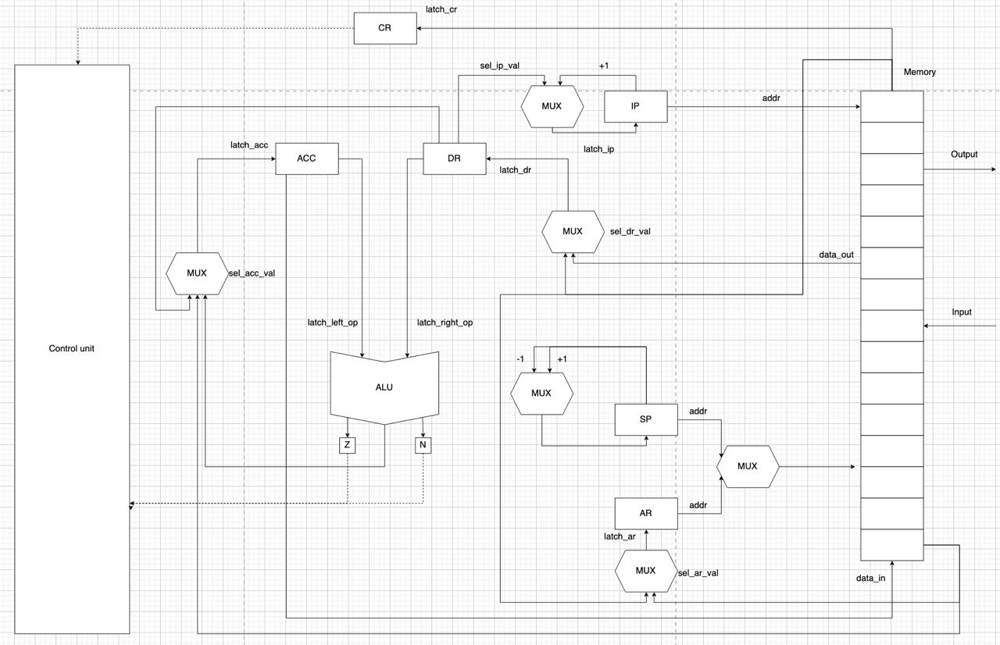
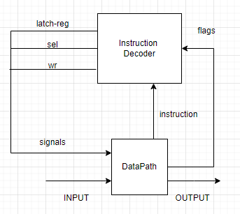

# Лабораторная работа №3. На кончиках пальцев / Эксперимент

- Емельянов Дмитрий Сергеевич
- `alg |  acc  |  neum  |  hw  |  tick  |  struct  | stream |  mem  |  cstr  |  prob2  | 8bit`
- Без усложнения

## **Описание варианта**

- **alg** -- синтаксис языка должен напоминать java/javascript/lua. Должен поддерживать математические выражения.
- **acc** -- система команд должна быть выстроена вокруг аккумулятора.
  - Инструкции -- изменяют значение, хранимое в аккумуляторе.
  - Ввод-вывод осуществляется через аккумулятор.
- **neum** -- фон Неймановская архитектура.
- **hw** (hardwired) -- ContolUnit реализуется как часть модели.
- **tick** -- процессор необходимо моделировать с точностью до такта, процесс моделирования может быть приостановлен на любом такте
- **struct** -- машинный код в виде высокоуровневой структуры данных. Считается, что одна инструкция укладывается в одно машинное слово.
- **stream** -- Ввод-вывод осуществляется как поток токенов.
- **mem** (port-mapped) -- memory-mapped (порты ввода-вывода отображаются в память и доступ к ним осуществляется штатными командами)
- **cstr** -- Null-terminated (C string)
- **prob2** -- Even Fibonacci numbers (сумма четных чисел Фибонначи, не превышающих 4 млн).

## Язык программирования

- Описание синтаксиса (по форме Бэкуса-Наура):

```
<программа> ::= <строка_программы> {<программа>}*

<строка_программы> ::= <объявление_переменной> | <условный_оператор> | <цикл> | <ввод> | <вывод>

<объявление_переменной> ::= [<тип>] ["{"<целочисленная_константа>"}"] <идентификатор> "=" <выражение> ;

<тип> :: = int | str

<идентификатор> ::= {<буква>}*

<выражение> ::= <арифметическое_выражение> | <идентификатор> | <литерал>

<условный_оператор> ::= if "(" <логическое выражение> ")" "{" <тело_оператора> "}"

<логическое выражение> ::= (<идентификатор> (< | > | == ) <целочисленная_константа>) | (<идентификатор> % <целочисленная_константа> == <целочисленная_константа>)

<цикл> ::= while ( <логическое выражение> ) { <тело_оператора> }

<тело_оператора> ::= <программа>

<арифметическое_выражение> ::= <терм> { ( + | - | * | /) <арифметическое_выражение> }*

<терм> ::= <идентификатор> | <литерал>

<литерал> ::= <целочисленная_константа> | <строка>

<целочисленная_константа> ::= <цифра>+

<ввод> ::= read(<идентификатор>);

<вывод> ::= print(<идентификатор>|<строка>);

<строка> ::= '{<любой_символ>}*'

<любой_символ> ::= <буква> | <цифра> | ...

<буква> ::= a | b | c | ... | z | A | B | C | ... | Z

<цифра> ::= 0 | 1 | 2 | 3 | 4 | 5 | 6 | 7 | 8 | 9
```

**Описание семантики**

- Область видимости - Глобальная
- Типизация - Статическая
- Типы данных: int, str
- Виды литералов :
  - Целочисленные - 123, 9877
  - Строки - "hello","qwer"
- Математические выражения - реализация через обратную польскую запись :
  - Сложение (+)
  - Вычитание (-)
  - Умножение (\*)
  - Деление (/)
- Поддерживаются конструкции `if` и `while`
- Переменные хранятся на стеке

```
               Registers
+------------------------------------+
| ACC - аккумулятор                  |
+------------------------------------+
| CR - регистр инструкции            |
+------------------------------------+
| DR - регистр данных                |
+------------------------------------+
| IP - счётчик команд                |
+------------------------------------+
| SP - указатель стека               |
+------------------------------------+
| AR - адрес записи в память         |
+------------------------------------+

            Instruction & Data memory
+-----------------------------------------------+
|    0    :  programm start                     |  <-- IP, SP
|        ...                                    |
| start   :  buffer start adr                   |
|        ...                                    |
| end     :  buffer end adr                     |
|        ...                                    |
+-----------------------------------------------+
```

- Память данных и команд - общая (фон Нейман)
- Виды адресации:
  - абсолютная
  - непосредственная адресация
  - косвенная
- Назначение регистров
  - ACC -- главный регистр (аккумуляторная архитектура), содержит результаты всех операций, ввод-вывод реализуется с него
  - CR -- содержит текущую выполняемую инструкцию
  - DR -- вспомомогательный регистр, хранит данные для выполнения текущей инструкции (После цикла выборки операнда)
  - IP -- содержит адрес следующей инструкции, которая должна быть выполнена
  - SP -- при операциях push и pop уменьшается и увеличивается соответственно (стек растет снизу вверх)
  - AR -- содержит адрес, по которому произойдет запись или чтение из памяти
- Циклы выполнения команды:
  - Цикл выборки инструкции: 1 такт
  - Цикл выборки операнда: 2-3 такта (Зависит от вида адресации)
  - Цикл выполнения команды: 1 такт
- Константы отсутствуют в языке
- Переменные помещаются на стек
- Строковые литералы хранятся последовательно в памяти
- В одном машинном слове хранится 1 символ строкового литерала

## Система команд

Особенности процессора:

- Длина машинного слова не определена
- Доступ к вводу-выводу происходит через команды доступа к памяти (memory maped IO), адреса хранятся в [isa](machine/isa.py)

Цикл команды:

- Выборка инструкции -- mem[IP] -> CR, IP+1 -> IP
- Выборка операнда --
  - addr-> AR, mem[AR] -> DR (Абсолютная);
  - addr -> DR (Непосредственная);
  - addr -> AR, mem[AR] -> AR, mem[AR] -> DR (косвенная)
- Выполнение команды

### Набор инструкций

| Инструкция    | Кол-во тактов | Описание                                                                     |
| :------------ | :------------ | :--------------------------------------------------------------------------- |
| ST `<addr>`   | 4-5           | Сохранить в память значение из аккумулятора                                  |
| LD `<addr>`   | 4-5           | Загрузить в аккумулятор значение из памяти                                   |
| ADD `<addr>`  | 4-5           | Сложить значение аккумулятора с значением из памяти, записать в аккумулятор  |
| SUB `<addr>`  | 4-5           | Вычесть из значения аккумулятора значение из памяти, записать в аккумулятор  |
| MUL `<addr>`  | 4-5           | Умножить значение аккумулятора на значение из памяти, записать в аккумулятор |
| DIV `<addr>`  | 4-5           | Поделить значение аккумулятора на значение из памяти, записать в аккумулятор |
| JUMP `<addr>` | 4-5           | Перейти по адресу                                                            |
| PUSH          | 2             | Сохранить в стек значение аккумулятора                                       |
| NOP           | 2             | Отсутствие операции                                                          |
| POP           | 2             | Загрузить в аккумулятор значение со стека                                    |
| CMP `<addr>`  | 4-5           | Выставить значения флагов при сравнении аккумулятора и значения из памяти    |
| JE `<addr>`   | 4-5           | Перейти по адресу, если флаг Z == 1                                          |
| JNE `<addr>`  | 4-5           | Перейти по адресу, если флаг Z == 0                                          |
| JA `<addr>`   | 4-5           | Перейти по адресу, если флаг N == 0                                          |
| JB `<addr>`   | 2-4           | Перейти по адресу, если флаг N == 1                                          |
| HALT          | 2             | Остановка симуляции                                                          |
| INC           | 2             | Прибавить к аккумулятору 1                                                   |

- `<addr>` -- абсолютная/косвенная/непосредственная адресация

### Кодирование инструкций

- Машинный код сереализуется в список JSON
- Один элемент списка -- одна инструкция

Пример:

```json
[
  {
    "index": 0,
    "opcode": "Opcode.LD",
    "arg1": "#",
    "arg2": 2011
  }
]
```

где:

- `index` -- адрес в памяти
- `opcode` -- код операции
- `arg1` -- вид адрессации
- `arg2` -- аргумент

Типы данных в модуле [isa](machine/isa.py), где:

- `Opcode` -- перечисление кодов операций
- 'TypesOfAddressing' -- доступные виды адресации

## Транслятор

Интерфейс командной строки: `translator.py <input_file> <target_file>`

Реализовано в модуле: [translator](translator/translate.py)

Этапы трансляции:

1. [Lexer](translator/lexer.py) - разбивает код из <input_file> на токены
2. [AST](translator/ast.py) - используя токены строит абстрактное синтаксическое дерево
3. [translator](translator/translate.py) - используя AST, создаётся машинный код, записывает в виде json в <target_file>

## Модель процессора

Интерфейс командной строки: `machine.py <machine_code_file> <input_file>`

Реализовано в модуле: [machine](machine/processor.py).

**Datapath**



Реализован в [machine](machine/data_path.py).

Регистры (соответствуют регистрам на схеме):

- `ACC`
- `DR`
- `CR`
- `AR`
- `SP`
- `IP`

Сигналы:

- `latch_ar` -- защелкнуть адресный регистр (addr->AR | mem[AR] -> AR)
- `latch_acc` -- защелкнуть аккумулятор (DR -> ACC | ALU_result -> ACC | mem[sp] -> ACC)
- `latch_ip` -- защелкнуть счетчик команд ( IP+1 -> IP | DR->IP)
- `latch_sp` -- защелкнуть регистр стека (SP+1-> SP | SP-1 -> SP)
- `latch_dr` -- защелкнуть регистр данных
- `latch_cr` -- защелкнуть регистр команд mem[IP] -> CR
- `latch_left_op` -- ACC -> left_operand
- `latch_right_op` -- ACC -> right_operand
- `signal_wr` -- запись в память ACC-> mem[AR]
- `calculate` -- выполнить операцию на АЛУ
- `get_flags` -- Получить флаги с АЛУ

Селекторы для мультиплексоров реализованы с помощью Enum в [machine](machine/data_path.py) классом Selector

Флаги:

- `N` (negative) -- результат в алу содержит отрицательное число
- `Z` (zero) -- результат в алу содержит ноль

**ControlUnit**



Реализован в [machine](machine/control_unit.py).

- Hardwired (реализовано полностью на Python)
- Метод `process_tick` моделирует выполнение следующего такта
- Каждая запись в журнале соответсвует состоянию процессора **после** выполнения инструкции
- Для журнала состояний процессора используется стандартный модуль `logging`
- Количество инструкций для моделирования лимитировано (Чтобы адекватно работало memory maped IO)
- Остановка моделирования осуществляется при:
  - превышении лимита количества tick
  - исключении `HaltError` (команда `halt`)
  - Попытке получить данные из пустого буфера

## Тестирование

Реализованные программы:

1. [hello_world](./examples/hello_world.dami) -- печатаем 'Hello, World!'
1. [cat](./examples/cat.dami) -- программа cat, повторяем ввод на выводе
1. [hello_usr](./examples/hello_user.dami) -- запросить у пользователя его имя, считать его, вывести на экран приветствие
1. [prob2](./examples/prob2.dami) -- сумма четных чисел, не превышающих 4 млн, последовательности Фиббоначи

Интеграционные тесты реализованы в [integration_test](./integration_test.py):

- Стратегия: golden tests, конфигурация в папке [golden](./golden/)

CI при помощи Github Action:

```yaml
defaults:
  run:
    working-directory: ./

jobs:
  test:
    runs-on: ubuntu-latest

    steps:
      - name: Checkout code
        uses: actions/checkout@v4

      - name: Set up Python
        uses: actions/setup-python@v4
        with:
          python-version: 3.11

      - name: Install dependencies
        run: |
          python -m pip install --upgrade pip
          pip install poetry
          poetry install

      - name: Run tests and collect coverage
        run: |
          poetry run coverage run -m pytest .
          poetry run coverage report -m
        env:
          CI: true

  lint:
    runs-on: ubuntu-latest

    steps:
      - name: Checkout code
        uses: actions/checkout@v4

      - name: Set up Python
        uses: actions/setup-python@v4
        with:
          python-version: 3.11

      - name: Install dependencies
        run: |
          python -m pip install --upgrade pip
          pip install poetry
          poetry install

      - name: Check code formatting with Ruff
        run: poetry run ruff format --check .

      - name: Run Ruff linters
        run: poetry run ruff check .
```

Пример использования и журнал работы процессора на примере hello_world

- Код:
  print('hello world!');

- Машинный код:

```
[{"index": 0, "opcode": "Opcode.JUMP", "arg1": "#", "arg2": 14},
  {"index": 1, "opcode": "Opcode.NOP", "arg1": 104, "arg2": null},
  {"index": 2, "opcode": "Opcode.NOP", "arg1": 101, "arg2": null},
  {"index": 3, "opcode": "Opcode.NOP", "arg1": 108, "arg2": null},
  {"index": 4, "opcode": "Opcode.NOP", "arg1": 108, "arg2": null},
  {"index": 5, "opcode": "Opcode.NOP", "arg1": 111, "arg2": null},
  {"index": 6, "opcode": "Opcode.NOP", "arg1": 32, "arg2": null},
  {"index": 7, "opcode": "Opcode.NOP", "arg1": 119, "arg2": null},
  {"index": 8, "opcode": "Opcode.NOP", "arg1": 111, "arg2": null},
  {"index": 9, "opcode": "Opcode.NOP", "arg1": 114, "arg2": null},
  {"index": 10, "opcode": "Opcode.NOP", "arg1": 108, "arg2": null},
  {"index": 11, "opcode": "Opcode.NOP", "arg1": 100, "arg2": null},
  {"index": 12, "opcode": "Opcode.NOP", "arg1": 33, "arg2": null},
  {"index": 13, "opcode": "Opcode.NOP", "arg1": 0, "arg2": null},
  {"index": 14, "opcode": "Opcode.LD", "arg1": "#", "arg2": 1},
  {"index": 15, "opcode": "Opcode.PUSH", "arg1": null, "arg2": null},
  {"index": 16, "opcode": "Opcode.LD", "arg1": "~", "arg2": 4095},
  {"index": 17, "opcode": "Opcode.ST", "arg1": "=", "arg2": 2000},
  {"index": 18, "opcode": "Opcode.CMP", "arg1": "#", "arg2": 0},
  {"index": 19, "opcode": "Opcode.JE", "arg1": "#", "arg2": 24},
  {"index": 20, "opcode": "Opcode.POP", "arg1": null, "arg2": null},
  {"index": 21, "opcode": "Opcode.INC", "arg1": null, "arg2": null},
  {"index": 22, "opcode": "Opcode.PUSH", "arg1": null, "arg2": null},
  {"index": 23, "opcode": "Opcode.JUMP", "arg1": "#", "arg2": 16},
  {"index": 24, "opcode": "Opcode.HALT", "arg1": null, "arg2": null}]
```

- Вывод программы:
  hello world!

- Журнал работы:

```
INFO    processor:simulation    Simulation start
  DEBUG   control_unit:process_tick  execute_command     Opcode.JUMP | tick:          3 | ip:         14 | dr         14 |ar:          0 | acc:          0
  DEBUG   control_unit:process_tick  execute_command       Opcode.LD | tick:          7 | ip:         15 | dr          1 |ar:          0 | acc:          1
  DEBUG   control_unit:process_tick  execute_command     Opcode.PUSH | tick:          9 | ip:         16 | dr          1 |ar:          0 | acc:          1
  DEBUG   control_unit:process_tick  execute_command       Opcode.LD | tick:         14 | ip:         17 | dr        104 |ar:          1 | acc:        104
  DEBUG   data_path:output         <- h
  DEBUG   control_unit:process_tick  execute_command       Opcode.ST | tick:         18 | ip:         18 | dr        104 |ar:       2000 | acc:        104
  DEBUG   control_unit:process_tick  execute_command      Opcode.CMP | tick:         22 | ip:         19 | dr          0 |ar:       2000 | acc:        104
  DEBUG   control_unit:process_tick  execute_command       Opcode.JE | tick:         26 | ip:         20 | dr         24 |ar:       2000 | acc:        104
  DEBUG   control_unit:process_tick  execute_command      Opcode.POP | tick:         28 | ip:         21 | dr         24 |ar:       2000 | acc:          1
  DEBUG   control_unit:process_tick  execute_command      Opcode.INC | tick:         30 | ip:         22 | dr         24 |ar:       2000 | acc:          2
  DEBUG   control_unit:process_tick  execute_command     Opcode.PUSH | tick:         32 | ip:         23 | dr         24 |ar:       2000 | acc:          2
  DEBUG   control_unit:process_tick  execute_command     Opcode.JUMP | tick:         36 | ip:         16 | dr         16 |ar:       2000 | acc:          2
  DEBUG   control_unit:process_tick  execute_command       Opcode.LD | tick:         41 | ip:         17 | dr        101 |ar:          2 | acc:        101
  DEBUG   data_path:output        h <- e
  DEBUG   control_unit:process_tick  execute_command       Opcode.ST | tick:         45 | ip:         18 | dr        101 |ar:       2000 | acc:        101
  DEBUG   control_unit:process_tick  execute_command      Opcode.CMP | tick:         49 | ip:         19 | dr          0 |ar:       2000 | acc:        101
  DEBUG   control_unit:process_tick  execute_command       Opcode.JE | tick:         53 | ip:         20 | dr         24 |ar:       2000 | acc:        101
  DEBUG   control_unit:process_tick  execute_command      Opcode.POP | tick:         55 | ip:         21 | dr         24 |ar:       2000 | acc:          2
  DEBUG   control_unit:process_tick  execute_command      Opcode.INC | tick:         57 | ip:         22 | dr         24 |ar:       2000 | acc:          3
  DEBUG   control_unit:process_tick  execute_command     Opcode.PUSH | tick:         59 | ip:         23 | dr         24 |ar:       2000 | acc:          3
  DEBUG   control_unit:process_tick  execute_command     Opcode.JUMP | tick:         63 | ip:         16 | dr         16 |ar:       2000 | acc:          3
  DEBUG   control_unit:process_tick  execute_command       Opcode.LD | tick:         68 | ip:         17 | dr        108 |ar:          3 | acc:        108
  DEBUG   data_path:output        he <- l
  DEBUG   control_unit:process_tick  execute_command       Opcode.ST | tick:         72 | ip:         18 | dr        108 |ar:       2000 | acc:        108
  DEBUG   control_unit:process_tick  execute_command      Opcode.CMP | tick:         76 | ip:         19 | dr          0 |ar:       2000 | acc:        108
  DEBUG   control_unit:process_tick  execute_command       Opcode.JE | tick:         80 | ip:         20 | dr         24 |ar:       2000 | acc:        108
  DEBUG   control_unit:process_tick  execute_command      Opcode.POP | tick:         82 | ip:         21 | dr         24 |ar:       2000 | acc:          3
  DEBUG   control_unit:process_tick  execute_command      Opcode.INC | tick:         84 | ip:         22 | dr         24 |ar:       2000 | acc:          4
  DEBUG   control_unit:process_tick  execute_command     Opcode.PUSH | tick:         86 | ip:         23 | dr         24 |ar:       2000 | acc:          4
  DEBUG   control_unit:process_tick  execute_command     Opcode.JUMP | tick:         90 | ip:         16 | dr         16 |ar:       2000 | acc:          4
  DEBUG   control_unit:process_tick  execute_command       Opcode.LD | tick:         95 | ip:         17 | dr        108 |ar:          4 | acc:        108
  DEBUG   data_path:output        hel <- l
  DEBUG   control_unit:process_tick  execute_command       Opcode.ST | tick:         99 | ip:         18 | dr        108 |ar:       2000 | acc:        108
  DEBUG   control_unit:process_tick  execute_command      Opcode.CMP | tick:        103 | ip:         19 | dr          0 |ar:       2000 | acc:        108
  DEBUG   control_unit:process_tick  execute_command       Opcode.JE | tick:        107 | ip:         20 | dr         24 |ar:       2000 | acc:        108
  DEBUG   control_unit:process_tick  execute_command      Opcode.POP | tick:        109 | ip:         21 | dr         24 |ar:       2000 | acc:          4
  DEBUG   control_unit:process_tick  execute_command      Opcode.INC | tick:        111 | ip:         22 | dr         24 |ar:       2000 | acc:          5
  DEBUG   control_unit:process_tick  execute_command     Opcode.PUSH | tick:        113 | ip:         23 | dr         24 |ar:       2000 | acc:          5
  DEBUG   control_unit:process_tick  execute_command     Opcode.JUMP | tick:        117 | ip:         16 | dr         16 |ar:       2000 | acc:          5
  DEBUG   control_unit:process_tick  execute_command       Opcode.LD | tick:        122 | ip:         17 | dr        111 |ar:          5 | acc:        111
  DEBUG   data_path:output        hell <- o
  DEBUG   control_unit:process_tick  execute_command       Opcode.ST | tick:        126 | ip:         18 | dr        111 |ar:       2000 | acc:        111
  DEBUG   control_unit:process_tick  execute_command      Opcode.CMP | tick:        130 | ip:         19 | dr          0 |ar:       2000 | acc:        111
  DEBUG   control_unit:process_tick  execute_command       Opcode.JE | tick:        134 | ip:         20 | dr         24 |ar:       2000 | acc:        111
  DEBUG   control_unit:process_tick  execute_command      Opcode.POP | tick:        136 | ip:         21 | dr         24 |ar:       2000 | acc:          5
  DEBUG   control_unit:process_tick  execute_command      Opcode.INC | tick:        138 | ip:         22 | dr         24 |ar:       2000 | acc:          6
  DEBUG   control_unit:process_tick  execute_command     Opcode.PUSH | tick:        140 | ip:         23 | dr         24 |ar:       2000 | acc:          6
  DEBUG   control_unit:process_tick  execute_command     Opcode.JUMP | tick:        144 | ip:         16 | dr         16 |ar:       2000 | acc:          6
  DEBUG   control_unit:process_tick  execute_command       Opcode.LD | tick:        149 | ip:         17 | dr         32 |ar:          6 | acc:         32
  DEBUG   data_path:output        hello <- ' '
  DEBUG   control_unit:process_tick  execute_command       Opcode.ST | tick:        153 | ip:         18 | dr         32 |ar:       2000 | acc:         32
  DEBUG   control_unit:process_tick  execute_command      Opcode.CMP | tick:        157 | ip:         19 | dr          0 |ar:       2000 | acc:         32
  DEBUG   control_unit:process_tick  execute_command       Opcode.JE | tick:        161 | ip:         20 | dr         24 |ar:       2000 | acc:         32
  DEBUG   control_unit:process_tick  execute_command      Opcode.POP | tick:        163 | ip:         21 | dr         24 |ar:       2000 | acc:          6
  DEBUG   control_unit:process_tick  execute_command      Opcode.INC | tick:        165 | ip:         22 | dr         24 |ar:       2000 | acc:          7
  DEBUG   control_unit:process_tick  execute_command     Opcode.PUSH | tick:        167 | ip:         23 | dr         24 |ar:       2000 | acc:          7
  DEBUG   control_unit:process_tick  execute_command     Opcode.JUMP | tick:        171 | ip:         16 | dr         16 |ar:       2000 | acc:          7
  DEBUG   control_unit:process_tick  execute_command       Opcode.LD | tick:        176 | ip:         17 | dr        119 |ar:          7 | acc:        119
  DEBUG   data_path:output        hello  <- w
  DEBUG   control_unit:process_tick  execute_command       Opcode.ST | tick:        180 | ip:         18 | dr        119 |ar:       2000 | acc:        119
  DEBUG   control_unit:process_tick  execute_command      Opcode.CMP | tick:        184 | ip:         19 | dr          0 |ar:       2000 | acc:        119
  DEBUG   control_unit:process_tick  execute_command       Opcode.JE | tick:        188 | ip:         20 | dr         24 |ar:       2000 | acc:        119
  DEBUG   control_unit:process_tick  execute_command      Opcode.POP | tick:        190 | ip:         21 | dr         24 |ar:       2000 | acc:          7
  DEBUG   control_unit:process_tick  execute_command      Opcode.INC | tick:        192 | ip:         22 | dr         24 |ar:       2000 | acc:          8
  DEBUG   control_unit:process_tick  execute_command     Opcode.PUSH | tick:        194 | ip:         23 | dr         24 |ar:       2000 | acc:          8
  DEBUG   control_unit:process_tick  execute_command     Opcode.JUMP | tick:        198 | ip:         16 | dr         16 |ar:       2000 | acc:          8
  DEBUG   control_unit:process_tick  execute_command       Opcode.LD | tick:        203 | ip:         17 | dr        111 |ar:          8 | acc:        111
  DEBUG   data_path:output        hello w <- o
  DEBUG   control_unit:process_tick  execute_command       Opcode.ST | tick:        207 | ip:         18 | dr        111 |ar:       2000 | acc:        111
  DEBUG   control_unit:process_tick  execute_command      Opcode.CMP | tick:        211 | ip:         19 | dr          0 |ar:       2000 | acc:        111
  DEBUG   control_unit:process_tick  execute_command       Opcode.JE | tick:        215 | ip:         20 | dr         24 |ar:       2000 | acc:        111
  DEBUG   control_unit:process_tick  execute_command      Opcode.POP | tick:        217 | ip:         21 | dr         24 |ar:       2000 | acc:          8
  DEBUG   control_unit:process_tick  execute_command      Opcode.INC | tick:        219 | ip:         22 | dr         24 |ar:       2000 | acc:          9
  DEBUG   control_unit:process_tick  execute_command     Opcode.PUSH | tick:        221 | ip:         23 | dr         24 |ar:       2000 | acc:          9
  DEBUG   control_unit:process_tick  execute_command     Opcode.JUMP | tick:        225 | ip:         16 | dr         16 |ar:       2000 | acc:          9
  DEBUG   control_unit:process_tick  execute_command       Opcode.LD | tick:        230 | ip:         17 | dr        114 |ar:          9 | acc:        114
  DEBUG   data_path:output        hello wo <- r
  DEBUG   control_unit:process_tick  execute_command       Opcode.ST | tick:        234 | ip:         18 | dr        114 |ar:       2000 | acc:        114
  DEBUG   control_unit:process_tick  execute_command      Opcode.CMP | tick:        238 | ip:         19 | dr          0 |ar:       2000 | acc:        114
  DEBUG   control_unit:process_tick  execute_command       Opcode.JE | tick:        242 | ip:         20 | dr         24 |ar:       2000 | acc:        114
  DEBUG   control_unit:process_tick  execute_command      Opcode.POP | tick:        244 | ip:         21 | dr         24 |ar:       2000 | acc:          9
  DEBUG   control_unit:process_tick  execute_command      Opcode.INC | tick:        246 | ip:         22 | dr         24 |ar:       2000 | acc:         10
  DEBUG   control_unit:process_tick  execute_command     Opcode.PUSH | tick:        248 | ip:         23 | dr         24 |ar:       2000 | acc:         10
  DEBUG   control_unit:process_tick  execute_command     Opcode.JUMP | tick:        252 | ip:         16 | dr         16 |ar:       2000 | acc:         10
  DEBUG   control_unit:process_tick  execute_command       Opcode.LD | tick:        257 | ip:         17 | dr        108 |ar:         10 | acc:        108
  DEBUG   data_path:output        hello wor <- l
  DEBUG   control_unit:process_tick  execute_command       Opcode.ST | tick:        261 | ip:         18 | dr        108 |ar:       2000 | acc:        108
  DEBUG   control_unit:process_tick  execute_command      Opcode.CMP | tick:        265 | ip:         19 | dr          0 |ar:       2000 | acc:        108
  DEBUG   control_unit:process_tick  execute_command       Opcode.JE | tick:        269 | ip:         20 | dr         24 |ar:       2000 | acc:        108
  DEBUG   control_unit:process_tick  execute_command      Opcode.POP | tick:        271 | ip:         21 | dr         24 |ar:       2000 | acc:         10
  DEBUG   control_unit:process_tick  execute_command      Opcode.INC | tick:        273 | ip:         22 | dr         24 |ar:       2000 | acc:         11
  DEBUG   control_unit:process_tick  execute_command     Opcode.PUSH | tick:        275 | ip:         23 | dr         24 |ar:       2000 | acc:         11
  DEBUG   control_unit:process_tick  execute_command     Opcode.JUMP | tick:        279 | ip:         16 | dr         16 |ar:       2000 | acc:         11
  DEBUG   control_unit:process_tick  execute_command       Opcode.LD | tick:        284 | ip:         17 | dr        100 |ar:         11 | acc:        100
  DEBUG   data_path:output        hello worl <- d
  DEBUG   control_unit:process_tick  execute_command       Opcode.ST | tick:        288 | ip:         18 | dr        100 |ar:       2000 | acc:        100
  DEBUG   control_unit:process_tick  execute_command      Opcode.CMP | tick:        292 | ip:         19 | dr          0 |ar:       2000 | acc:        100
  DEBUG   control_unit:process_tick  execute_command       Opcode.JE | tick:        296 | ip:         20 | dr         24 |ar:       2000 | acc:        100
  DEBUG   control_unit:process_tick  execute_command      Opcode.POP | tick:        298 | ip:         21 | dr         24 |ar:       2000 | acc:         11
  DEBUG   control_unit:process_tick  execute_command      Opcode.INC | tick:        300 | ip:         22 | dr         24 |ar:       2000 | acc:         12
  DEBUG   control_unit:process_tick  execute_command     Opcode.PUSH | tick:        302 | ip:         23 | dr         24 |ar:       2000 | acc:         12
  DEBUG   control_unit:process_tick  execute_command     Opcode.JUMP | tick:        306 | ip:         16 | dr         16 |ar:       2000 | acc:         12
  DEBUG   control_unit:process_tick  execute_command       Opcode.LD | tick:        311 | ip:         17 | dr         33 |ar:         12 | acc:         33
  DEBUG   data_path:output        hello world <- !
  DEBUG   control_unit:process_tick  execute_command       Opcode.ST | tick:        315 | ip:         18 | dr         33 |ar:       2000 | acc:         33
  DEBUG   control_unit:process_tick  execute_command      Opcode.CMP | tick:        319 | ip:         19 | dr          0 |ar:       2000 | acc:         33
  DEBUG   control_unit:process_tick  execute_command       Opcode.JE | tick:        323 | ip:         20 | dr         24 |ar:       2000 | acc:         33
  DEBUG   control_unit:process_tick  execute_command      Opcode.POP | tick:        325 | ip:         21 | dr         24 |ar:       2000 | acc:         12
  DEBUG   control_unit:process_tick  execute_command      Opcode.INC | tick:        327 | ip:         22 | dr         24 |ar:       2000 | acc:         13
  DEBUG   control_unit:process_tick  execute_command     Opcode.PUSH | tick:        329 | ip:         23 | dr         24 |ar:       2000 | acc:         13
  DEBUG   control_unit:process_tick  execute_command     Opcode.JUMP | tick:        333 | ip:         16 | dr         16 |ar:       2000 | acc:         13
  DEBUG   control_unit:process_tick  execute_command       Opcode.LD | tick:        338 | ip:         17 | dr          0 |ar:         13 | acc:          0
  DEBUG   control_unit:process_tick  execute_command       Opcode.ST | tick:        342 | ip:         18 | dr          0 |ar:       2000 | acc:          0
  DEBUG   control_unit:process_tick  execute_command      Opcode.CMP | tick:        346 | ip:         19 | dr          0 |ar:       2000 | acc:          0
  DEBUG   control_unit:process_tick  execute_command       Opcode.JE | tick:        350 | ip:         24 | dr         24 |ar:       2000 | acc:          0
  DEBUG   data_path:output_the_buffer output: hello world!
  INFO    processor:simulation    Simulation stop
```

```text
| ФИО                          | алг             | LoC | code байт | code инстр. | инстр. | такт. | вариант                                                                    |
| Емельянов Дмитрий Сергеевич  | hello_world     | 1   | -         | 24          | 117    | 352   | alg | acc | neum | hw | tick | struct | stream | mem | cstr | prob2 | 8bit |
| Емельянов Дмитрий Сергеевич  | cat             | 7   | -         | 37          | 203    | 699   | alg | acc | neum | hw | tick | struct | stream | mem | cstr | prob2 | 8bit |
| Емельянов Дмитрий Сергеевич  | hello_user      | 11  | -         | 101         | 467    | 1509  | alg | acc | neum | hw | tick | struct | stream | mem | cstr | prob2 | 8bit |
| Емельянов Дмитрий Сергеевич  | prob2           | 13  | -         | 37          | 693    | 2625  | alg | acc | neum | hw | tick | struct | stream | mem | cstr | prob2 | 8bit |
```

> где:
>
> алг. -- название алгоритма (hello, cat, или как в варианте)
>
> прог. LoC -- кол-во строк кода в реализации алгоритма
>
> code байт -- кол-во байт в машинном коде (если бинарное представление)
>
> code инстр. -- кол-во инструкций в машинном коде
>
> инстр. -- кол-во инструкций, выполненных при работе алгоритма
>
> такт. -- кол-во тактов, которое заняла работа алгоритма
