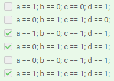

______
### Примечания:

* Если какие-то варианты ответов не совпадают, то кликайте на рандом, пока не совпадут. [На крайний случай](https://github.com/RedGry/ITMO/blob/master/System%20software/docs/СПО%20-%20Операционные%20системы.pdf)
* Особо большие куски кода закинул в папки с названием соответствующих глав
______


## 1.2
```
xchgq %rsi, %rdx
```
___

```
addq %RDX, %RSI
```
___
```
sub $32, %RSI
mov $5, %RAX
mul %RSI
mov $9, %RBX
div %RBX
mov %RAX, %RSI
```
___

```
XCHG %RSI,%RDX
```
___

## 1.3
```
swap:
    // Put your code here
   pushq (%RDI)

   pushq (%RSI)

    popq (%RDI)

    popq (%RSI)
    retq
```
___
```

min:

cmpq %RSI, %RDI

ja RSI_min

movq %RDI, %RAX

retq

RSI_min:

movq %RSI, %RAX

retq
```
___
```
pow:
movq $1, %rax
Cycle:
cmpq $0, %rsi
je st1
mulq %rdi
decq %rsi
jmp Cycle
st1:
retq
```
___

## 1.5
```
4096
```
___

## 2.1

```
EBX
```
___

## 2.3


___

## 2.4

```
2
```
___

Код в папке "2.4"
___

## 2.5


Код в папке "2.5"
___

## 2.6


___
```
4
```
___

## 2.7

Код в папке "2.7"
___

## 3.1

```
10
```
___

## 3.2

```
5
```
___

## 3.4

```
n = input()

print(" ".join(map(lambda t: str(t[0]),
sorted(enumerate(map(int, input().split())),
key=lambda t: t[1]))))
```
___

## 3.5

Код в папке "3.5"
___


___

## 4.1

```
Да
```

___


## 4.2


___

___

___

___

## 4.4

```
int atomic_fetch_add(atomic_int *x, int arg)
{
    /* Ваш код здесь */
    for (;;) {
        int old_value = load_linked(x);
        if (store_conditional(x, old_value + arg))
            return old_value;
    }
}

bool atomic_compare_exchange(atomic_int *x, int *expected_value,
                             int new_value)
{
    /* Ваш код здесь */
    for (;;) {
        int old_value = load_linked(x);
        if (old_value != *expected_value) {
            *expected_value = old_value;
            return false;
        }
        if (store_conditional(x, new_value))
            return true;
    }
}

```
___

## 4.4
```
Нет
```
___
```
Да
```
___

Код в папке "4.6"
___

## 5.1

Код в папке "5.1/1"
___
Код в папке "5.1/2"
___