______
### Примечания:

* Если какие-то варианты ответов не совпадают, то кликайте на рандом, пока не совпадут. [На крайний случай](https://octoant.github.io/system-software/docs/stepik/course/548/section-5.2/)

______
## 2.1
```
man
```
___

```
man ls
```
___
## 2.2
```
pwd
```
___

```
/
```
___
```
ls
```
___

```
-a
```
___

```
-p
```
___

```
mkdir -p ./foo/bar/baz
```
___
## 2.3
```
file
```
___
```
touch
```
___
```
Навсегда
```
___
```
Регистрозависимыми
```
___
```
-r
```
___
```
rm -rf /home/box
```
___

## 2.4
```
head
```
___
```
tail
```
___
```
less
more
```
___
```
tail -n 2 /etc/fstab
```
___

## 2.5
```
/home
```
___
```
точки .
```
___
```
/media
```
___
```
/etc
```
___
```
/dev
```
___
```
/var/log
```
___
```
/var/cache
```
___
## 3.1

```
4
```
___
```
echo "foo bar"

echo 'foo bar'
```
___
```
type
```
___
```
which
```
___
```
alias lh="ls -lh"
```
___
```
echo
alias
```
___
```
rm

tac

route

which

echo
```
___

___

## 3.2

```
;
```
___
```
&
```
___

___
```
#
```
___
```
\
```
___
```
pwd ; ls
```
___
```
rm file55 && echo "удалось" || echo "не удалось"
```
___

## 3.3
```
$
```
___
```
TestVar=123
```
___
```
set

env
```
___
```
$TestVar
```
___
```
Hello world!
```
___
```
unset
```
___
```
$PATH
```
___

## 3.4
```
`…`

$(…)
```
___
```
$(…)
```
___

## 3.5
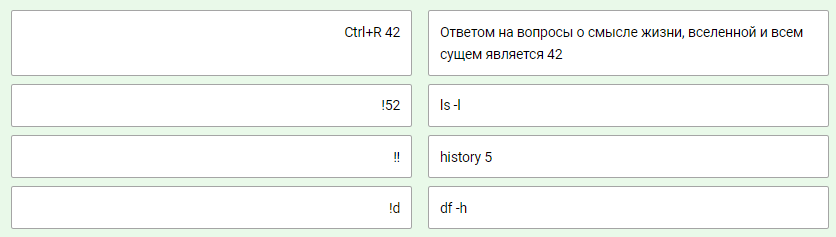
___

```
пробел
```
___
```
HISTSIZE=5000
```
___

## 4.1


___
```
echo Hello world! >|hello

echo Hello world! >hello
```
___
```
find / > allfiles.txt 2>&1

find / > allfiles.txt 2> /dev/null
```
___
```
set -o noclobber

set -C
```
___
```
Да
```
___


## 4.2
```
tee
```
___
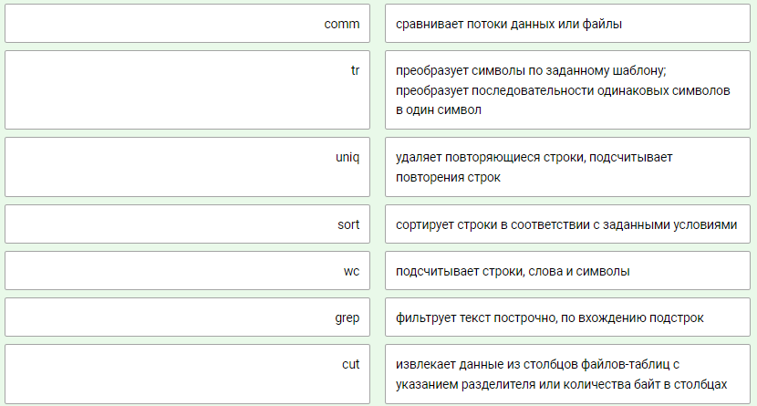
___
```
env | wc -l
```
___
```
sort -k2 tennis.txt
```
___
## 4.3

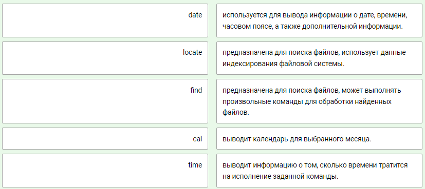
___
```
updatedb
```
___
```
find / -type d -name "foo*"
```
___
```
find / -type f -name '*.bar'
```
___
```
find /etc -name "*.conf" -exec cp {} /backup \;
```
___

## 4.4

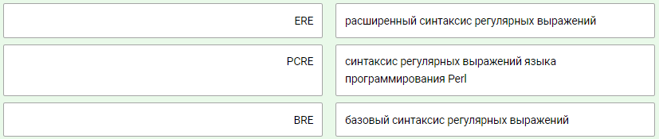
___
```
grep -G "M\|W" tennis.txt

grep -E "W|M" tennis.txt
```
___
```
grep -i Bel tennis.txt
```
___
```
grep -E "a*" bar.txt

grep -E "a+" bar.txt

grep -E 'aaa?' bar.txt

```
___
```
grep -i a$ tennis.txt

grep -iE 'a$' tennis.txt
```
___
```
Приморский
```
___
```
echo Заморский | sed 's/ский/ить/'
```
___
```
послепослезавтра
```
___
```
05/01/1889
```
___

## 5.1
```
Esc
```
___
```
o

i

a
```
___
```
сначала :w, потом :q

:wq

ZZ
```
___
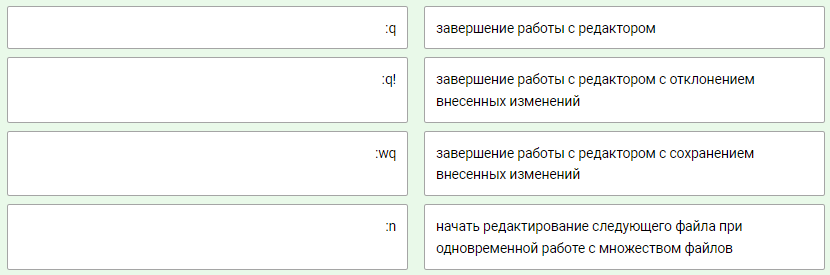
___
```
yyp

```
___
```
ddp
```
___
```
:2,5 s/baz/bar/g
```
___
## 6.1
```
she-bang
```
___
```
#!/bin/csh

#!/bin/bash
```
___
```
#!/bin/ksh
```
___
```
#!/bin/bash
read -r a b c # Читаем переменные, переданные на стандартный ввод
echo $a,$c,$b

```
___
## 6.2
```
[]
```
___
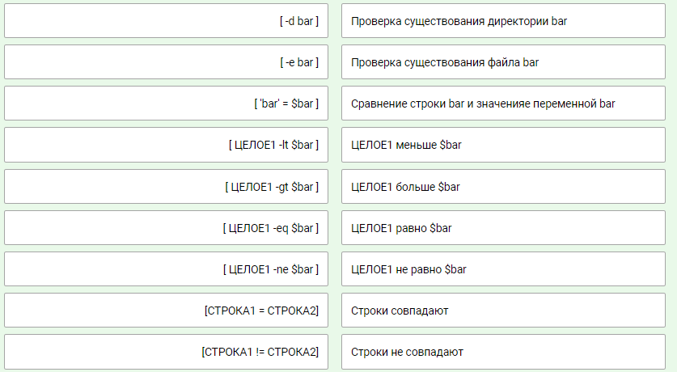
___
```
Мало.
```
___
```
1
```
___
```
for i in {10..1}; do echo $i; done;

```
___
```
#!/bin/bash
i=1
while [ $i -le 11 ]
do
 let i=i+1
done

```
___
```
#!/bin/bash
j=9
until [ $j -lt 3 ]
do
 let j=j-1
done

```
___
```
#!/bin/bash
read -r a b # Читаем переменные, переданные на стандартный ввод
let sum=0
for i in `seq $a $b`
do
  let sum=sum+i;
done
echo $sum;

```
___

## 6.3
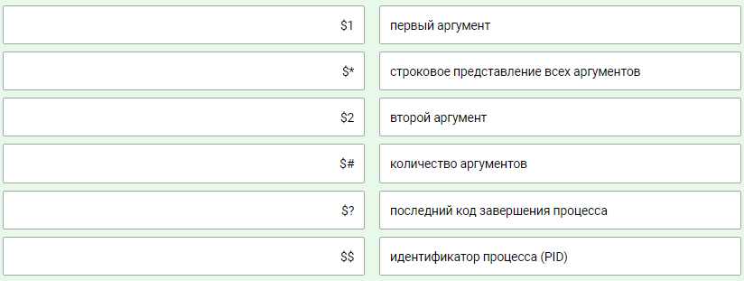
___
```
getopts
```
___
```
shopt
```
___
```
#!/bin/bash
if [ $# -gt 0 ]
then
  while (( $# ))
  do
    echo $1
    shift
  done
fi

```
___

## 6.4
```
eval
```
___
```
(( ))
```
___
```
let
```
___
## 7.1
```
whoami

who am i
```
___
```
w

who
```
___
```
id
```
___
```
su
```
___
```
сохраняет переменные окружения командной оболочки исходного пользователя
```
___
```
su -
```
___
```
sudo
```
___
```
пароль не задан
```
___
## 7.2
```
/etc/passwd
```
___
```
root
```
___
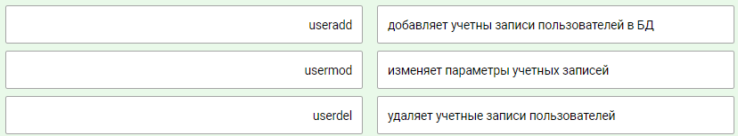
___
```
/etc/skel
```
___
## 7.3
```
/etc/shadow
```
___
```
passwd

openssl
```
___
```
установки минимального и максимального срока действия пароля

установки даты истечения срока действия пользовательской учетной записи

установки количества дней, в течение которых выводятся предупреждения об истечении срока действия пароля

даты истечения срока действия пароля
```
___
```
!
```
___

## 7.4
```
/etc/profile
```
___
```
~/.bash_profile
~/.profile
~/.bash_login
~/.bashrc

```
___

## 7.5
```
создать новую группу
```
___
```
/etc/group
```
___
```
посмотреть в каких группах состоит пользователь
```
___
```
usermod
```
___
```
-a
```
___
```
groupmod
```
___

## 8.1
```
Имя пользователся, владеющего файлом

Имя группы, владеющей файлом
```
___
```
Имя группы, владеющей файлом
```
___
```
Права доступа к файлу
```
___
```
chown bar /home/foo
```
___
```
chgrp bar /home/foo
```
___
```
chown bar:baz /home/foo
```
___
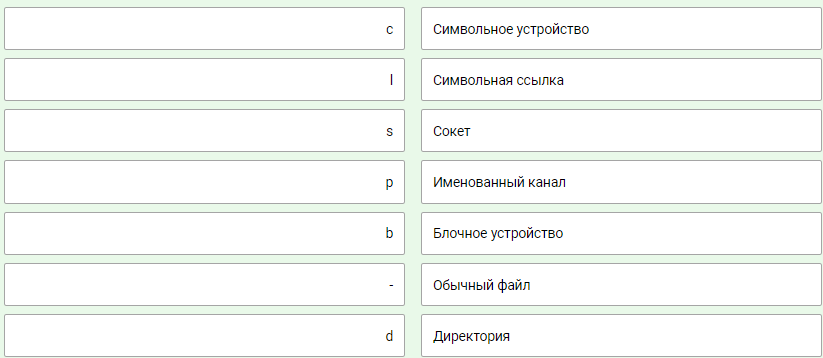
___

___
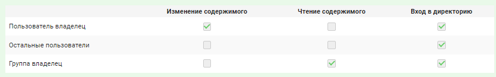
___
```
permissions - это файл

пользователи, не являющиеся владельцами, и не являющие членами группы владельца, имеют права на чтение permissions

пользователь-владелец имеет полный доступ к permissions

группа-владелец имеет права на чтение и исполнение permissions
```
___
```
755
```
___
```
740
```
___
```
110100100
```
___

## 8.2
```
для предотвращения удаления файлов пользователями, которые не являются их непосредственными владельцами.
```
___
```
в тех случаях, когда необходимо, чтобы в качестве группы пользователей, владеющей всеми файлами в директории, использовалась группа пользователей, владеющая директорией.
```
___
```
чтобы пользователь, запустивший файл на исполнение, получил повышение прав до пользователя-владельца файла (обычно root) в рамках запущенного процесса.
```
___
## 8.3
```
Чтение списков контроля доступа
```
___
```
Удаление списков контроля доступа

Модификация списков контроля доступа

Удаление элементов списков контроля доступа

Запись списков контроля доступа
```
___
## 8.4
```
относящиеся к файлу метаданные
```
___
```
ls -li
```
___
```
Ограничены своими разделами дисков.

Оригинальный файл и ссылка имеют одни и те же права доступа, а также одного и того же владельца.

Новое имя файла ставится в соответствие существующей структуре
inode.
```
___
```
Права доступа не имеют значения, так как в итоге будут учитываться права доступа к целевому файлу.

Могут указывать на файлы из других файловых систем, в т.ч. сетевых.

Не указывают на структуры inode, а являются соответствиями между именами файлов.
```
___
## 9.1

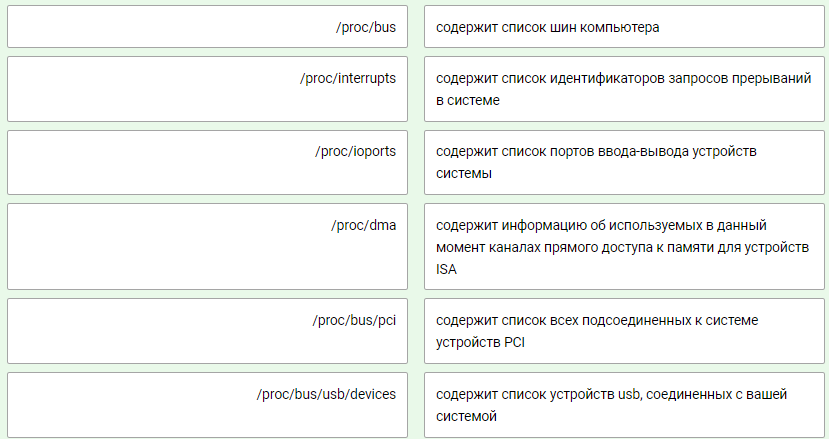
___

___
