______
### Примечания:

* Если какие-то варианты ответов не совпадают, то кликайте на рандом, пока не совпадут. [На крайний случай](https://octoant.github.io/system-software/docs/stepik/course/548/section-5.2/)
* Файлы, которые нужно загрузить, находятся в папках с номером главы (1.2, 1.3 и тд)
______
## 1.1

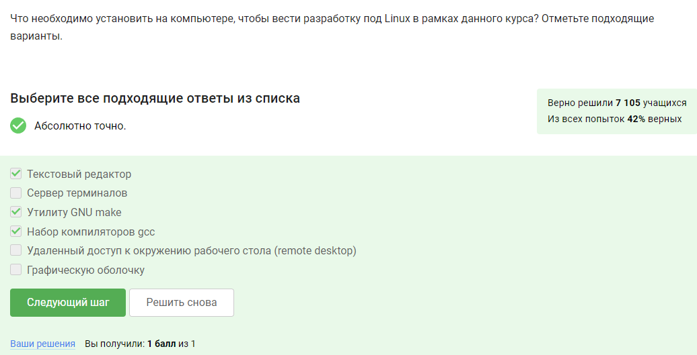

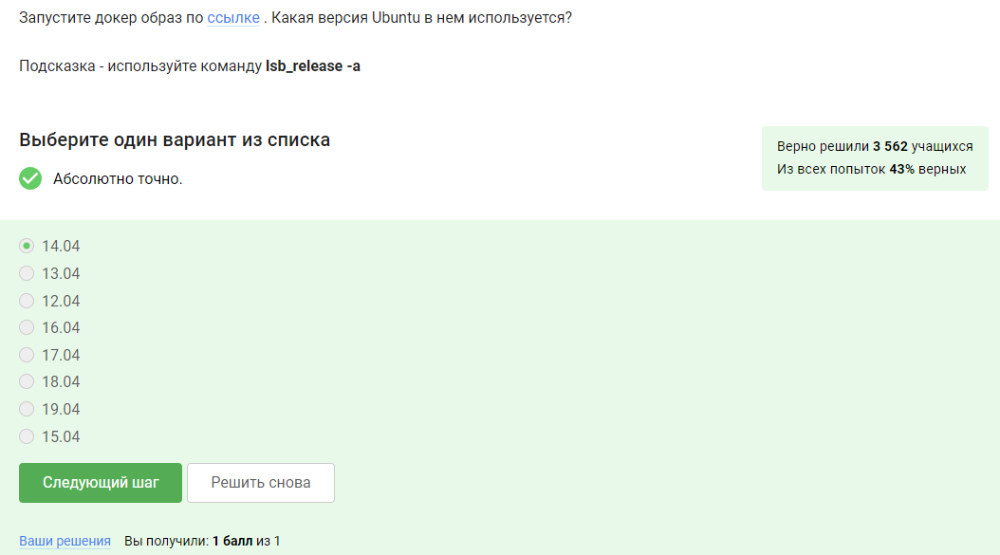

## 1.2

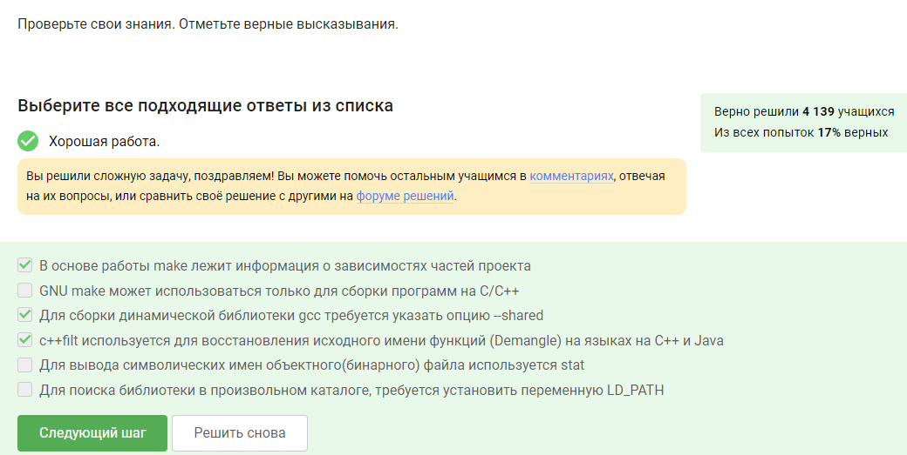

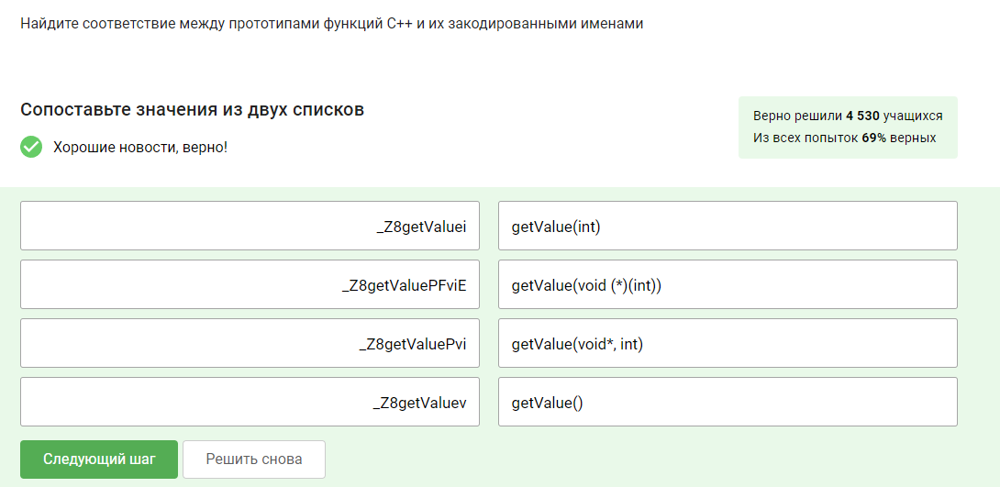

тут ищем файлики в одноименной папке

## 1.3

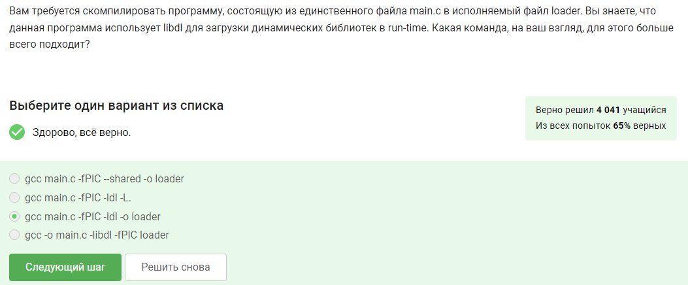

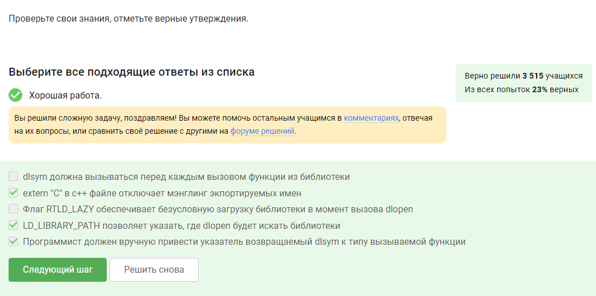

тут ищем файлики в одноименной папке

## 2.1

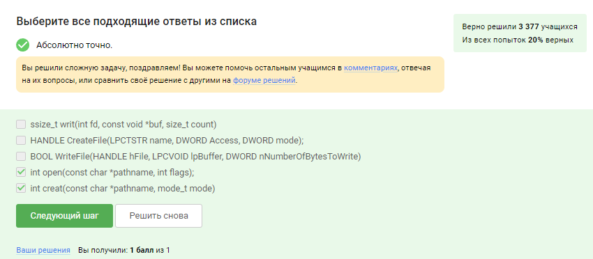

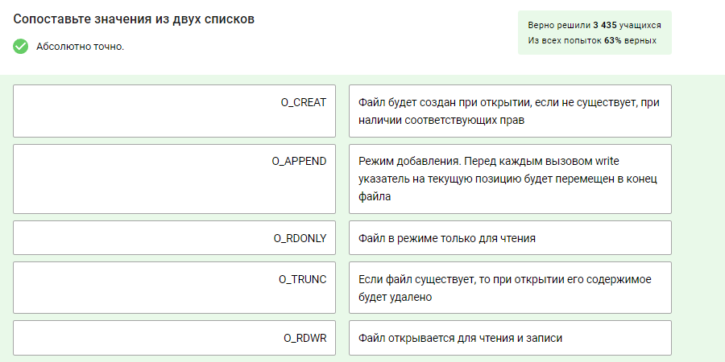

## 2.2

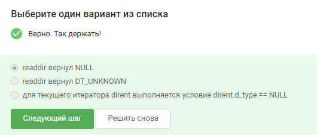

## 2.3

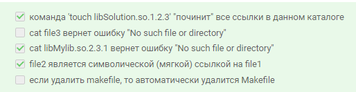

## 2.4

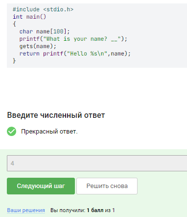

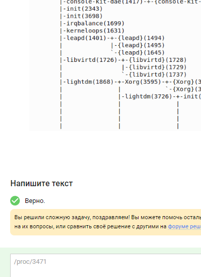

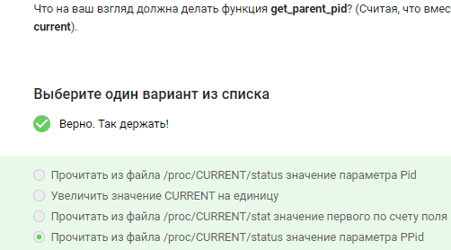

## 2.5

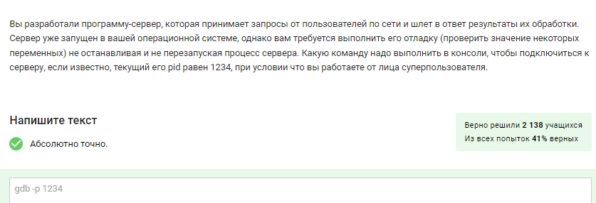

## 3.1

## 3.2

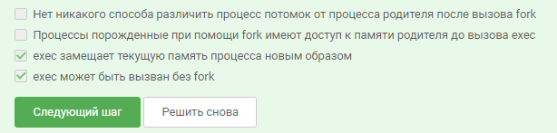

Все верные ответы:
* exec может быть вызван без fork +
* fork копирует текущий процесс, таким образом, что состояние памяти оказывается одинаковым у родителя и потомка+ 
* fork может быть использован без exec, если код потомка содержится в том же бинарном файле что и код родителя+
* exec замещает текущую память процесса новым образом+

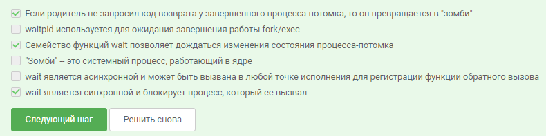

## 3.5

тут ищем файлики в одноименной папке

## 4.1

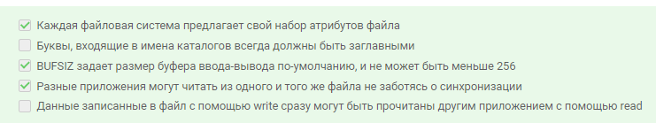

## 4.6

тут ищем файлики в одноименной папке

## 5.2

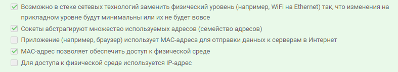

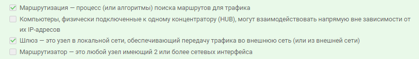

## 5.3

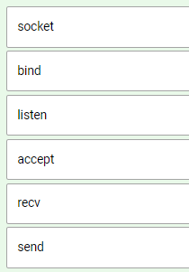

## 5.7

тут ищем файлики в одноименной папке

## 8.1

